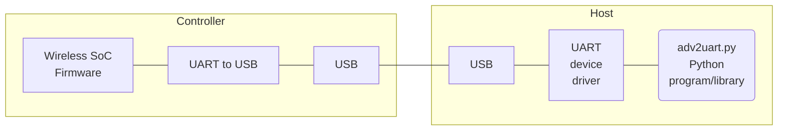

# ADV_BLE2UART

BLE-to-UART [scanner](https://en.wikipedia.org/wiki/Bluetooth_Low_Energy#Advertising_and_discovery), which continuously receives [BLE](https://en.wikipedia.org/wiki/Bluetooth_Low_Energy) advertisements and delivers them to a host connected via [UART-to-USB](https://en.wikipedia.org/wiki/USB-to-serial_adapter) adapter.

The following Wireless [SoC](https://en.wikipedia.org/wiki/System_on_a_chip) solutions are implemented:

- [Telink TLSR825x](source/ble2uart/README.md)
- [ESP32-C3 USB](source/esp32-c3/ble50_scan/README.md)

Check related README documents for further details on each implementation.

Common characteristics:

- robust datalink with CRC16 for error detection while transitting data;
- the firmware scans BLE PHY 1M advertisements and Coded PHY S8 advertisements (125kbps BLE Long Range mode) concurrently;
- white-list and black-list for 64 MAC addresses;
- LEDs to monitor the advertising processing;
- Compared to implementations based on variants of the Hayes/AT command set, this software employs a very compact bidirectional protocol to optimize UART traffic;
- the BLE device can be fully controlled by the hosts via commands;
- Available commands can be extended.

This software allows experimenting BLE Long Range with a Windows PC or through a wide set of hosts supporting the USB-to-UART interface.

---------------------

> Related project: [WCHBLE2ETH](https://github.com/pvvx/WCHBLE2ETH), which uses a CH32V208W SoC to receive BLE advertisements (including "LE Long Range" - CODED PHY), forwarding them via TCP/IP socket (port 1000) and using DHCP for network configuration.
