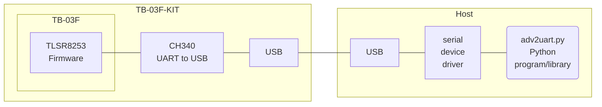
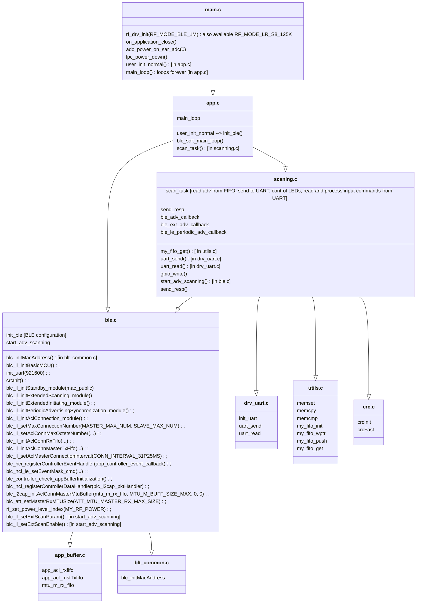

# TLSR825x_ADV_BLE2UART

__TLSR825x firmware__ implementing a BLE scanner, which continuously receives BLE advertisements and delivers them to a host connected via UART-to-USB.



Characteristics of this BLE receiver firmware:

- tested on a Ai-Thinker [TB-03F-KIT](https://docs.ai-thinker.com/_media/tb-03f-kit_specification_en.pdf);
- output to UART, 921600 Baud (the bitrate can be modified, e.g. to 115200, by recompiling the firmware);
- robust datalink with CRC16 for error detection while transitting data to the host via UART;
- software FIFO sized for 4 packets of 240 bytes;
- the firmware accepts BLE PHY 1M and Coded PHY S8 (BLE Long Range) concurrently;
- white-list and black-list for 64 MAC addresses;
- LEDs to monitor the advertising processing;
- the software exploits the latest version of the [Telink SDK](https://wiki.telink-semi.cn/wiki/chip-series/TLSR825x-Series/#software-development-kit) for [Bluetooth LE Multi Connection](https://wiki.telink-semi.cn/tools_and_sdk/BLE/B85M_BLE_SDK.zip);
- ready to compile makefile;
- Compared to implementations based on variants of the Hayes/AT command set, this software employs a very compact bidirectional protocol to optimize UART traffic;
- the BLE device can be fully controlled by the hosts via commands;
- Available commands can be extended.

When using modules like the TB-03F-KIT, this software allows experimenting BLE Long Range with a Windows PC or through a wide set of hosts supporting the CH340 USB-to-UART interface.

## TB-03F-KIT LEDs

IC Port |LED Color|Description
--------|---------|-----------
PC4     |RGB Green|PHY 1M advertisement received
PC2     |RGB Blue |Coded PHY advertisement received
PB4     |Yellow   |Advertisement succesfully sent to the UART FIFO
PC3     |RGB Red  |FIFO overflow errors, when the UART troughtput is not enough to process all received BLE advertisements
PB5     |White    |Host command received from the UART

If a FIFO overflow is detected, it is suggested to add filters in the black and white lists to reduce the set of processed advertisements per device.

Configuring the controller to transmit at 921600 baud (default bitrate) is suggested if also the host device driver allows this; otherwise the firmware can be recompiled to transmit data at 115200 baud. Reducing the bitrate increases the risk of FIFO overflow.

## Installation

```
git clone https://github.com/pvvx/TLSR825x_ADV_BLE2UART
```

Compiling the firmware (including `make clean`):

```
cd TLSR825x_ADV_BLE2UART/source/ble2uart
make
```

Recompiling the firmware without `make clean`:

```
make main-build
```

The compiled firmware is in the directory TLSR825x_ADV_BLE2UART/source/ble2uart/TLSR825xScaner.bin

## Flashing the firmware via TlsrPgm.py

TlsrPgm.py needs a patch applied to the device: [How to write TLSRPGM program to TB-03F-KIT or TB-04-KIT](https://github.com/pvvx/TLSRPGM/tree/main/sources/UART2SWire/tb-0x-pgm).

Flash the firmware via the following command (`we` = write file to flash erasing related sectors):

```
PGM_PORT=COM10 make flash
```

To erase all flash:

```
PGM_PORT=COM10 make erase
```

To perform a chip soft reset and get External Chip Information:

```
PGM_PORT=COM10 make reset
```

### Alternative firmware update procedure via USBCOMFlashTx.html

https://pvvx.github.io/ATC_MiThermometer/USBCOMFlashTx.html

### Alternative firmware update procedure via Telink_Tools.py

Similarly to the USBCOMFlashTx.html web program, the Telink_Tools.py python application allows uploading the firmware to the TB-03F-KIT device without needing the patch.

Connect the device to a PC via USB. Run the [Telink_Tools.py](https://github.com/Ircama/freetz-ble/blob/main/ble-adv-telink/make/Telink_Tools.py) Python program (Python2 and Python3, Windows and Linux). It requires `pip install pyserial`.

Example to burn the firmware with the Ai-Thinker device connected via USB to the virtual COM8 serial port of the PC:

```
python3 Telink_Tools.py --port com8 burn TLSR825xScaner.bin
```

## SDK Update

Use a UNIX system to compile the sources.

Compiling without reinstalling the SDK:

```bash
cd source/ble2uart
make
```

If the compiler is not included in the SDK, the makefile downloads it.

The *install_sdk.sh* script is tested with [b85m_ble_sdk_V4.0.1.3_Patch/patch_0001_20231201](https://wiki.telink-semi.cn/tools_and_sdk/BLE/B85M_BLE_SDK.zip); it allows to download the latest SDK form Telink, patch it and install it to the target directory.

Reinstall the SDK and compile:

```bash
cd source/ble2uart
rm -r SDK
./install_sdk.sh
make
```

## SDK Documentation

Documentation on using the API can be found in the header comments of the SDK files.

## adv2uart.py Usage

This program reads the advertisement messages produced by the device. It supports both Python3 and Python2.

```
usage: adv2uart.py [-h] [-d] [-v] [-i] [-b BAUDRATE] [-p PORT] [-t TIMEOUT] [-n NUMBER]

optional arguments:
  -h, --help            show this help message and exit
  -d, --debug           Print debug information
  -v, --verbose         Print verbose information
  -i, --info            Print limited debug information
  -b BAUDRATE, --baudrate BAUDRATE
                        serial connection baudrate (default: 115200)
  -p PORT, --port PORT  Serial port; default = COM11 or /dev/ttyUSB0
  -t TIMEOUT, --timeout TIMEOUT
                        serial port read timeout in seconds (default: 0.1)
  -n NUMBER, --number NUMBER
                        Number of advertisements to process (default is 0 = infinite)

BLE TLSR825x_ADV_BLE2UART scanner
```

## API

Example of usage of the API:

```python
from adv2uart import Ble2Uart

dv = Ble2Uart(port="...", baud=..., timeout=0.1)  # example: dv = Ble2Uart(port="/dev/ttyUSB0", baud=115200, timeout=0.1)
dv.read(64)  # flush
dv.black_white_list(white_list=[...], black_list=[...])  # load black and white lists; example: dv.black_white_list(white_list=[], black_list=["aabbccddeef0", "aabbccddeef1"])
while True:
    rssi, evtp, adtp, phys, mac, payload = dv.read_adv()
    print(mac, payload)
```

`read_adv()`: *read serial input, detect advertisements and decode commands*.

Returned parameters: rssi, evtp, adtp, phys, mac, payload

Format of the input packet (commands and advertisements have different content):

  - Header: 5 bytes (fixed for commands and advertisements)

    - the first byte is the length of the payload

      - If command: 0

    - rssi

      - If command: command number

    - adtp:
        - BT4.2: pa->event_type
        - ext_adv: pa->event_type
        - periodic_adv: pExt->subEventCode

        - If command: mac array position, or max number of positions
        - If command 0=CMD_ID_INFO: version in BCD format; 0x34 -> '3.4'

        ````
        ADV_REPORT_EVENT_TYPE_ADV_IND           = 0x00,
        ADV_REPORT_EVENT_TYPE_DIRECT_IND        = 0x01,
        ADV_REPORT_EVENT_TYPE_SCAN_IND          = 0x02,
        ADV_REPORT_EVENT_TYPE_NONCONN_IND       = 0x03,
        ADV_REPORT_EVENT_TYPE_SCAN_RSP          = 0x04,
        ````

    - evtp:
        - BT4.2: pa->adr_type & 0x0f
        - ext_adv: (pa->address_type & 0x0f) | (pa->direct_address_type << 4)
        - periodic_adv: periodic_adv.advAddrType & 0x0f

        - If command: length of the command data; can be 0

        ````
        PUBLIC = 0,
        RANDOM = 1,
        RESOLVE_PRIVATE_PUBLIC = 2,
        RESOLVE_PRIVATE_RANDOM = 3,
        ````

    - phys
        - bt4.2: 0x00
        - ext_adv: pa->primary_phy | (pa->secondary_phy << 4)
        - periodic_adv: periodic_adv.advPHY

        - If command: 0xff

        ````
        BLE_PHY_1M              = 0x01,
        BLE_PHY_2M              = 0x02,
        BLE_PHY_CODED           = 0x03,
        ````

  - mac: 6 bytes, fixed for commands and advertisements
        for advertisements: MAC in scope

        - If command CMD_ID_CLRM: 000000000000
        - If command CMD_ID_INFO: public MAC address of the device
        - If command CMD_ID_SCAN: adv_scanning parameters; see length
        - If CMD_ID_WMAC and CMD_ID_BMAC: MAC in scope

  - payload: variable length 'l'
 
    - If command: not present

  - crc: 2 bytes, fixed for commands and advertisements
        CRC16 of the total packet length

header (5 bytes) + mac (6 bytes) + crc (2 bytes) = 13 bytes
total packet length: l + 13

Examples of the structure of some commands:

- Command CMD_ID_INFO: `00 00 01 06 ff a4c138bfff34`
- Command CMD_ID_CLRM: `00 04 40 00 ff 000000000000`
- Command CMD_ID_BMAC: `00 03 01 06 ff aabbccddeeff`
- Command CMD_ID_SCAN: `00 01 10 03 ff 000000003033`

```python
black_white_list(white_list=[ ... ], black_list=[ ... ], info=True, clear=True, start=True)
```

- Info=False: do not sen the info command
- clear=False: do not send the list clear command
- start=False: do not start advertising.

Usage of custom commands:

```python
from adv2uart import Ble2Uart, Command, adv_scanning

dv = Ble2Uart(port="...", baud=..., timeout=1)
dv.read(64)
dv.command(Command.CMD_ID_INFO)
dv.command(Command.CMD_ID_CLRM)
dv.black_white_list(white_list=[...], black_list=[...], info=False, clear=False, start=False)
dv.command(Command.CMD_ID_SCAN + adv_scanning.build(
        {
            "flag": {
                "address_type": "PUBLIC",
                "address_type_filter_random": True,
                "address_type_filter_private": True,
                "DUP_FILTER_ENABLE": False,
                "SCAN_TYPE_ACTIVE": False,
                "SCAN_PHY_CODED": True,
                "SCAN_PHY_1M": True
            },
            "window_ms": 30
        }
    )
)

for i in range(20):
    rssi, evtp, adtp, phys, mac, payload = dv.read_adv()
    print(mac, payload)

dv.command(Command.STOP_SCAN)
```

### DUP_FILTER_ENABLE

Set to True to filter duplicates (duplicate advertisings)

### SCAN_TYPE_ACTIVE

This parameter can be set as “passive scan” (False) or “active scan” (True). For active scan, when an advertising packet is received, a "scan_req" will be sent to the remote device to obtain more information. For passive scan, the "scan req" won’t be sent. 

### window_ms

window_ms = scan_interval * 0.625

The scan_interval is set with the same value as the scan_window

scan_interval is the time interval from when the Controller started its last scan until it begins the subsequent scan on the primary advertising physical channel

scan_window is the duration of the scan on the primary advertising physical channel.

## Documentation of the Firmware Source Code



Notes:

- [rf_drv_init()](http://wiki.telink-semi.cn/tools_and_sdk/Driver/doc/kite/html/rf__drv_8h.html#a22715be7838f01751b91706885914790)
- [RF_MODE_BLE_1M](http://wiki.telink-semi.cn/tools_and_sdk/Driver/doc/kite/html/rf__drv_8h.html#aefccab4a2d5d5fcda5b92f00c7e120d3)
