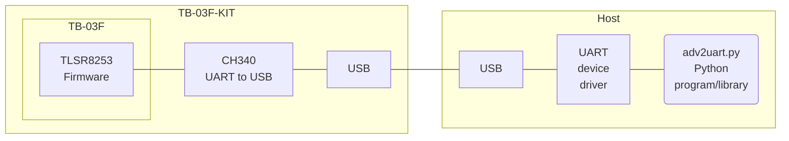
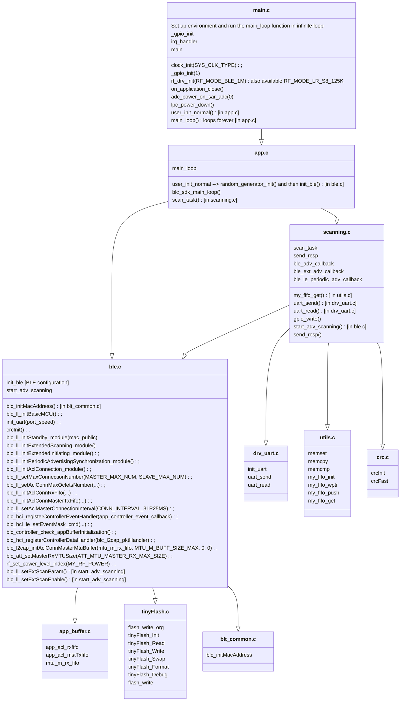
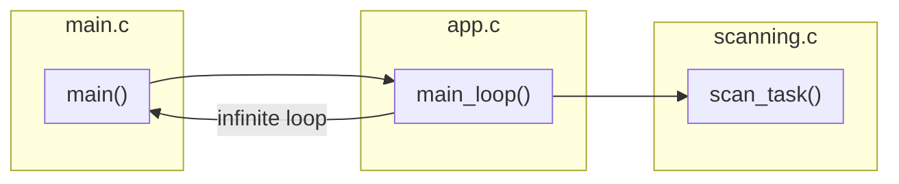
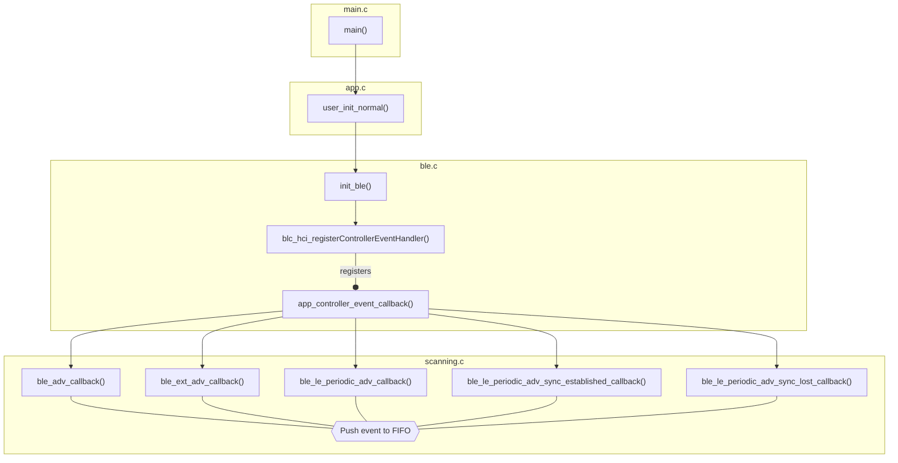

# TLSR825x ADV_BLE2UART ble2uart

__TLSR825x firmware__ implementing a BLE scanner, which continuously receives BLE advertisements and delivers them to a host connected via UART-to-USB adapter.



Characteristics of this BLE receiver firmware:

- compatible with [Telink TLSR825x SoC](http://wiki.telink-semi.cn/wiki/chip-series/TLSR825x-Series/);
- tested on Ai-Thinker [TB-03F-KIT](https://docs.ai-thinker.com/_media/tb-03f-kit_specification_en.pdf);
- output to UART, 2000000, 921600 baud (default) or 115200 baud; the bitrate can be changed with the "PROG" key of TB-03F-KIT, toggling between the defined ones (e.g. at the moment 2000000 [one blink], 921600 [two blinks] or 115200 [three blinks], but other bitrates can be added); any change in the bitrate performed with the key is permanently stored to the firmware flash;
- robust datalink with CRC16 for error detection while transitting data;
- software FIFO sized for 4 packets of 240 bytes;
- the firmware can scan BLE PHY 1M advertisements and Coded PHY S8 advertisements (125kbps BLE Long Range mode) concurrently;
- white-list and black-list for 64 MAC addresses;
- LEDs to monitor the BLE advertising interface;
- the software exploits the latest version of the [Telink SDK](https://wiki.telink-semi.cn/wiki/chip-series/TLSR825x-Series/#software-development-kit) for [Bluetooth LE Multi Connection](https://wiki.telink-semi.cn/tools_and_sdk/BLE/B85M_BLE_SDK.zip);
- ready-to-compile makefile;
- Compared to implementations based on variants of the Hayes/AT command set, this software employs a very compact bidirectional protocol to optimize UART traffic;
- the BLE device can be fully controlled by the hosts via commands;
- Available commands can be extended.

If the RGB LED switches on for a while (all three colors) when powering on the device (e.g., new device), it means that the default bitrate has an invalid value; press the PROG key to define a valid UART bitrate.

## TB-03F-KIT LEDs

IC Port |LED Color|Description
--------|---------|-----------
PC4     |RGB Green|PHY 1M advertisement received
PC2     |RGB Blue |Coded PHY advertisement received
PB4     |Yellow   |Advertisement succesfully sent to the UART FIFO
PC3     |RGB Red  |FIFO overflow error, when the UART troughtput is not enough to process all received BLE advertisements
PB5     |White    |Host command received from the UART

If a FIFO overflow is detected, it is suggested to add filters to the black and white lists to reduce the set of processed advertisements.

Configuring the controller to transmit at 2000000 baud (default bitrate) is suggested if also the host device driver allows this throughput. Reducing the bitrate increases the risk of FIFO overflow.

## Installation and compilation

### Using pre-built assets

The [Releases](https://github.com/pvvx/ADV_BLE2UART/releases) folder provides the *ble2uart.zip* ZIP archive, which is auto-generated by a [GitHub Action](.github/workflows/build.yml). The ZIP file includes the following assets:

- *TLSR825xScaner.bin*: precompiled firmware
- *Telink_Tools.exe*: Windows flash tool to upload the firmware to the device (pre-compiled from *Telink_Tools.py*)
- *adv2uart.exe*: Windows test program which prints the advertisement messages produced by the device (pre-compiled from *adv2uart.py*)

Steps to install the firmware and test the device:

- Unzip the *ble2uart.zip* archive to a directory.
- Connect the device to an USB port.
- Open the Device Manager to verify the COM port in use (COM7 in the following examples).
- Open a Windows CMD (Command Prompt).

To flash the firmware:

```
Telink_Tools.exe --port COM7 burn TLSR825xScaner.bin
```

To test the device:

```
adv2uart.exe -p COM7 -i
```

### Compilation from sources

```
git clone https://github.com/pvvx/ADV_BLE2UART
```

Python is required for *adv2uart.py*. Prerequisite modules:

```cmd
pip3 install pyserial
pip3 install construct
```

Use a UNIX system to compile the sources. The [Ubuntu](https://apps.microsoft.com/detail/9pn20msr04dw) distribution for [WSL](https://en.wikipedia.org/wiki/Windows_Subsystem_for_Linux) is a way to easily perform the compilation with a Windows system.

Needed components for the firmware compilation:

```cmd
sudo apt-get install make bzip2
```

Compiling the firmware (including `make clean`) and copying the created TLSR825xScaner.elf flash image to TLSR825xScaner.bin:

```
cd ADV_BLE2UART/source/ble2uart
make
```

Recompiling the firmware without `make clean` and copying the created TLSR825xScaner.elf flash image to TLSR825xScaner.bin:

```
make main-build
```

Make all files, run TlsrMemInfo.py, do not copy the TLSR825xScaner.elf flash image to TLSR825xScaner.bin:

```
make sizedummy
```

Cleaning files (but not the SDK, which also needs `rm -r SDK`):

```
make clean
```

The compiled firmware is in the directory ADV_BLE2UART/source/ble2uart/TLSR825xScaner.bin

### Debug some SDK functions

To print UART debug messages tracing the parameters used to invoke some SDK functions (`blc_ll_setExtScanParam()`, `blc_ll_setExtScanEnable()`, advertising event callback function), set `DEBUG_MSG` to 1 in *app_config.h*. This can be used to check the actual effect of the configuration dictionary passed to `adv_scanning.build()` in *adv2uart.py*.

## Flashing the firmware

### Flashing the firmware via TlsrPgm.py

*TlsrPgm.py* needs a hw patch applied to the device: [How to write TLSRPGM program to TB-03F-KIT or TB-04-KIT](https://github.com/pvvx/TLSRPGM/tree/main/sources/UART2SWire/tb-0x-pgm).

Flash the firmware via the following command (`we` = write file to flash erasing related buffers):

```
PGM_PORT=COM10 make flash
```

To erase all flash:

```
PGM_PORT=COM10 make erase
```

To perform a chip soft reset and get External Chip Information:

```
PGM_PORT=COM10 make reset
```

### Alternative firmware update procedure via USBCOMFlashTx.html

https://pvvx.github.io/ATC_MiThermometer/USBCOMFlashTx.html

### Alternative firmware update procedure via Telink_Tools.py

Similarly to the *USBCOMFlashTx.html* web program, the *Telink_Tools.py* Python application allows uploading the firmware to the TB-03F-KIT device without needing the hw patch.

Connect the device to a PC via USB. Run the [Telink_Tools.py](https://github.com/Ircama/freetz-ble/blob/main/ble-adv-telink/make/Telink_Tools.py) Python program (Python2 and Python3, Windows and Linux). It requires `pip install pyserial`.

Example to burn the firmware with the Ai-Thinker device connected via USB to the virtual COM8 serial port of the PC:

```
python3 Telink_Tools.py --port com8 burn TLSR825xScaner.bin
```

### Running Telink_Tools.py and adv2uart.py via WSL

While there are ways to map Windows USB serial ports to WSL, the easiest method is to run the Windows Python programs from WSL (provided that [Python for Windows](https://apps.microsoft.com/detail/9nrwmjp3717k?hl=en-us&gl=US) is installed):

```bash
# from WSL
make && cmd.exe /c 'python3 freetz-ble\ble-adv-telink\make\Telink_Tools.py --port com10 burn ADV_BLE2UART\source\ble2uart\TLSR825xScaner.bin'
```

Similarly, you can also run *adv2uart.py*:

```bash
# from WSL
cmd.exe /c 'python3 ADV_BLE2UART\source\ble2uart\adv2uart.py -p com10 -i'
```

## Persistent user data storage

Flash user data storage starts from 0x70020 (458784) if the first byte 0x70000 (458752) is not FF, or from 0x71020 (462880). Each update of a value (e.g., "bitrate" value) takes 4 sequential bytes. One buffer is 256 bytes.

After erasing a buffer, data can be written only once (not twice). A rewrite needs erasing data first. To avoid too many rewrites (that wear the storage), data are organized in an array where each segment is progressively updated in sequence so that the last value is the actual one.

See "tinyFlash.c".

### Erasing the user data flash

```bash
Telink_Tools.py --port com10 erase_flash 0x70000 1
Telink_Tools.py --port com10 erase_flash 0x71000 1
Telink_Tools.py --port com10 write_flash_fill 0x70000 "00"
```

The first two commands erase one buffer starting from the indicated address (0x70000 or 0x71000). The resulting data are initialized to 0xff.

The third command writes 00 to the first byte. Notice that a *write_flash_fill* also checks that the remaining data until the end of the buffer are set to 0xff and, for each data that needs to be changed, it initializes it to 0xff; as they are already to this value, all data subsequent to 00 are not rewritten and can be used by the application.

### Reading the first buffer

```bash
Telink_Tools.py --port com10 read_flash 0x70000 255
```

### Reading the second buffer

```bash
Telink_Tools.py --port com10 read_flash 0x71000 255
```

## SDK Update

Compiling without reinstalling the SDK:

```bash
cd ADV_BLE2UART/source/ble2uart
make
```

If the compiler is not included in the SDK, the makefile downloads it.

The *install_sdk.sh* script is tested with [telink_b85m_ble_sdk_V4.0.1.3_Patch]((https://wiki.telink-semi.cn/tools_and_sdk/BLE/B85M_BLE_SDK.zip)) including patch_0001_20231201 and patch_0002_20240402; it allows to download the latest SDK from Telink, patch it and install it to the target directory.

Reinstall the SDK and compile:

```bash
cd ADV_BLE2UART/source/ble2uart
rm -r SDK
./install_sdk.sh
make
```

## SDK Documentation

Documentation on using the API can be found in the header comments of the SDK files.

## adv2uart.py Usage

This program reads the advertisement messages produced by the device. It supports both Python3 and Python2.

```
usage: adv2uart.py [-h] [-d] [-v] [-i] [-s SLEEP] [-b BAUDRATE] [-p PORT] [-t TIMEOUT] [-n NUMBER]

optional arguments:
  -h, --help            show this help message and exit
  -d, --debug           Print debug information
  -v, --verbose         Print verbose information
  -i, --info            Print limited debug information
  -s SLEEP, --sleep SLEEP
                        add an initial delay in seconds before the query (default: 1)
  -b BAUDRATE, --baudrate BAUDRATE
                        serial connection baudrate (default: 2000000)
  -p PORT, --port PORT  Serial port; default = COM11 or /dev/ttyUSB0
  -t TIMEOUT, --timeout TIMEOUT
                        serial port read timeout in seconds (default: 0.3)
  -n NUMBER, --number NUMBER
                        Number of advertisements to process (default is 0 = infinite)

BLE ADV_BLE2UART scanner
```

## API

```python
from adv2uart import Ble2Uart

dv = Ble2Uart(
    port=...,
    baud=...,
    timeout=...,
    mac_separator=...
)
```

Parameter|Description
---------|-----------
port|device name, depending on operating system. e.g. `"/dev/ttyUSB0"` on GNU/Linux or `"COM10"` on Windows.
baud|Baud rate. CH340 supports common baud rates: 50, 75, 100, 110, 134.5, 150, 300, 600, 900, 1200, 1800, 2400, 3600, 4800, 9600, 14400, 19200, 28800, 33600, 38400, 56000, 57600, 76800, 115200, 128000, 153600, 230400, 460800, 921600, 1500000, 2000000 baud. Some devices only support up to 921600 baud, some up to 115200 baud.
timeout|Read timeout value in seconds. Default is 0.3 seconds. `None` waits until 64 bytes are received. 0 is non-blocking (never waits).
mac_separator|Separator of each digit of the 6-bytes MAC address. The default is no separator. To set it to a colon, use `mac_separator=':'`.

### black_white_list()

```python
black_white_list(white_list=[ ... ], black_list=[ ... ], info=True, clear=True, start=True)
```

- Info=False: do not send the info command
- clear=False: do not send the list clear command
- start=False: do not start advertising.

### read_adv()

`read_adv()`: *read serial input, detect advertisements and decode commands*.

Returned parameters: rssi, evtp, adtp, phys, mac, payload

Format of the input packet (commands and advertisements have different content):

General packet format:

- 5-byte header,
- 6-byte MAC,
- optional payload,
- crc_16 at the end.

Description:

- Header: 5 bytes (fixed for commands and advertisements)

    - the first byte is the length of the payload

      - If command: 0

    - rssi

      - If command: command number

    - adtp:
        - BT4.2: pa->event_type
        - ext_adv: pa->event_type
        - periodic_adv: pExt->subEventCode

        - If command: mac array position, or max number of positions
        - If command 0=CMD_ID_INFO: version in BCD format; 0x34 -> '3.4'

        ````
        ADV_REPORT_EVENT_TYPE_ADV_IND           = 0x00,
        ADV_REPORT_EVENT_TYPE_DIRECT_IND        = 0x01,
        ADV_REPORT_EVENT_TYPE_SCAN_IND          = 0x02,
        ADV_REPORT_EVENT_TYPE_NONCONN_IND       = 0x03,
        ADV_REPORT_EVENT_TYPE_SCAN_RSP          = 0x04,
        ````

    - evtp:
        - BT4.2: pa->adr_type & 0x0f
        - ext_adv: (pa->address_type & 0x0f) | (pa->direct_address_type << 4)
        - periodic_adv: periodic_adv.advAddrType & 0x0f

        - If command: length of the command data; can be 0

        ````
        PUBLIC = 0,
        RANDOM = 1,
        RESOLVE_PRIVATE_PUBLIC = 2,
        RESOLVE_PRIVATE_RANDOM = 3,
        ````

    - phys
        - bt4.2: 0x00
        - ext_adv: pa->primary_phy | (pa->secondary_phy << 4)
        - periodic_adv: periodic_adv.advPHY

        - If command: 0xff

        ````
        BLE_PHY_1M              = 0x01,
        BLE_PHY_2M              = 0x02,
        BLE_PHY_CODED           = 0x03,
        ````

- mac: 6 bytes, fixed for commands and advertisements
        for advertisements: MAC in scope

        - If command CMD_ID_CLRM: 000000000000
        - If command CMD_ID_INFO: public MAC address of the device
        - If command CMD_ID_SCAN: adv_scanning parameters; see length
        - If CMD_ID_WMAC and CMD_ID_BMAC: MAC in scope

- payload: variable length 'l'
 
    - If command: not present

- crc: 2 bytes, fixed for commands and advertisements
        CRC16 of the total packet length

header (5 bytes) + mac (6 bytes) + crc (2 bytes) = 13 bytes
total packet length: l + 13

### command()

```python
from adv2uart Command, adv_scanning
```

Argument:

- Command.CMD_ID_INFO
- Command.CMD_ID_CLRM
- Command.CMD_ID_WMAC + mac_reverse
- Command.CMD_ID_BMAC + mac_reverse
- Command.START_SCAN
- Command.STOP_SCAN
- Command.CMD_ID_SCAN + adv_scanning.build(adv_scan_params)
- Command.DEBUG_PRINT

A Command.DEBUG_PRINT return message is generated by the `uart_printf()` print debugger: related debugging frames have:

- 5-byte header (message length, 05=CMD_ID_PRNT, 0xff, 0xff, 0xff),
- null MAC (00, 00, 00, 00, 00, 00),
- payload (message body)
- crc_16 at the end.

The the `uart_printf()` message is printed by `adv2uart.py` as a `Command.DEBUG_PRINT` warning and uses the FIFO.

The `p_printf()` function writes a `Command.DEBUG_PRINT` packet to the USB UART without using the FIFO.

The `raw_printf()` function writes raw data to the USB UART directly calling `uart_send()`, without using FIFO/headers/crc, and it is not compatible with `adv2uart.py`.

Examples of the structure of some commands, as produced by `command()`:

- Command CMD_ID_INFO: `00 00 01 06 ff a4c138bfff34`
- Command CMD_ID_CLRM: `00 04 40 00 ff 000000000000`
- Command CMD_ID_BMAC: `00 03 01 06 ff aabbccddeeff`
- Command CMD_ID_SCAN: `00 01 10 03 ff 000000003033`

### Example of usage of the API

```python
from adv2uart import Ble2Uart

dv = Ble2Uart(port="...", baud=..., timeout=0.1)  # example: dv = Ble2Uart(port="/dev/ttyUSB0", baud=115200, timeout=0.1)
dv.read(64)  # flush
dv.black_white_list(white_list=[...], black_list=[...])  # load black and white lists; example: dv.black_white_list(white_list=[], black_list=["aabbccddeef0", "aabbccddeef1"])
while True:
    rssi, evtp, adtp, phys, mac, payload = dv.read_adv()
    print(mac, payload)
```

### Example of usage of custom commands

```python
from adv2uart import Ble2Uart, Command, adv_scanning

dv = Ble2Uart(port="...", baud=..., timeout=1)
dv.read(64)
dv.command(Command.CMD_ID_INFO)
dv.command(Command.CMD_ID_CLRM)
dv.black_white_list(white_list=[...], black_list=[...], info=False, clear=False, start=False)
dv.command(Command.CMD_ID_SCAN + adv_scanning.build(
        {
            "flag": {
                "address_type": "PUBLIC",
                "address_type_filter_random": True,
                "address_type_filter_private": True,
                "DUP_FILTER_ENABLE": False,
                "SCAN_TYPE_ACTIVE": False,
                "SCAN_PHY_CODED": True,
                "SCAN_PHY_1M": True
            },
            "window_ms": 30
        }
    )
)

for i in range(20):
    rssi, evtp, adtp, phys, mac, payload = dv.read_adv()
    print(mac, payload)

dv.command(Command.STOP_SCAN)
```

### DUP_FILTER_ENABLE

Set to True to filter duplicates (duplicate advertisings)

### SCAN_TYPE_ACTIVE

This parameter can be set as “passive scan” (False) or “active scan” (True). For active scan, when an advertising packet is received, a "scan_req" will be sent to the remote device to obtain more information. For passive scan, the "scan req" won’t be sent. 

### window_ms

*scan_interval* and *scan_window* are internal parameters used within the Telink *blc_ll_setExtScanParam()* SDK system call (invoked by `Command.START_SCAN`).

*scan_interval* is the time interval from when the Controller started its last scan until it begins the subsequent scan on the primary advertising physical channel.

*scan_window* is the duration of the scan on the primary advertising physical channel.

`window_ms` = *scan_intervalé * 0.625; unit is in milliseconds.

*scan_interval* is set by the firmware with the same value as the *scan_window*.

## Documentation of the source code of the firmware 



Notes:

- [rf_drv_init()](http://wiki.telink-semi.cn/tools_and_sdk/Driver/doc/kite/html/rf__drv_8h.html#a22715be7838f01751b91706885914790)
- [RF_MODE_BLE_1M](http://wiki.telink-semi.cn/tools_and_sdk/Driver/doc/kite/html/rf__drv_8h.html#aefccab4a2d5d5fcda5b92f00c7e120d3)

### Main loop



`scan_task()` loop:

- pop advertisement from FIFO `my_fifo_get(); my_fifo_pop();`
- creates a packet and add CRC `crc = crcFast(p, len);`
- send packet to UART `if(uart_send(p, len + 2) > 0)`
- control LEDs `gpio_write(GPIO_LED_E, 1);`
- read commands from UART `int len = uart_read(buf, sizeof(buf));`
- process input commands

### Events


