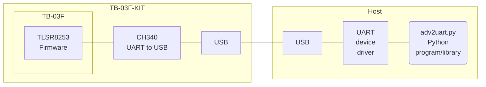
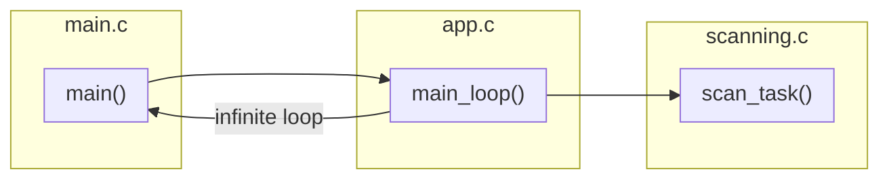
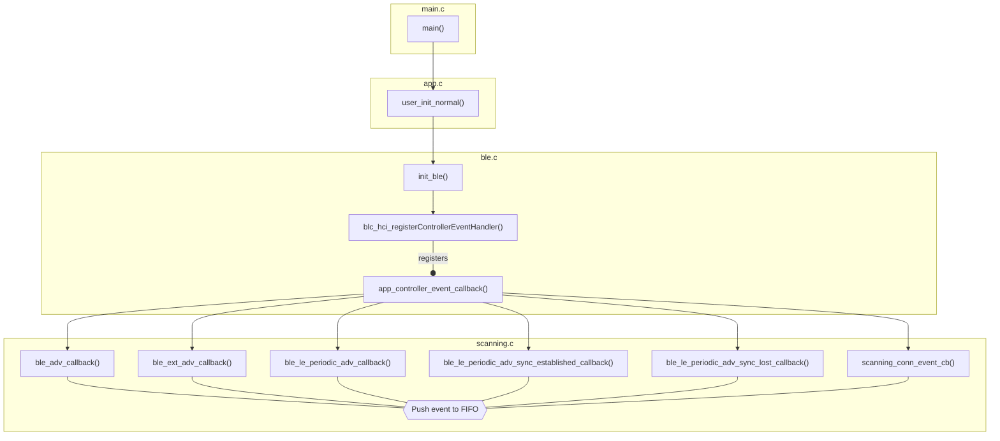

# TLSR825x ADV_BLE2UART ble2uart

__TLSR825x firmware__ implementing a BLE scanner, which continuously receives BLE advertisements and delivers them to a host connected via UART-to-USB adapter.


```mermaid
%%{init: {"flowchart": {"htmlLabels": false}} }%%
flowchart LR;

subgraph TLSR825x["TB-03F-KIT"]
subgraph TB-03F
Firmware["TLSR8253\nFirmware"]
end

CH340["CH340\nUART to USB"]
USBD["USB"]
end

subgraph Host
USBH["USB"]
UART["UART\ndevice\ndriver"]
adv2uart("adv2uart.py\nPython\nprogram/library")
end


Firmware --- CH340 --- USBD --- USBH --- UART --- adv2uart
```

Characteristics of this BLE receiver firmware:

- compatible with [Telink TLSR825x SoC](http://wiki.telink-semi.cn/wiki/chip-series/TLSR825x-Series/);
- tested on Ai-Thinker [TB-03F-KIT](https://docs.ai-thinker.com/_media/tb-03f-kit_specification_en.pdf);
- output to UART, 2000000 (default), 921600 baud, or 115200 baud; the bitrate can be changed with the "PROG" key of TB-03F-KIT, toggling between the defined ones (e.g. at the moment 2000000 [one blink], 921600 [two blinks] or 115200 [three blinks], but other bitrates can be added); any change in the bitrate performed with the key is permanently stored to the firmware flash;
- robust datalink with CRC16 for error detection while transitting data;
- software FIFO sized for 4 packets of 240 bytes;
- the firmware can scan BLE PHY 1M advertisements and Coded PHY S8 advertisements (125kbps BLE Long Range mode) concurrently;
- white-list and black-list for 64 MAC addresses;
- on-demand `CMD_ID_VBAT` measurement of the chip `VBAT` / board `3.3 V` rail;
- LEDs to monitor the BLE advertising interface;
- the software exploits the latest version of the [Telink SDK](https://wiki.telink-semi.cn/wiki/chip-series/TLSR825x-Series/#software-development-kit) for [Bluetooth LE Multi Connection](https://wiki.telink-semi.cn/tools_and_sdk/BLE/B85M_BLE_SDK.zip);
- ready-to-compile makefile;
- compact bidirectional byte-oriented protocol with CRC16-protected UART transport;
- the BLE device can be fully controlled by the hosts via commands;
- Available commands can be extended.

If the RGB LED switches on for a while (all three colors) when powering on the device (e.g., new device), it means that the default bitrate has an invalid value; press the PROG key to define a valid UART bitrate.

## TB-03F-KIT LEDs

IC Port |LED Color|Description
--------|---------|-----------
PC4     |RGB Green|PHY 1M advertisement received
PC2     |RGB Blue |Coded PHY advertisement received
PB4     |Yellow   |Advertisement succesfully sent to the UART FIFO
PC3     |RGB Red  |FIFO overflow error, when the UART troughtput is not enough to process all received BLE advertisements
PB5     |White    |Host command received from the UART

If a FIFO overflow is detected, it is suggested to add filters to the black and white lists to reduce the set of processed advertisements.

Configuring the controller to transmit at 2000000 baud (default bitrate) is suggested if also the host device driver allows this throughput. Reducing the bitrate increases the risk of FIFO overflow.

## Installation and compilation

### Using pre-built assets

The [Releases](https://github.com/pvvx/ADV_BLE2UART/releases) folder provides the *ble2uart.zip* ZIP archive, which is auto-generated by a [GitHub Action](.github/workflows/build.yml). The ZIP file includes the following assets:

- *TLSR825xScanner.bin*: precompiled firmware
- *Telink_Tools.exe*: Windows flash tool to upload the firmware to the device (pre-compiled from *Telink_Tools.py*)
- *adv2uart.exe*: Windows test program which prints the advertisement messages produced by the device (pre-compiled from *adv2uart.py*)

Steps to install the firmware and test the device:

- Unzip the *ble2uart.zip* archive to a directory.
- Connect the device to an USB port.
- Open the Device Manager to verify the COM port in use (COM7 in the following examples).
- Open a Windows CMD (Command Prompt).

To flash the firmware:

```
Telink_Tools.exe --port COM7 burn TLSR825xScanner.bin
```

To test the device:

```
adv2uart.exe -p COM7 -i
```

### Compilation from sources

```
git clone https://github.com/pvvx/ADV_BLE2UART
```

Python is required for *adv2uart.py*. Prerequisite modules:

```cmd
pip3 install pyserial
pip3 install construct
```

Use a UNIX system to compile the sources. The [Ubuntu](https://apps.microsoft.com/detail/9pn20msr04dw) distribution for [WSL](https://en.wikipedia.org/wiki/Windows_Subsystem_for_Linux) is a way to easily perform the compilation with a Windows system.

Needed components for the firmware compilation:

```cmd
sudo apt-get install make bzip2
```

Compiling the firmware (including `make clean`) and copying the created TLSR825xScanner.elf flash image to TLSR825xScanner.bin:

```
cd ADV_BLE2UART/source/ble2uart
make
```

Recompiling the firmware without `make clean` and copying the created TLSR825xScanner.elf flash image to TLSR825xScanner.bin:

```
make main-build
```

Make all files, run TlsrMemInfo.py, do not copy the TLSR825xScanner.elf flash image to TLSR825xScanner.bin:

```
make sizedummy
```

Cleaning files (but not the SDK, which also needs `rm -r SDK`):

```
make clean
```

The compiled firmware is in the directory ADV_BLE2UART/source/ble2uart/TLSR825xScanner.bin

### Debug some SDK functions

To print UART debug messages tracing the parameters used to invoke some SDK functions (`blc_ll_setExtScanParam()`, `blc_ll_setExtScanEnable()`, advertising event callback function), set `DEBUG_MSG` to 1 in *app_config.h*. This can be used to check the actual effect of the configuration dictionary passed to `adv_scanning.build()` in *adv2uart.py*.

## Flashing the firmware

### Flashing the firmware via TlsrPgm.py

*TlsrPgm.py* needs a hw patch applied to the device: [How to write TLSRPGM program to TB-03F-KIT or TB-04-KIT](https://github.com/pvvx/TLSRPGM/tree/main/sources/UART2SWire/tb-0x-pgm).

Flash the firmware via the following command (`we` = write file to flash erasing related buffers):

```
PGM_PORT=COM10 make flash
```

To erase all flash:

```
PGM_PORT=COM10 make erase
```

To perform a chip soft reset and get External Chip Information:

```
PGM_PORT=COM10 make reset
```

### Alternative firmware update procedure via USBCOMFlashTx.html

https://pvvx.github.io/ATC_MiThermometer/USBCOMFlashTx.html

### Alternative firmware update procedure via Telink_Tools.py

Similarly to the *USBCOMFlashTx.html* web program, the *Telink_Tools.py* Python application allows uploading the firmware to the TB-03F-KIT device without needing the hw patch.

Connect the device to a PC via USB. Run the [Telink_Tools.py](https://github.com/Ircama/freetz-ble/blob/main/ble-adv-telink/make/Telink_Tools.py) Python program (Python2 and Python3, Windows and Linux). It requires `pip install pyserial`.

Example to burn the firmware with the Ai-Thinker device connected via USB to the virtual COM8 serial port of the PC:

```
python3 Telink_Tools.py --port com8 burn TLSR825xScanner.bin
```

### Running Telink_Tools.py and adv2uart.py via WSL

While there are ways to map Windows USB serial ports to WSL, the easiest method is to run the Windows Python programs from WSL (provided that [Python for Windows](https://apps.microsoft.com/detail/9nrwmjp3717k?hl=en-us&gl=US) is installed):

```bash
# from WSL
make && cmd.exe /c 'python3 freetz-ble\ble-adv-telink\make\Telink_Tools.py --port com10 burn ADV_BLE2UART\source\ble2uart\TLSR825xScanner.bin'
```

Similarly, you can also run *adv2uart.py*:

```bash
# from WSL
cmd.exe /c 'python3 ADV_BLE2UART\source\ble2uart\adv2uart.py -p com10 -i'
```

## Binary command protocol

All host↔firmware communication uses a unified binary framing with CRC-16 error detection. The protocol is described in the **API** section. This section documents all commands currently supported by the firmware.

### Frame format

Every frame (command and response alike) has the same structure:

```
[payload_len: 1B] [cmd/rssi: 1B] [id/evtype: 1B] [data_len/adtype: 1B] [marker/phys: 1B] [mac/data: 6B] [optional payload] [CRC16-lo: 1B] [CRC16-hi: 1B]
```

For **command responses**, byte[4] (marker/phys) is always `0xFF`. The `id` byte carries a sub-result or state value; `data_len` is the number of valid bytes in the 6-byte data field.

### Command status codes

All commands that include an operation byte return a status in the `id` field of the response:

| Code | Name | Meaning |
|------|------|---------|
| 0 | `CMD_STATUS_OK` | Operation succeeded |
| 1 | `CMD_STATUS_ARGS` | Wrong number or invalid arguments |
| 2 | `CMD_STATUS_PIN` | Invalid or unsupported GPIO pin |
| 3 | `CMD_STATUS_DENIED` | Operation refused (e.g. not connected) |
| 4 | `CMD_STATUS_VALUE` | Argument value out of range |

### Commands reference

#### `0x00` CMD_ID_INFO — device information

Sent by firmware on startup or in response to a `CMD_ID_INFO` request.

| Field | Response value |
|-------|----------------|
| `id` | SW version (BCD, e.g. `0x01` = "0.1") |
| `data_len` | 6 |
| `data[0..5]` | Public MAC address (little-endian) |

The `adv2uart_gui.py` GUI sends this command at connect time and displays the firmware version and local MAC.

---

#### `0x01` CMD_ID_SCAN — start / stop BLE scanning

Two request formats are supported (both backward-compatible with each other):

**Short format — shared window (3-byte payload):**

`[0x01] [scan_mode: 1B] [window_lo: 1B] [window_hi: 1B]`

- `scan_mode` bit-field: PHY selection, filter flags (public/random/private addresses, duplicate filter, active/passive scan).
- `window` is the *scan interval / window* in units of 0.625 ms, applied equally to both 1M and Coded PHY.

**Extended format — independent windows (5-byte payload):**

`[0x01] [scan_mode: 1B] [window_1m_lo: 1B] [window_1m_hi: 1B] [window_coded_lo: 1B] [window_coded_hi: 1B]`

- `window_1m` applies to the 1M PHY scan.
- `window_coded` applies to the Coded PHY scan. If the Coded PHY minimum window (see `CMD_ID_RFSDK` op=4) is larger than `window_coded`, the minimum is used as a floor.

Sending `window_coded = 0` in the extended format is equivalent to the short format (same as `window_1m` with minimum-window floor applied).

Response `data[0..N-1]` echoes the accepted payload bytes.

The **Scan** tab of `adv2uart_gui.py` exposes two separate spinboxes — *1M window ms* and *Coded window ms* — and sends the extended format automatically when the two values differ; the short format is sent when they are equal (remains compatible with older firmware).

---

#### `0x02` CMD_ID_WMAC — add MAC to white list
#### `0x03` CMD_ID_BMAC — add MAC to black list

Request format: `[0x02/0x03] [mac_bytes: 1..6B]`

The MAC field accepts **1 to 6 bytes**. When fewer than 6 bytes are supplied, only the most-significant bytes (OUI end) are matched: a 3-byte entry matches any device whose OUI equals those 3 bytes. This allows filtering entire manufacturers without listing individual addresses.

Response `id` = current list count; `data[0..5]` = accepted MAC (zero-padded on the right if partial).

---

#### `0x04` CMD_ID_CLRM — clear MAC filter list

Request format: `[0x04]`

Response `id` = maximum list capacity.

---

#### `0x05` CMD_ID_PRNT — debug print (firmware → host only)

Never sent by the host. The firmware uses this command ID to push `uart_printf()` messages as framed packets into the FIFO. The payload is the raw ASCII text.

---

#### `0x06` CMD_ID_GPIO — GPIO / LED control

Request format: `[0x06] [op: 1B] [pin_code: 1B] [...]`

`pin_code` is derived from the GPIO mnemonic: high nibble = port group (`A=0`, `B=1`, `C=2`, `D=3`), low nibble = pin number. Examples: `PA7 = 0x07`, `PB4 = 0x14`, `PC2 = 0x22`.

Operations (`op`):
- `0` — query pin state and board mask
- `1` — read single pin value: `[0x06, 1, pin_code]`
- `2` — write single pin value: `[0x06, 2, pin_code, value]` *(LED pins only)*
- `3` — toggle single pin: `[0x06, 3, pin_code]` *(LED pins only)*
- `4` — configure GPIO: `[0x06, 4, pin_code, input_en, output_en, pull]`

`pull`: `0` = floating, `1` = pull-up 1M, `2` = pull-down 100K, `3` = pull-up 10K.

Supported TB-03F-KIT pin codes:

| pin_code | GPIO | Function | Capabilities |
|----------|------|----------|--------------|
| `0x07` | PA7 | KEY_USER / SWS | read/config (input only) |
| `0x14` | PB4 | Yellow LED | read/write/toggle/config |
| `0x15` | PB5 | White LED | read/write/toggle/config |
| `0x22` | PC2 | RGB Blue LED | read/write/toggle/config |
| `0x23` | PC3 | RGB Red LED | read/write/toggle/config |
| `0x24` | PC4 | RGB Green LED | read/write/toggle/config |

UART transport pins `PA0` (RX) and `PB1` (TX) are not accepted to avoid breaking the serial link.

Response `data`: `[op, pin_code, value, led_mask, board_mask_lo, board_mask_hi]`.

`board_mask` bit positions: bit 0 = KEY PA7, bit 1 = Blue PC2, bit 2 = Red PC3, bit 3 = Green PC4, bit 4 = Yellow PB4, bit 5 = White PB5.

---

#### `0x08` CMD_ID_UART — UART ping / baud rate configuration

Request format: `[0x08] [op: 1B] [...]`

Operations:
- `0` — query current baud rate configuration
- `1` — send ping: `[0x08, 1, seq_lo, seq_hi, pattern]` — echoes back the sequence number and pattern
- `2` — change baud rate: `[0x08, 2, baud_index]`

Available baud rate indices: `0` = 2 000 000, `1` = 921 600, `2` = 115 200.

Response `data`: `[op, baud_index, count, baud_lo, baud_mid, baud_hi]`.

**Note**: after a `CMD_STATUS_OK` response to baud-rate change op=2, the firmware switches to the new baud rate within ~600 ms. The host must reconnect at the new rate.

---

#### `0x09` CMD_ID_RFSDK — RF and scan runtime tuning

Request format: `[0x09] [op: 1B] [...]`

Operations:
- `0` — query current RF settings
- `1` — set TX power: `[0x09, 1, power_index]`
- `2` — set crystal capacitance override: `[0x09, 2, cap_value]` (`0xFF` = use calibrated value)
- `3` — set primary scan channels: `[0x09, 3, ch0, ch1, ch2]` (default: 37, 38, 39)
- `4` — set Coded PHY minimum scan window: `[0x09, 4, min_10ms]` (units: 10 ms)

Response `data`: `[power, cap, ch0, ch1, ch2, coded_min_units]`.

---

#### `0x0A` CMD_ID_VERSION — hardware / firmware / SDK version

Request format: `[0x0A]`

| Response field | Value |
|----------------|-------|
| `id` | SW version (BCD) |
| `data[0]` | HW version (`0x10` = TB-03F-KIT) |
| `data[1]` | SDK certification mark |
| `data[2]` | SDK structure version |
| `data[3]` | SDK major version |
| `data[4]` | SDK minor version |
| `data[5]` | SDK patch number |

---

#### `0x0F` CMD_ID_VBAT — on-demand VBAT / supply measurement

Request format: `[0x0F]`

Returns the current chip supply `VBAT` in millivolts. On TB-03F-KIT this is the `3.3 V` rail after the onboard regulator (not the `5 V` micro-USB input).

Host tooling support:
- `adv2uart.py` exposes `--battery` and `Ble2Uart.read_vbat()`.
- `adv2uart_gui.py` exposes a `VBAT` button and shows the latest reading in the Device bar.

| Response field | Value |
|----------------|-------|
| `id` | `CMD_STATUS_*` result |
| `data[0]` | voltage low byte |
| `data[1]` | voltage high byte |

Implementation note: on TLSR8253 / TB-03F-KIT the measurement uses free ADC-capable pin `PB7`, which must remain unused by the application.

---

#### `0x0B` CMD_ID_TXADV — transmit custom advertisement *(currently disabled)*

Start, stop or query a custom advertisement set transmitted by the device itself.

Request format:
- **Stop**: `[0x0B, 0]`
- **Start**: `[0x0B, 1, phy, interval_lo, interval_hi, adv_len, adv_data...]`
- **Query**: `[0x0B, 0x0F]`

`phy` values:

| Value | Description |
|-------|-------------|
| 0 | Legacy 1M (`ADV_NONCONN_IND`) |
| 1 | Extended 1M |
| 2 | Extended Coded PHY |

`interval` is in units of 0.625 ms (minimum 20 ms = value 32). `adv_data` is the raw AD payload (max 31 bytes).

Response `data`: `[running_phy, interval_lo, interval_hi, adv_len, 0, 0]`.  
`running_phy` = 0 when stopped; 1/2/3 when active (value = `phy + 1`).

Currently returns `CMD_STATUS_DENIED` (see RAM note below).

The **TX Adv** tab of `adv2uart_gui.py` provides a graphical interface for this command.

---

#### `0x0C` CMD_ID_CONN — BLE ACL connection (central role) *(connect/cancel currently disabled)*

Establishes, terminates or queries a BLE connection to a peripheral device. The firmware operates as a BLE central (master) with a maximum of one simultaneous connection.

Request format:

| op | Description | Additional bytes |
|----|-------------|-----------------|
| `0` | Query connection state | — |
| `1` | Connect via 1M PHY | `[addr_type, addr[0..5]]` |
| `2` | Connect via Coded PHY | `[addr_type, addr[0..5]]` |
| `3` | Disconnect | — |
| `4` | Cancel pending connection attempt | — |

`addr_type`: `0` = Public, `1` = Random.  
`addr[0..5]`: peer MAC address in little-endian (LSB first) wire order.

Response `data`: `[state, peer_addr_type, peer_addr[0..3], 0]`.

**Async notifications**: when a connection is established or dropped by either side, the firmware would push a `CMD_ID_CONN` response with the new state.

`state` values:

| Value | Meaning |
|-------|---------|
| 0 | Idle |
| 1 | Connecting |
| 2 | Connected |

Op=0 (status query) always works. Op=1/2/3/4 (connect/disconnect/cancel) return `CMD_STATUS_DENIED` (see RAM note below).

The **BLE Conn** tab of `adv2uart_gui.py` provides a graphical interface for connection management.

---

#### `0x0D` CMD_ID_TXDATA — ATT Write to connected peer *(currently disabled)*

Request format: `[0x0D, att_handle_lo, att_handle_hi, data_len, data...]`

Sends an ATT Write Without Response (Write Command) to the given ATT handle of the connected peer. `data_len` ≤ 20 bytes.

Response `data`: `[att_handle_lo, att_handle_hi, data_len, ble_status, 0, 0]`.

Currently returns `CMD_STATUS_DENIED` (see RAM note below).

---

#### `0x0E` CMD_ID_RXDATA — ATT notification / indication from peer *(currently disabled)*

Firmware → host async push. Never sent by the host.

When the connected peer sends an ATT Handle Value Notification (opcode `0x1B`) or Indication (opcode `0x1D`), the firmware would push a frame with:
- `id` = ATT opcode (`0x1B` = notification, `0x1D` = indication)
- `data[0..1]` = ATT handle (little-endian)
- `data[2]` = value length
- `data[3..5]` = first 3 bytes of the ATT value

Currently disabled (see RAM note below).

---

> **RAM constraint — disabled commands**: Each BLE SDK module in `liblt_8258.a` carries large hidden BSS (the extended advertising module alone adds ~7.8 KB; the ACL central role module adds a similar amount). The TLSR8253F512 has only 64 KB of SRAM, with ~55 KB already used by the scanner stack. Initializing any of these modules leaves less than 1 KB of stack space, causing a hard crash. Until a device with more SRAM is used, commands `0x0B` CMD_ID_TXADV, `0x0C` CMD_ID_CONN (connect/disconnect/cancel), `0x0D` CMD_ID_TXDATA, and `0x0E` CMD_ID_RXDATA all return `CMD_STATUS_DENIED`.

---

## Persistent user data storage

After erasing a buffer, data can be written only once (not twice). A rewrite needs erasing data first. To avoid too many rewrites (that wear the storage), data are organized in an array where each segment is progressively updated in sequence so that the last value is the actual one.

See "tinyFlash.c".

### Erasing the user data flash

```bash
Telink_Tools.py --port com10 erase_flash 0x70000 1
Telink_Tools.py --port com10 erase_flash 0x71000 1
Telink_Tools.py --port com10 write_flash_fill 0x70000 "00"
```

The first two commands erase one buffer starting from the indicated address (0x70000 or 0x71000). The resulting data are initialized to 0xff.

The third command writes 00 to the first byte. Notice that a *write_flash_fill* also checks that the remaining data until the end of the buffer are set to 0xff and, for each data that needs to be changed, it initializes it to 0xff; as they are already to this value, all data subsequent to 00 are not rewritten and can be used by the application.

### Reading the first buffer

```bash
Telink_Tools.py --port com10 read_flash 0x70000 255
```

### Reading the second buffer

```bash
Telink_Tools.py --port com10 read_flash 0x71000 255
```

## SDK Update

Compiling without reinstalling the SDK:

```bash
cd ADV_BLE2UART/source/ble2uart
make
```

If the compiler is not included in the SDK, the makefile downloads it.

Two install scripts are provided:

- *install_sdk_v4023.sh* — **recommended**: clones [Telink BLE SDK V4.0.2.3](https://github.com/telink-semi/tc_ble_sdk) directly from GitHub (tag `V4.0.2.3`) and applies a `liblt_8258.a` fix (see note below).
- *install_sdk_v4013.sh* — legacy: downloads `telink_b85m_ble_sdk_V4.0.1.3_Patch` from the Telink website and applies patch_0001_20231201 and patch_0002_20240402.

> **Note — Coded PHY bug in V4.0.2.2 / V4.0.2.3**: `liblt_8258.a` shipped in SDK tags V4.0.2.2 and V4.0.2.3 contains a bug that crashes the BLE stack when receiving Coded PHY advertisements. *install_sdk_v4023.sh* automatically replaces that library with the V4.0.2.1 version as a workaround.

Reinstall the SDK and compile:

```bash
cd ADV_BLE2UART/source/ble2uart
rm -r SDK
./install_sdk_v4023.sh
make
```

## SDK Documentation

Documentation on using the API can be found in the header comments of the SDK files.

## adv2uart.py Usage

This program reads the advertisement messages produced by the device (Python 3).

```
usage: adv2uart.py [-h] [-d] [-v] [-i] [-s SLEEP] [-b BAUDRATE] [-p PORT] [-t TIMEOUT] [-n NUMBER]
                   [--duration DURATION] [--idle-timeout IDLE_TIMEOUT] [--status-interval STATUS_INTERVAL]
                   [--phy {1m,coded,both}] [--scan-window-ms SCAN_WINDOW_MS]
                   [--filter-random | --accept-random] [--filter-private | --accept-private]
                   [--info-after INFO_AFTER] [--battery]

optional arguments:
  -h, --help            show this help message and exit
  -d, --debug           Print debug information
  -v, --verbose         Print verbose information
  -i, --info            Print limited debug information
  -s SLEEP, --sleep SLEEP
                        add an initial delay in seconds before the query (default: 1)
  -b BAUDRATE, --baudrate BAUDRATE
                        serial connection baudrate (default: 2000000)
  -p PORT, --port PORT  Serial port; default = COM11 or /dev/ttyUSB0
  -t TIMEOUT, --timeout TIMEOUT
                        serial port read timeout in seconds (default: 0.3)
  -n NUMBER, --number NUMBER
                        Number of advertisements to process (default is 0 = infinite)
  --duration DURATION   stop scanning after this many seconds (default: 0 = infinite)
  --idle-timeout IDLE_TIMEOUT
                        stop scanning after this many seconds without advertisements (default: 0 = disabled)
  --status-interval STATUS_INTERVAL
                        print an idle status every N seconds while listening (default: 10, 0 = disabled)
  --phy {1m,coded,both}
                        scan PHY selection (default: both)
  --scan-window-ms SCAN_WINDOW_MS
                        scan window in milliseconds (default: 30)
  --filter-random       discard random-address advertisements
  --accept-random       accept random-address advertisements (default)
  --filter-private      discard private-address advertisements
  --accept-private      accept private-address advertisements (default)
  --info-after INFO_AFTER
                        send INFO this many seconds after scan start and report whether it is acknowledged
    --battery             query the current VBAT / 3V3 rail in millivolts and exit

BLE ADV_BLE2UART scanner
```

To query only the device supply rail instead of starting a scan:

```bash
python3 adv2uart.py -p /dev/ttyUSB0 -b 2000000 --battery -i
```

The command returns the module `VBAT` / `3.3 V` rail in millivolts, not the upstream `5 V` USB input.

In `adv2uart_gui.py`, the **Device** bar shows a `VBAT` field: it is queried automatically after connect and can be refreshed on demand with the `VBAT` button.

## API

```python
from adv2uart import Ble2Uart

dv = Ble2Uart(
    port=...,
    baud=...,
    timeout=...,
    mac_separator=...
)
```

Parameter|Description
---------|-----------
port|device name, depending on operating system. e.g. `"/dev/ttyUSB0"` on GNU/Linux or `"COM10"` on Windows.
baud|Baud rate. CH340 supports common baud rates: 50, 75, 100, 110, 134.5, 150, 300, 600, 900, 1200, 1800, 2400, 3600, 4800, 9600, 14400, 19200, 28800, 33600, 38400, 56000, 57600, 76800, 115200, 128000, 153600, 230400, 460800, 921600, 1500000, 2000000 baud. Some devices only support up to 921600 baud, some up to 115200 baud.
timeout|Read timeout value in seconds. Default is 0.3 seconds. `None` waits until 64 bytes are received. 0 is non-blocking (never waits).
mac_separator|Separator of each digit of the 6-bytes MAC address. The default is no separator. To set it to a colon, use `mac_separator=':'`.

### black_white_list()

```python
black_white_list(white_list=[ ... ], black_list=[ ... ], info=True, clear=True, start=True)
```

- Info=False: do not send the info command
- clear=False: do not send the list clear command
- start=False: do not start advertising.

### read_adv()

`read_adv()`: *read serial input, detect advertisements and decode commands*.

### read_vbat()

`read_vbat(wait_seconds=2.0)`: send `CMD_ID_VBAT`, wait for the response and return `(status, millivolts)`.

- `status = 0` means success and `millivolts` contains the measured `VBAT` / `3.3 V` rail value.
- `status != 0` means the command was rejected or malformed.
- `status is None` means the query timed out before a response arrived.

Returned parameters: rssi, evtp, adtp, phys, mac, payload

Format of the input packet (commands and advertisements have different content):

General packet format:

- 5-byte header,
- 6-byte MAC,
- optional payload,
- crc_16 at the end.

Description:

- Header: 5 bytes (fixed for commands and advertisements)

    - the first byte is the length of the payload

      - If command: 0

    - rssi

      - If command: command number

    - adtp:
        - BT4.2: pa->event_type
        - ext_adv: pa->event_type
        - periodic_adv: pExt->subEventCode

        - If command: mac array position, or max number of positions
        - If command 0=CMD_ID_INFO: version in BCD format; 0x34 -> '3.4'

        ````
        ADV_REPORT_EVENT_TYPE_ADV_IND           = 0x00,
        ADV_REPORT_EVENT_TYPE_DIRECT_IND        = 0x01,
        ADV_REPORT_EVENT_TYPE_SCAN_IND          = 0x02,
        ADV_REPORT_EVENT_TYPE_NONCONN_IND       = 0x03,
        ADV_REPORT_EVENT_TYPE_SCAN_RSP          = 0x04,
        ````

    - evtp:
        - BT4.2: pa->adr_type & 0x0f
        - ext_adv: (pa->address_type & 0x0f) | (pa->direct_address_type << 4)
        - periodic_adv: periodic_adv.advAddrType & 0x0f

        - If command: length of the command data; can be 0

        ````
        PUBLIC = 0,
        RANDOM = 1,
        RESOLVE_PRIVATE_PUBLIC = 2,
        RESOLVE_PRIVATE_RANDOM = 3,
        ````

    - phys
        - bt4.2: 0x00
        - ext_adv: pa->primary_phy | (pa->secondary_phy << 4)
        - periodic_adv: periodic_adv.advPHY

        - If command: 0xff

        ````
        BLE_PHY_1M              = 0x01,
        BLE_PHY_2M              = 0x02,
        BLE_PHY_CODED           = 0x03,
        ````

- mac: 6 bytes, fixed for commands and advertisements
        for advertisements: MAC in scope

        - If command CMD_ID_CLRM: 000000000000
        - If command CMD_ID_INFO: public MAC address of the device
        - If command CMD_ID_SCAN: adv_scanning parameters; see length
        - If CMD_ID_WMAC and CMD_ID_BMAC: MAC in scope

- payload: variable length 'l'
 
    - If command: not present

- crc: 2 bytes, fixed for commands and advertisements
        CRC16 of the total packet length

header (5 bytes) + mac (6 bytes) + crc (2 bytes) = 13 bytes
total packet length: l + 13

### command()

```python
from adv2uart Command, adv_scanning
```

Argument:

- Command.CMD_ID_INFO
- Command.CMD_ID_CLRM
- Command.CMD_ID_WMAC + mac_reverse
- Command.CMD_ID_BMAC + mac_reverse
- Command.START_SCAN
- Command.STOP_SCAN
- Command.CMD_ID_SCAN + adv_scanning.build(adv_scan_params)
- Command.DEBUG_PRINT

A Command.DEBUG_PRINT return message is generated by the `uart_printf()` print debugger: related debugging frames have:

- 5-byte header (message length, 05=CMD_ID_PRNT, 0xff, 0xff, 0xff),
- null MAC (00, 00, 00, 00, 00, 00),
- payload (message body)
- crc_16 at the end.

The the `uart_printf()` message is printed by `adv2uart.py` as a `Command.DEBUG_PRINT` warning and uses the FIFO.

The `p_printf()` function writes a `Command.DEBUG_PRINT` packet to the USB UART without using the FIFO.

The `raw_printf()` function writes raw data to the USB UART directly calling `uart_send()`, without using FIFO/headers/crc, and it is not compatible with `adv2uart.py`.

Examples of the structure of some commands, as produced by `command()`:

- Command CMD_ID_INFO: `00 00 01 06 ff a4c138bfff34`
- Command CMD_ID_CLRM: `00 04 40 00 ff 000000000000`
- Command CMD_ID_BMAC: `00 03 01 06 ff aabbccddeeff`
- Command CMD_ID_SCAN: `00 01 10 03 ff 000000003033`

### Example of usage of the API

```python
from adv2uart import Ble2Uart

dv = Ble2Uart(port="...", baud=..., timeout=0.1)  # example: dv = Ble2Uart(port="/dev/ttyUSB0", baud=115200, timeout=0.1)
dv.read(64)  # flush
dv.black_white_list(white_list=[...], black_list=[...])  # load black and white lists; example: dv.black_white_list(white_list=[], black_list=["aabbccddeef0", "aabbccddeef1"])
while True:
    rssi, evtp, adtp, phys, mac, payload = dv.read_adv()
    print(mac, payload)
```

### Example of usage of custom commands

```python
from adv2uart import Ble2Uart, Command, adv_scanning

dv = Ble2Uart(port="...", baud=..., timeout=1)
dv.read(64)
dv.command(Command.CMD_ID_INFO)
dv.command(Command.CMD_ID_CLRM)
dv.black_white_list(white_list=[...], black_list=[...], info=False, clear=False, start=False)
dv.command(Command.CMD_ID_SCAN + adv_scanning.build(
        {
            "flag": {
                "address_type": "PUBLIC",
                "address_type_filter_random": True,
                "address_type_filter_private": True,
                "DUP_FILTER_ENABLE": False,
                "SCAN_TYPE_ACTIVE": False,
                "SCAN_PHY_CODED": True,
                "SCAN_PHY_1M": True
            },
            "window_ms": 30
        }
    )
)

for i in range(20):
    rssi, evtp, adtp, phys, mac, payload = dv.read_adv()
    print(mac, payload)

dv.command(Command.STOP_SCAN)
```

### DUP_FILTER_ENABLE

Set to True to filter duplicates (duplicate advertisings)

### SCAN_TYPE_ACTIVE

This parameter can be set as “passive scan” (False) or “active scan” (True). For active scan, when an advertising packet is received, a "scan_req" will be sent to the remote device to obtain more information. For passive scan, the "scan req" won’t be sent. 

### window_ms / window_coded_ms

*scan_interval* and *scan_window* are internal parameters used within the Telink *blc_ll_setExtScanParam()* SDK system call (invoked by `Command.START_SCAN`).

*scan_interval* is the time interval from when the Controller started its last scan until it begins the subsequent scan on the primary advertising physical channel.

*scan_window* is the duration of the scan on the primary advertising physical channel.

`window_ms` = *scan_interval* × 0.625; unit is in milliseconds.

*scan_interval* is set by the firmware with the same value as the *scan_window*.

`window_coded_ms` sets an **independent** scan window for the Coded PHY. When set to `0` (or omitted), the Coded PHY uses the same value as `window_ms`. This allows, for example, using a short 30 ms window for 1M scanning while using a wider 150 ms window for Long Range (Coded PHY) scanning, so both PHYs receive adequate air time.

## Documentation of the source code of the firmware 


```mermaid
%% a class diagram is used simply for rendering, but the code is just standard C, with no OO paradigm
classDiagram
    main --|> app
    app --|> ble
    ble --|> app_buffer
    ble --|> tinyFlash
    ble --|> blt_common
    app --|> scanning
    scanning --|> ble
    scanning --|> drv_uart
    scanning --|> utils
    scanning --|> crc

    class main["main.c"]{
        Set up environment and run the main_loop function in infinite loop
        _gpio_init
        irq_handler
        main

        %% Invoked functions:
        clock_init(SYS_CLK_TYPE);
        _gpio_init(1)
        rf_drv_init(RF_MODE_BLE_1M) also available RF_MODE_LR_S8_125K
        on_application_close()
        adc_power_on_sar_adc(0)
        lpc_power_down()
        user_init_normal() [in app.c]
        main_loop() loops forever [in app.c]
    }

    class app["app.c"]{
        %% Functions:
        user_init_normal --> random_generator_init() and then init_ble() [in ble.c]
        main_loop
        
        %% Invoked functions:
        blc_sdk_main_loop()
        scan_task() [in scanning.c]
    }

    class ble["ble.c"]{
        %% Functions:
        init_ble [BLE configuration]
        start_adv_scanning
        conn_start
        conn_stop
        conn_state_get
        conn_handle_get
        conn_peer_addr_get
        conn_interval_get
        txadv_start
        txadv_stop

        %% Invoked functions in init_ble:
        blc_initMacAddress() [in blt_common.c]
        blc_ll_initBasicMCU();
        init_uart(port_speed);
        crcInit();
        blc_ll_initStandby_module(mac_public)

        blc_ll_initExtendedScanning_module()
        blc_ll_initExtendedInitiating_module();

        blc_ll_initPeriodicAdvertisingSynchronization_module();
        blc_ll_initAclConnection_module();
        blc_ll_initAclCentralRole_module();
        blc_ll_setMaxConnectionNumber(MASTER_MAX_NUM, SLAVE_MAX_NUM);
        blc_ll_setAclConnMaxOctetsNumber(...);
        blc_ll_initAclConnRxFifo(...);
        blc_ll_initAclCentralTxFifo(...);
        blc_hci_registerControllerEventHandler(app_controller_event_callback);
        blc_hci_le_setEventMask_cmd(...);
        blc_hci_setEventMask_cmd(HCI_EVT_MASK_DISCONNECTION_COMPLETE);
        blc_controller_check_appBufferInitialization();
        %% Note: L2CAP/GATT/SMP not initialized (saves ~1180 B library BSS)
        rf_set_power_level_index(MY_RF_POWER);

        blc_ll_setExtScanParam() [in start_adv_scanning]
        blc_ll_setExtScanEnable() [in start_adv_scanning]
        blc_ll_createConnection() [in conn_start]
        blc_ll_disconnect() [in conn_stop]
        blc_ll_createConnectionCancel() [in conn_stop]
    }

    class app_buffer["app_buffer.c"]{
        %% Functions:
        app_acl_rxfifo
        app_acl_mstTxfifo
        mtu_m_rx_fifo
    }

    class tinyFlash["tinyFlash.c"]{
        %% Functions:
        tinyFlash_Init
        tinyFlash_Read
        tinyFlash_Write
        tinyFlash_Swap
        flash_write
    }

    class scanning["scanning.c"]{
        %% Functions:
        scan_task
        send_resp

        ble_adv_callback
        ble_ext_adv_callback
        ble_le_periodic_adv_callback
        scanning_conn_event_cb
        handle_conn_command
        handle_txdata_command

        %% Commands dispatched in scan_task:
        %% 0x00 CMD_ID_INFO  0x01 CMD_ID_SCAN
        %% 0x02 CMD_ID_WMAC  0x03 CMD_ID_BMAC  0x04 CMD_ID_CLRM
        %% 0x05 CMD_ID_PRNT  0x06 CMD_ID_GPIO (ops 0-4)
        %% 0x07 CMD_ID_LED   0x08 CMD_ID_UART  0x09 CMD_ID_RFSDK  0x0A CMD_ID_VERSION  0x0F CMD_ID_VBAT

        %% Invoked functions:
        my_fifo_get() [SDK/common/utility.c]
        uart_send() [in drv_uart.c]
        uart_read() [in drv_uart.c]
        gpio_write()
        start_adv_scanning() [in ble.c]
        txadv_start() [in ble.c]
        txadv_stop() [in ble.c]
        conn_start() [in ble.c]
        conn_stop() [in ble.c]
        conn_state_get() [in ble.c]
        send_resp()
    }

    class drv_uart["drv_uart.c"]{
        %% Functions:
        init_uart
        uart_send
        uart_read
    }

    class utils["utils.c"]{
        %% Stub include file; all utility/memory functions are provided by the SDK:
        %% memset, memcpy, memcmp  →  SDK/common/string.c
        %% my_fifo_init, my_fifo_wptr, my_fifo_push, my_fifo_get  →  SDK/common/utility.c
    }

    class blt_common["blt_common.c"]{
        %% Functions:
        blc_initMacAddress
    }

    class crc["crc.c"]{
        %% Functions:
        crcInit
        crcFast
    }
```

Notes:

- [rf_drv_init()](http://wiki.telink-semi.cn/tools_and_sdk/Driver/doc/kite/html/rf__drv_8h.html#a22715be7838f01751b91706885914790)
- [RF_MODE_BLE_1M](http://wiki.telink-semi.cn/tools_and_sdk/Driver/doc/kite/html/rf__drv_8h.html#aefccab4a2d5d5fcda5b92f00c7e120d3)

### Main loop


```mermaid
flowchart LR

subgraph scanning_c["scanning.c"]
    subgraph scan_task["scan_task()"]
    end
end

subgraph app_c["app.c"]
    subgraph main_loop["main_loop()"]
    end
end

subgraph main_c["main.c"]
    subgraph main["main()"]
    end
end

main --> main_loop 
main_loop -- infinite loop --> main

main_loop --> scan_task
```

`scan_task()` loop:

- pop advertisement from FIFO `my_fifo_get(); my_fifo_pop();`
- creates a packet and add CRC `crc = crcFast(p, len);`
- send packet to UART `if(uart_send(p, len + 2) > 0)`
- control LEDs `gpio_write(GPIO_LED_E, 1);`
- read commands from UART `int len = uart_read(buf, sizeof(buf));`
- process input commands

### Events


```mermaid
flowchart TB

subgraph main_c["main.c"]
    main["main()"]
end

subgraph app_c["app.c"]
    user_init_normal["user_init_normal()"]
end

subgraph ble_c["ble.c"]
    init_ble["init_ble()"]
    blc_hci_registerControllerEventHandler["blc_hci_registerControllerEventHandler()"]
    app_controller_event_callback["app_controller_event_callback()"]
end

subgraph scanning_c["scanning.c"]
    ble_adv_callback["ble_adv_callback()"]
    ble_ext_adv_callback["ble_ext_adv_callback()"]
    ble_le_periodic_adv_callback["ble_le_periodic_adv_callback()"]
    ble_le_periodic_adv_sync_established_callback["ble_le_periodic_adv_sync_established_callback()"]
    ble_le_periodic_adv_sync_lost_callback["ble_le_periodic_adv_sync_lost_callback()"]
    scanning_conn_event_cb["scanning_conn_event_cb()"]

    FIFO{{"`Push event to FIFO`"}}        
end

main --> user_init_normal --> init_ble --> blc_hci_registerControllerEventHandler -- registers --o app_controller_event_callback

app_controller_event_callback --> ble_adv_callback
app_controller_event_callback --> ble_ext_adv_callback
app_controller_event_callback --> ble_le_periodic_adv_callback
app_controller_event_callback --> ble_le_periodic_adv_sync_established_callback
app_controller_event_callback --> ble_le_periodic_adv_sync_lost_callback
app_controller_event_callback --> scanning_conn_event_cb

ble_adv_callback --- FIFO
ble_ext_adv_callback --- FIFO
ble_le_periodic_adv_callback --- FIFO
ble_le_periodic_adv_sync_established_callback --- FIFO
ble_le_periodic_adv_sync_lost_callback --- FIFO
scanning_conn_event_cb --- FIFO
```
