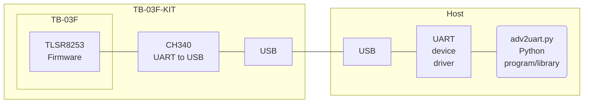
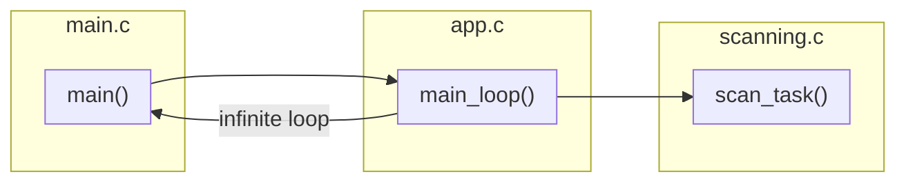
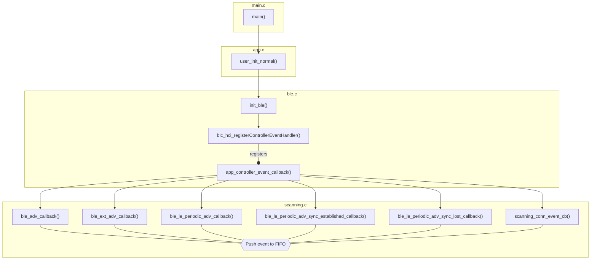

# TLSR825x ADV_BLE2UART ble2uart

__TLSR825x firmware__ implementing a BLE scanner, which continuously receives BLE advertisements and delivers them to a host connected via UART-to-USB adapter.

This software is designed for the [Ai-Thinker **TB-03F-KIT** module](https://aithinker-static.oss-cn-shenzhen.aliyuncs.com/docs/Public%20Document%20Center/Bluetooth/blue_tooth/Specification/TB-03F-Kit%20Specification-20201203.pdf) and interfaces directly with its exposed GPIO pins, user button, status LEDs, CH340 USB-to-UART bridge and preinstalled bootloader, replacing the default firmware.


```mermaid
%%{init: {"flowchart": {"htmlLabels": false}} }%%
flowchart LR;

subgraph TLSR825x["TB-03F-KIT"]
subgraph TB-03F
Firmware["TLSR8253\nFirmware"]
end

CH340["CH340\nUART to USB"]
USBD["USB"]
end

subgraph Host
USBH["USB"]
UART["UART\ndevice\ndriver"]
adv2uart("adv2uart.py\nPython\nprogram/library")
end


Firmware --- CH340 --- USBD --- USBH --- UART --- adv2uart
```

Characteristics of this BLE receiver firmware:

- compatible with [Telink TLSR825x SoC](http://wiki.telink-semi.cn/wiki/chip-series/TLSR825x-Series/);
- tested on Ai-Thinker [TB-03F-KIT](https://docs.ai-thinker.com/_media/tb-03f-kit_specification_en.pdf);
- output to UART, 2000000 (default), 921600 baud, or 115200 baud; the bitrate can be changed with the "PROG" key of TB-03F-KIT, toggling between the defined ones (e.g. at the moment 2000000 [one blink], 921600 [two blinks] or 115200 [three blinks], but other bitrates can be added); any change in the bitrate performed with the key is permanently stored to the firmware flash;
- robust datalink with CRC16 for error detection while transitting data;
- software FIFO sized for 4 packets of 240 bytes;
- the firmware can scan BLE PHY 1M advertisements and Coded PHY S8 advertisements (125kbps BLE Long Range mode) concurrently; the legacy advertisement transmitter (`CMD_ID_TXADV`) is a compile-time option (`TXADV_ENABLE = 1`) that cannot be combined with the Coded-PHY scan - see *Scanning and TXADV: exclusive, and what TXADV costs*;
- white-list and black-list for 64 MAC addresses;
- on-demand `CMD_ID_VBAT` measurement of the chip `VBAT` / board `3.3 V` rail;
- LEDs to monitor the BLE advertising interface;
- the software exploits the latest version of the [Telink SDK](https://wiki.telink-semi.cn/wiki/chip-series/TLSR825x-Series/#software-development-kit) for [Bluetooth LE Multi Connection](https://wiki.telink-semi.cn/tools_and_sdk/BLE/B85M_BLE_SDK.zip);
- ready-to-compile makefile;
- compact bidirectional byte-oriented protocol with CRC16-protected UART transport;
- the BLE device can be fully controlled by the hosts via commands;
- Available commands can be extended.

If the RGB LED switches on for a while (all three colors) when powering on the device (e.g., new device), it means that the default bitrate has an invalid value; press the PROG key to define a valid UART bitrate.

## TB-03F-KIT LEDs

IC Port |LED Color|Description
--------|---------|-----------
PC4     |RGB Green|PHY 1M advertisement received
PC2     |RGB Blue |Coded PHY advertisement received
PB4     |Yellow   |Advertisement succesfully sent to the UART FIFO
PC3     |RGB Red  |FIFO overflow error, when the UART troughtput is not enough to process all received BLE advertisements
PB5     |White    |Host command received from the UART

If a FIFO overflow is detected, it is suggested to add filters to the black and white lists to reduce the set of processed advertisements.

Configuring the controller to transmit at 2000000 baud (default bitrate) is suggested if also the host device driver allows this throughput. Reducing the bitrate increases the risk of FIFO overflow.

## Installation and compilation

### Using pre-built assets

The [Releases](https://github.com/pvvx/ADV_BLE2UART/releases) folder provides the *ble2uart.zip* ZIP archive, which is auto-generated by a [GitHub Action](.github/workflows/build.yml). The ZIP file includes the following assets:

- *TLSR825xScanner.bin*: precompiled firmware
- *Telink_Tools.exe*: Windows flash tool to upload the firmware to the device (pre-compiled from *Telink_Tools.py*)
- *adv2uart.exe*: Windows test program which prints the advertisement messages produced by the device (pre-compiled from *adv2uart.py*)

Steps to install the firmware and test the device:

- Unzip the *ble2uart.zip* archive to a directory.
- Connect the device to an USB port.
- Open the Device Manager to verify the COM port in use (COM7 in the following examples).
- Open a Windows CMD (Command Prompt).

To flash the firmware:

```
Telink_Tools.exe --port COM7 burn TLSR825xScanner.bin
```

To test the device:

```
adv2uart.exe -p COM7 -i
```

### Notes on flashing the firmware

The *Telink_Tools* utility is recommended for flashing the firmware. It relies on, and requires, the native bootloader shipped with the Ai-Thinker **TB-03F-KIT** module.

*Telink_Tools* is available in three versions:

* `telink_tools.c` — Linux utility that can be compiled into the `telink_tools` executable;
* `Telink_Tools.py` — Python implementation;
* `Telink_Tools.exe` — Windows executable generated with PyInstaller.

Alternatively, if the native bootloader is no longer available, [TlsrComProg825x](https://github.com/pvvx/TlsrComProg825x) can be used as a general-purpose flashing utility. It requires a (temporary) connection between CH340C pin 2 (TX) and the TB-03F-KIT SWS pin.

In addition, there is also a [browser based utility](https://github.com/pvvx/ATC_MiThermometer#the-usb-com-adapter-writes-the-firmware-in-explorer-web-version): https://pvvx.github.io/ATC_MiThermometer/USBCOMFlashTx.html

### Compilation from sources

```
git clone https://github.com/pvvx/ADV_BLE2UART
```

Python is required for *adv2uart.py*. Prerequisite modules:

```cmd
pip3 install pyserial
pip3 install construct
```

Use a UNIX system to compile the sources. The [Ubuntu](https://apps.microsoft.com/detail/9pn20msr04dw) distribution for [WSL](https://en.wikipedia.org/wiki/Windows_Subsystem_for_Linux) is a way to easily perform the compilation with a Windows system.

Needed components for the firmware compilation:

```cmd
sudo apt-get install make bzip2
```

Compiling the firmware (including `make clean`) and copying the created TLSR825xScanner.elf flash image to TLSR825xScanner.bin:

```
cd ADV_BLE2UART/source/ble2uart
make
```

Recompiling the firmware without `make clean` and copying the created TLSR825xScanner.elf flash image to TLSR825xScanner.bin:

```
make main-build
```

### Compile `telink_tools.c` on Linux

From `ADV_BLE2UART/source/ble2uart`:

```bash
gcc -Wall -Wextra -O2 telink_tools.c -o telink_tools
```

Run help:

```bash
./telink_tools
```

Example:

```bash
./telink_tools -p /dev/ttyUSB0 burn TLSR825xScanner.bin
```

Make all files, run TlsrMemInfo.py, do not copy the TLSR825xScanner.elf flash image to TLSR825xScanner.bin:

```
make sizedummy
```

Cleaning files (but not the SDK, which also needs `rm -r SDK`):

```
make clean
```

The compiled firmware is in the directory ADV_BLE2UART/source/ble2uart/TLSR825xScanner.bin

### Debug some SDK functions

To print UART debug messages tracing the parameters used to invoke some SDK functions (`blc_ll_setExtScanParam()`, `blc_ll_setExtScanEnable()`, advertising event callback function), set `DEBUG_MSG` to 1 in *app_config.h*. This can be used to check the actual effect of the configuration dictionary passed to `adv_scanning.build()` in *adv2uart.py*.

### Build options

Optional command groups are controlled by compile-time switches; all can be
overridden from the command line through `EXTRA_FLAGS`:

| Switch | Default | Enables | SRAM cost |
|--------|---------|---------|-----------|
| `TXADV_ENABLE` | `0` | `CMD_ID_TXADV` (0x0B) and the legacy advertising module | ~2.6 KB |
| `GATT_ENABLE` | `1` | `CMD_ID_CONN` ops 5..10, `CMD_ID_TXDATA` (0x0D), `CMD_ID_RXDATA` (0x0E) | ~4 byte |
| `ADV_FIFO_BLOCKS` | `4` | depth of the UART/response FIFO (`scanning.c`), 241 B per block | ~482 B per block |
| `SCHED_TIMER_GUARD` | `0` | `sched_timer_guard()`: keeps the library from masking the System Timer interrupt off (see *System Timer guard*) | ~0 |

Switch `SCHED_TIMER_GUARD` on to reproduce the guarded behaviour:

```bash
make EXTRA_FLAGS="-DSCHED_TIMER_GUARD=1"
```

Examples:

```bash
# default: the whole scanning command set is available (1M + Coded)
make

# add the custom advertisement transmitter (costs the Coded-PHY scan, ~2.3 KB)
make EXTRA_FLAGS="-DTXADV_ENABLE=1"

# drop the GATT client
make EXTRA_FLAGS="-DGATT_ENABLE=0"

# halve the UART FIFO (2 is the safe minimum: command responses use it too)
make EXTRA_FLAGS="-DADV_FIFO_BLOCKS=2"
```

`EXTRA_FLAGS` is appended to the default compiler flags. Changing a switch requires a full `make` (the makefile does not track header dependencies, so `make main-build` alone would not rebuild anything).

#### Scanning and TXADV: exclusive, and what TXADV costs

Scanning and TXADV share the radio, so they can never be enabled at the same
time. The command handlers enforce that at runtime, without asking the host:

| Command | Effect |
|---------|--------|
| `CMD_ID_SCAN` with `scan_mode & 3` | stops a running advertisement first |
| `CMD_ID_TXADV` op `1` | stops the scan first (`start_adv_scanning(0, 0, 0)`) |

`TXADV_ENABLE = 1` has a second, **build-time** cost, measured on
the TB-03F-KIT with the native V4.0.2.5 library (interleaved A/B, three runs
each, `CMD_ID_SCAN` mode 3 = 1M + Coded, 15 s windows, `/tmp/scan_diag.py`):

| Build | Coded-PHY scan |
|-------|----------------|
| `blc_ll_initLegacyAdvertising_module()` **not referenced** | **3/3 OK** (Coded and 2M reports received, scan stop answered) |
| the same source with the call present | **0/3 OK** (dies on the first Coded advertisement: boot report on the wire, scan stop not answered) |

The 1M scan is unaffected by the switch (306 frames in 8 s measured on the
build with the module). It is *not* the initialisation call that matters - neither
build calls it before the scan - but what referencing it pulls into the link: 2308
bytes of library BSS ( `_ram_use_end_` `0x84D928` -> `0x84E22C` ), which re-orders
the RAM layout, and the Coded-PHY scan of this library is layout-sensitive. A
2308 byte application array does not have the same effect, and neither does
enlarging the interrupt stack to 1 KB or peeling the black-box bookkeeping out
of the interrupt handler. That is why the switch defaults to **0**:

* `TXADV_ENABLE = 0` (**default**): the full **1M + Coded** scan works and `0x0B`
  answers `CMD_STATUS_DENIED`;
* `TXADV_ENABLE = 1`: the legacy 1M broadcast transmitter works together with
  `CMD_ID_CONN`, but the **Coded-PHY scan does not**.

The extended advertising module - the other way to transmit on the Coded PHY -
is not an alternative: it wedges the RF interrupt handler as soon as an extended
advertising set is enabled on this library.

### Known toolchain pitfall: never use `__attribute__((optimize(...)))`

The tc32 GCC 4.5.1 shipped with this SDK **miscompiles a switch statement inside a
function that carries a per-function `optimize()` attribute**:

* the jump table is emitted **inline in `.text`** as packed **16-bit relative
offsets**,
* while the dispatch code generated next to it indexes that table with a
**4-byte stride** and jumps through the loaded value.

Every case except the first (and every value handled before the switch) therefore
jumps to a garbage address: the CPU takes an unhandled exception, lands in the
`END: tj END` loop of `cstartup_825x.S` and the firmware stops answering for good,
with the LEDs left in whatever state they were in. A switch in a normal function
(no attribute) compiles into a correct table placed in `.rodata`.

Every `__attribute__((optimize("-Os")))` has been removed from `scanning.c` and
`ble.c`. **Do not add it back.** It saved almost nothing anyway: the image went
from 106916 to 107556 bytes (+640 B) after removing all five occurrences.

If a firmware suddenly stops answering, check the build with:

```sh
tc32-elf-objdump -d out/TLSR825xScanner.elf > /tmp/dis.txt
grep -n "tmov\s*pc," /tmp/dis.txt     # every computed jump (jump table)
```

and look at the lines **immediately after** each one: real instructions are fine,
while `.short` / `.byte` data means an inline jump table - and if that
holds small 16-bit values, the dispatch is broken.

> `.word` values after a `tmov pc,` are **not** proof of a broken table: the
> compiler also puts literal pools there (constants loaded by an earlier
> `tloadr rX, [pc, #N]`), and a *correct* switch may hold its table inline as
> 32-bit words. To tell them apart, follow the `tloadr rX, [pc, #N]` that loads
> the table base and check the value: a table in `.rodata`/`.text` (a code
> address) is right, a table of packed `.short` offsets is the bug.

### CMD_ID_TXADV solved: legacy advertising API

The TXADV freeze is **solved**. Short version:

> On V4.0.2.5 the **extended** advertising API (`blc_ll_setExtAdvEnable`) wedges
the library's RF interrupt handler as soon as interrupts are enabled, whereas the
> **legacy** advertising API works - provided the peripheral (slave) role is
> initialised.

Minimal reproducer (`ext_adv_test/`, mode 0 = Telink's own init sequence, plus
`EXT_ADV_TEST_APPEXTRAS=8` for `irq_enable()`): the banner restarts in a loop
right after the first extended advertising enable. The same build **without**
`irq_enable()` never wedges - but then `reg_irq_en` is 0, no interrupt ever fires
(`Bn=0`) and the radio is dead, so the image is worthless as evidence. Never trust
a test-bed result unless the black box shows `Bn` (ISR counter) actually growing.

`init_ble()` now sets up, in this order:

| Init call | Why |
|-----------|-----|
| `blc_ll_initExtendedScanning_module()` + `blc_ll_initLegacyInitiating_module()` | scanning and `CMD_ID_CONN` |
| `blc_ll_init2MPhyCodedPhy_feature()` | PHY feature kept for the scan side |
| `blc_ll_initLegacyAdvertising_module()` | the legacy advertiser used by TXADV |
| `blc_ll_initAclCentralRole_module()` | `CMD_ID_CONN` |
| `blc_ll_initAclPeriphrRole_module()` + `blc_ll_initAclPeriphrTxFifo(app_acl_slvTxfifo, ...)` | **mandatory**: without it `blc_ll_setAdvEnable()` answers `0x0D` (`HCI_ERR_CONN_REJ_LIMITED_RESOURCES`) |
| `irq_enable()` | mandatory master enable of the RF interrupt group (see `main.c`) |

That also requires `BLE_DEVICE_ENABLE 1` in `app_config.h` (it gates
`app_acl_slvTxfifo` / `mtu_s_*` in `app_buffer.c` - with 0 the firmware does not
even link) and `SLAVE_MAX_NUM 1`.

The TXADV wire format is unchanged, but:

* `phy` is only 0 (= 1M `ADV_NONCONN_IND`); any other value answers
  `LL_ERR_INVALID_PARAMETER`. The extended-advertising / Coded-PHY flavours and
  the diagnostic sub-operations (op 2..8) no longer exist: the extended
  advertising API of the V4.0.2.5 library wedges the RF interrupt handler, so
  the product transmits legacy 1M PDUs only.

Verified on hardware, fw 0.20 (`txadv_survive.py COM6`): ops 2/3/4/0 all answer
`status=0x00`; with the advertisement enabled the interrupt mask gains the
advertising bit (`Bm` `0x01002010` -> `0x01102010`) and `Bn` keeps climbing
(198 -> 3329 in ~7 s) with `Bi=00000000` and `Bc=00010501`: the ISR is served, the
main loop keeps running and the firmware never wedges.

### Extended advertising and the V4.0.2.5 library (historical)

On this board the **native V4.0.2.5 library wedges its own RF interrupt
handler** as soon as an extended advertising set is enabled: after
`blc_ll_setExtAdvEnable(BLC_ADV_ENABLE, ...)` the firmware stops answering and
the watchdog resets it ~3 s later. The black box says where it died:

| Report | Value | Meaning |
|--------|-------|---------|
| `Bi=` | `00040000` | the CPU died **inside the RF interrupt handler**, not in the main loop |
| `Bc=` | `ffffffff` | no command handler was running (the main loop had completed a pass) |
| `Br=` | constant | `sched_timer_guard()` never had to intervene |
| `Bm=` | keeps `0x00100000` | the System Timer interrupt was enabled |
| `Bs=` | `00080000` | the scheduler requirement bitmap was **not** zero |

So the System Timer part (see above) is *not* the cause here: the library's own
interrupt code is what dies. This is the same family of regression that makes
extended **scanning** unusable on V4.0.2.5, and the workaround known to work is
the **V4.0.2.1** library:

```sh
curl -sSL -o /tmp/liblt_8258_v4021.a \
  https://raw.githubusercontent.com/telink-semi/tc_ble_sdk/V4.0.2.1/tc_ble_sdk/proj_lib/liblt_8258.a
cp SDK/proj_lib/liblt_8258.a /tmp/liblt_8258_v4025.a       # keep the native one
cp /tmp/liblt_8258_v4021.a SDK/proj_lib/liblt_8258.a
make clean && make                                          # full rebuild is required
```

The swap is ABI compatible: the whole command set (TXADV, GATT, Coded PHY) links
unchanged, and `_ram_use_end_` drops from `0x84F72C` to `0x84F13C` (~1.6 KB more
stack margin). The two images are distinguished by `SW_VERSION`: **0.10 = native
V4.0.2.5** (`TLSR825xScanner_v4025lib.bin`) and **0.11 = V4.0.2.1**
(`TLSR825xScanner.bin`). Note that `install_sdk_v4025.sh` validates the hash of
`proj_lib/liblt_8258.a`, so it will warn (and restore the native file) after this
swap.

**The V4.0.2.1 swap does not work for this firmware**: the two tags are different
API generations (in V4.0.2.1 `blc_ll_initExtendedAdvertising_module()` takes three
arguments, here none), so the image links but the firmware never answers — not even
the boot report, which means it dies inside `init_ble()`. Always verify a library
swap with the boot report / `VERSION` frame.

### Differences against the official extended-advertising examples

The product firmware uses the **legacy** advertising API for `CMD_ID_TXADV`
(1M `ADV_NONCONN_IND` only): the extended advertising API of the V4.0.2.5
library wedges the RF interrupt handler in the configs tried, so the Coded/2M
flavours of the official `feature_ext_adv` example are not available here. The
official example is exercised in the separate project **`ext_adv_test/`**
(same layout as `~/coded_phy_test/coded_phy_scan_repro`), which runs Telink's
own sequence - `feature_ext_adv` init order, legacy advertising module,
peripheral role, `single_adv_set.c` calls — on the TB-03F-KIT with a 115200
UART log, a PB4 heartbeat and a watchdog. Build/flash: see
`ext_adv_test/README.md`.

### Stall diagnostics (black box + watchdog)

The firmware keeps a **black box** in a few words placed between the end of the
application RAM and the stack (`0x84F800`, outside `.bss`, so a reset does not
clear it) and feeds a **watchdog with a 3 s period** from the main loop. When the
main loop stops, the chip resets itself and at the next boot the black box is sent
to the host as `CMD_ID_PRNT` frames, which show up in the GUI log as
`RX debug: <6 chars>`. Reassemble them to read:

| Value | Meaning |
|-------|---------|
| `Bc=ffffffff` | it was running normally: the stall happened **between** commands |
| `Bc=0001ccoo` | stall inside the dispatcher for command `cc`, op `oo` |
| `Bc=000bXXXX` | stall while handling `CMD_ID_TXADV` (`XXXX` = op<<12, +1 before / +2 after the SDK call) |
| `Bc=000c0001` | inside `blc_ll_setExtAdvParam` |
| `Bc=000c0002` | inside `blc_ll_setExtAdvData` |
| `Bc=000c0003` | inside `blc_ll_setExtAdvEnable(BLC_ADV_ENABLE)` |
| `Bc=000c0004` | inside `blc_ll_setExtAdvEnable(BLC_ADV_DISABLE)` |
| `Bm=xxxxxxxx` | `reg_irq_mask` at the last main-loop snapshot (bit 20 = 0x00100000 is `FLD_IRQ_SYSTEM_TIMER`: if it is missing, the timer interrupt was switched off) |
| `Bs=xxxxxxxx` | `g_scheMng+0x14` at the last snapshot: the library's "who needs the System Timer" bitmap. Zero means the library was about to mask the timer off |
| `Bi=00040000` | the CPU died **inside the RF interrupt handler** (`blc_sdk_irq_handler()`); `Bi=00000000` means the handler returned normally |

Phase markers written by `main_loop()` complete the picture: `Bc=00020000` =
inside `blc_sdk_main_loop()`, `Bc=00030000` = inside `scan_task()`.

The report can also be requested while the firmware runs: the host sends
`CMD_ID_PRNT` (0x05) with payload `01` and the values are sent back immediately.
`Bc` is then `0001 05 01` from the query itself, which is normal.

The report is 9 frames and each frame takes one block of the 4-block response
FIFO, so `bb_report_task()` sends one chunk and waits for `send_resp()` to accept
it: without that retry the main loop fills the FIFO in a few microseconds, the
rest of the report is dropped by `send_resp()` and the host loses frame
synchronisation (`RX CRC/resync discard` bursts and seemingly lost answers).

`bb_init()` also guards against the black box overlapping the application RAM: in
that case `Bc` starts with `dead` and the value is unusable.

`Bb=` is the boot counter of the current power cycle: 0 = cold start (the report
carries nothing), >= 1 = the report was written by the previous life and is
meaningful.

`Br=` counts how many times `sched_timer_guard()` had to re-enable the System
Timer interrupt (00 = never, ff = 255 or more).

> Note: `wd_set_interval_ms()` only programs the watchdog capture value — it does
> **not** enable the watchdog. `wd_start()` is required as well, otherwise a stall
> is never recovered and no report is ever produced.

### System Timer guard

The V4.0.2.5 library masks the System Timer interrupt off — without re-arming the
tick — as soon as its "who needs the System Timer" bitmap (`g_scheMng+0x14`) is
zero. The scheduler then stops and `blc_sdk_main_loop()` never returns, which is
what a stalled board looks like: white and yellow LED latched on, no reply to any
command. Measured with the black box: `Bm=` without `0x00100000`
(`FLD_IRQ_SYSTEM_TIMER`) and a checkpoint left at `ffffffff`, i.e. the stall is
inside the SDK main loop, not in a command handler.

`sched_timer_guard()` (called once per main-loop pass, switch
`SCHED_TIMER_GUARD`) defends in two steps: it re-asserts the application
requirement bit (bit 19, ignored by the scheduler mask `0xff87ffff`) so the
library never sees a zero bitmap, and, if the interrupt was masked off anyway, it
points the next tick into the future, clears the pending flag and re-enables the
interrupt (re-enabling without re-arming gives an immediate interrupt storm).

Measured (fw 0.8, TXADV op 6 = enable with a 3 s auto-stop): the firmware no
longer stays dead — the watchdog brings it back — but the stall itself is still
there, about 3 s after the auto-stop, with `Bc=ffffffff`, `Bm` **including**
`0x00100000` and `Br=df` (223 re-arms). So the guard keeps the timer alive but
the library still stops the scheduler somewhere in the extended advertising
teardown. fw 0.9 adds the ISR-phase word (`Bi=`) and the scheduler bitmap (`Bs=`)
to tell whether the death is in the RF interrupt handler and whether the bitmap
really was zeroed.

### RAM and stack budget

The TLSR8253F512 in the TB-03F-KIT has 64 KB of SRAM; the linker places the
data/BSS area at the bottom and the main stack grows down from the end of SRAM
into whatever is left. The build prints the top of the data area as
`_ram_use_end_`, and the linker asserts `_ram_use_end_ < __SRAM_SIZE - 0x258`,
i.e. it requires at least **600 byte** of stack (Telink's own figure).

Reference values for the default build (`TXADV_ENABLE = 0`, the rest on):

| Item | Value |
|------|-------|
| `_ram_use_end_` (end of data/BSS) | `0x84D7C8` |
| SRAM end = stack top (`__SRAM_SIZE`) | `0x850000` |
| Stack available above BSS | `0x2838` = **10296 B** (requirement: 600 B) |
| Flash image | 96148 B |

With `TXADV_ENABLE = 1` the same build ends at `0x84E22C` (2660 B more, ~7.6 KB
of stack left) and the image grows to 101540 B.

The stack is not the constraint: the largest frames in the command path are
`scan_task` 116 B, `send_gpio_state` 32 B, `send_resp` 24 B and `main_loop` 24 B,
so the deepest reachable chain (main loop → `blc_sdk_main_loop` → `scan_task` →
handler) stays within a few hundred bytes.


## Flashing the firmware

### Flashing the firmware via TlsrPgm.py

*TlsrPgm.py* needs a hw patch applied to the device: [How to write TLSRPGM program to TB-03F-KIT or TB-04-KIT](https://github.com/pvvx/TLSRPGM/tree/main/sources/UART2SWire/tb-0x-pgm).

Flash the firmware via the following command (`we` = write file to flash erasing related buffers):

```
PGM_PORT=COM10 make flash
```

To erase all flash:

```
PGM_PORT=COM10 make erase
```

To perform a chip soft reset and get External Chip Information:

```
PGM_PORT=COM10 make reset
```

### Alternative firmware update procedure via Telink_Tools.py

The *Telink_Tools.py* Python application allows uploading the firmware to the TB-03F-KIT device without needing the hw patch that links CH340C pin 2 (TX) with the TB-03F-KIT SWS pin.

Connect the device to a PC via USB. Run the [Telink_Tools.py](https://github.com/Ircama/freetz-ble/blob/main/ble-adv-telink/make/Telink_Tools.py) Python program (Python2 and Python3, Windows and Linux). It requires `pip install pyserial`.

Example to burn the firmware with the Ai-Thinker device connected via USB to the virtual COM8 serial port of the PC:

```
python3 Telink_Tools.py --port com8 burn TLSR825xScanner.bin
```

### Running Telink_Tools.py and adv2uart.py via WSL

While there are ways to map Windows USB serial ports to WSL, the easiest method is to run the Windows Python programs from WSL (provided that [Python for Windows](https://apps.microsoft.com/detail/9nrwmjp3717k?hl=en-us&gl=US) is installed):

```bash
# from WSL
make && cmd.exe /c 'python3 freetz-ble\ble-adv-telink\make\Telink_Tools.py --port com10 burn ADV_BLE2UART\source\ble2uart\TLSR825xScanner.bin'
```

Similarly, you can also run *adv2uart.py*:

```bash
# from WSL
cmd.exe /c 'python3 ADV_BLE2UART\source\ble2uart\adv2uart.py -p com10 -i'
```

## Binary command protocol

All host/firmware communication uses a unified binary framing with CRC-16 error detection. The protocol is described in the **API** section. This section documents all commands currently supported by the firmware.

### Frame format

Every frame (command and response alike) has the same structure:

```
[payload_len: 1B] [cmd/rssi: 1B] [id/evtype: 1B] [data_len/adtype: 1B] [marker/phys: 1B] [mac/data: 6B] [optional payload] [CRC16-lo: 1B] [CRC16-hi: 1B]
```

For **command responses**, byte[4] (marker/phys) is always `0xFF`. The `id` byte carries a sub-result or state value; `data_len` is the number of valid bytes in the 6-byte data field.

### Command status codes

All commands that include an operation byte return a status in the `id` field of the response:

| Code | Name | Meaning |
|------|------|---------|
| 0 | `CMD_STATUS_OK` | Operation succeeded |
| 1 | `CMD_STATUS_ARGS` | Wrong number or invalid arguments |
| 2 | `CMD_STATUS_PIN` | Invalid or unsupported GPIO pin |
| 3 | `CMD_STATUS_DENIED` | Operation refused (e.g. not connected) |
| 4 | `CMD_STATUS_VALUE` | Argument value out of range |

### Frame loss and diagnostics

The host -> device direction has **no explicit length delimiter on the wire**: the
firmware splits the incoming byte stream using the UART idle gap, and validates
each whole read with the CRC. Consequences and countermeasures:

* Do **not** send several commands back to back. If two frames are merged into a
  single DMA read the CRC fails and the firmware has no way to resynchronise, so
  **both commands are lost**. The host tools pace their writes (the GUI keeps a
  4 ms minimum inter-frame gap) and the preferred policy is one command per
  answer.
* When the firmware receives a frame whose CRC does not match, it answers with
  `data[0] = 0xFE` (`CMD_OP_BAD_FRAME`), status `CMD_STATUS_ARGS` and
  `data[1]` = received length, at most once every 200 ms. Seeing this in the host
  log means *the firmware is alive* but the frame or the link is corrupted
  (merged commands, wrong baud rate, noisy 2 Mbaud CH340C link).
* A command that is never answered is reported by `adv2uart_gui.py` as
  `*** no answer to ... after 600 ms`. Silence + no `0xFE` report points at a
  firmware that is not running (reset, hang) or a serial port that disappeared.
* If the LEDs are driven by hand from the host, the firmware stops driving those
  pins (`manual_led_mask`): the status indicators never overwrite a pin the host
  owns, and a host write to the white LED (`PB5`) therefore stays on until the
  host clears it. That is expected and is **not** a sign of a crash.

The GUI monitor notebook holds the tabs *Advertisements*, *MAC Stats*,
*LEDs / UART / RF* (the five LEDs and the blink controls), *GPIO pins* (pin
selection, write/toggle/configure, analog read and the pin state grid),
*GPIO events* (arm/disarm the CMD_ID_GPIOEVT edge interrupts), *Adv TX (TXADV)*,
*Connection* and *Log*.
* At 2000000 baud the CH340C bridge is at the edge of its capabilities: if CRC
  errors or lost frames appear, retry at 921600 baud
  (`CMD_ID_UART op 2`, "Set firmware baud" in the GUI) and reconnect at the new
  speed. Note that opening/closing the port toggles DTR/RTS, which resets the
  module.

### Commands reference

#### `0x00` CMD_ID_INFO — device information

Sent by firmware on startup or in response to a `CMD_ID_INFO` request.

| Field | Response value |
|-------|----------------|
| `id` | SW version (BCD, e.g. `0x01` = "0.1") |
| `data_len` | 6 |
| `data[0..5]` | Public MAC address (little-endian) |

The `adv2uart_gui.py` GUI sends this command at connect time and displays the firmware version and local MAC.

---

#### `0x01` CMD_ID_SCAN — start / stop BLE scanning

Two request formats are supported (both backward-compatible with each other):

**Short format — shared window (3-byte payload):**

`[0x01] [scan_mode: 1B] [window_lo: 1B] [window_hi: 1B]`

- `scan_mode` bit-field: PHY selection, filter flags (public/random/private addresses, duplicate filter, active/passive scan).
- `window` is the *scan interval / window* in units of 0.625 ms, applied equally to both 1M and Coded PHY.

**Extended format — independent windows (5-byte payload):**

`[0x01] [scan_mode: 1B] [window_1m_lo: 1B] [window_1m_hi: 1B] [window_coded_lo: 1B] [window_coded_hi: 1B]`

- `window_1m` applies to the 1M PHY scan.
- `window_coded` applies to the Coded PHY scan. If the Coded PHY minimum window (see `CMD_ID_RFSDK` op=4) is larger than `window_coded`, the minimum is used as a floor.

Sending `window_coded = 0` in the extended format is equivalent to the short format (same as `window_1m` with minimum-window floor applied).

Response `data[0..N-1]` echoes the accepted payload bytes.

The **Scan** tab of `adv2uart_gui.py` exposes two separate spinboxes — *1M window ms* and *Coded window ms* — and sends the extended format automatically when the two values differ; the short format is sent when they are equal (remains compatible with older firmware).

---

#### `0x02` CMD_ID_WMAC — add MAC to white list
#### `0x03` CMD_ID_BMAC — add MAC to black list

Request format: `[0x02/0x03] [mac_bytes: 1..6B]`

The MAC field accepts **1 to 6 bytes**. When fewer than 6 bytes are supplied, only the most-significant bytes (OUI end) are matched: a 3-byte entry matches any device whose OUI equals those 3 bytes. This allows filtering entire manufacturers without listing individual addresses.

Response `id` = current list count; `data[0..5]` = accepted MAC (zero-padded on the right if partial).

---

#### `0x04` CMD_ID_CLRM — clear MAC filter list

Request format: `[0x04]`

Response `id` = maximum list capacity.

---

#### `0x05` CMD_ID_PRNT — debug print (firmware → host only)

Never sent by the host. The firmware uses this command ID to push `uart_printf()` messages as framed packets into the FIFO. The payload is the raw ASCII text.

---

#### `0x06` CMD_ID_GPIO — GPIO / LED control

Request format: `[0x06] [op: 1B] [pin_code: 1B] [...]`

`pin_code` is derived from the GPIO mnemonic: high nibble = port group (`A=0`, `B=1`, `C=2`, `D=3`), low nibble = pin number. Examples: `PA7 = 0x07`, `PB4 = 0x14`, `PC2 = 0x22`.

Operations (`op`):
- `0` — query pin state and board mask
- `1` — read single pin value: `[0x06, 1, pin_code]`
- `2` — write single pin value: `[0x06, 2, pin_code, value]` *(LED pins only)*
- `3` — toggle single pin: `[0x06, 3, pin_code]` *(LED pins only)*
- `4` — configure GPIO: `[0x06, 4, pin_code, input_en, output_en, pull]`
- `5` — set LED brightness with the hardware PWM: `[0x06, 5, pin_code, duty, period_lo, period_hi]` *(LED pins only)*
- `6` — stop the PWM and give the pin back to the GPIO block: `[0x06, 6, pin_code]` *(LED pins only)*
- `7` — analog (ADC) read: `[0x06, 7, pin_code]`
- `8` — set RGB colour: `[0x06, 8, pin_code, R, G, B]`

`pull`: `0` = floating, `1` = pull-up 1M, `2` = pull-down 100K, `3` = pull-up 10K.

Op `5` drives the LED pin with its hardware PWM channel (`PC2` = PWM0,
`PC3` = PWM1, `PC4` = PWM2, `PB4` = PWM4, `PB5` = PWM5) for the TB-03F-KIT
"intelligent lighting" use case: `duty` is a percentage `0`..`100` and `period`
is in microseconds (`0` = 1 kHz default, minimum 10 us). While the PWM is active
the pin is owned by the PWM peripheral (the status blink no longer drives it);
op `6` stops the PWM and turns the pin back into a GPIO output (off).

Op `7` returns the 12-bit ADC value (3.3 V full scale) in `data[2..3]` instead of
the pin level. The TLSR825x ADC inputs are `PB0`..`PB7`, `PC4` and `PC5`, but on
the TB-03F-KIT: `PB0`, `PB2`, `PB3` and `PC5` are not on the 30-pin header,
`PB1` is the UART TX, `PB4`/`PB5`/`PC4` drive LEDs (`PC4` = RGB green) and `PB7`
is the ADC pad of the internal VBAT monitor (`CMD_ID_VBAT`). **`PB6` (header pin
7, pin code `0x16`) is therefore the only free analog input**; any other pin
returns `CMD_STATUS_PIN`.

Op `8` sets an RGB colour on LED1. The TB-03F-KIT wires the three colour
elements to `PC2` = Blue (PWM0), `PC3` = Red (PWM1) and `PC4` = Green (PWM2), so
a non-zero channel switches the corresponding LED on. It exists for compatibility
with the ESP32 sibling firmware, where the same operation drives a WS2812 pixel.

Supported TB-03F-KIT pin codes (header pin numbers from the board specification):

| pin_code | GPIO | Header pin | Function | Capabilities |
|----------|------|-----------|----------|--------------|
| `0x07` | PA7 | 3 | KEY_USER (PROG) / SWS | read/config |
| `0x22` | PC2 | 22 | RGB Blue LED (PWM0) | read/write/toggle/pwm/config |
| `0x23` | PC3 | 4 | RGB Red LED (PWM1) | read/write/toggle/pwm/config |
| `0x24` | PC4 | 2 | RGB Green LED (PWM2), ADC input | read/write/toggle/pwm/config |
| `0x14` | PB4 | 21 | Side Yellow LED (PWM4) | read/write/toggle/pwm/config |
| `0x15` | PB5 | 20 | Side White LED (PWM5) | read/write/toggle/pwm/config |
| `0x01` | PA1 | 23 | free / I2S clock | read/config |
| `0x16` | PB6 | 7 | free, **ADC input** | read/config/analog read |
| `0x17` | PB7 | 6 | ADC pad of the internal VBAT monitor | read/config |
| `0x20` | PC0 | 30 | I2C_SDA / UART_RTS | read/config |
| `0x21` | PC1 | 29 | I2C_CLK | read/config |
| `0x32` | PD2 | 26 | SPI CS / I2S_LR | read/config |
| `0x33` | PD3 | 27 | I2S_SDI | read/config |
| `0x34` | PD4 | 28 | Single Line Host SWM / I2S_SDO | read/config |
| `0x37` | PD7 | 5 | SPI clock (I2C_SCK) | read/config |

The UART transport pins `PA0` (RX) and `PB1` (TX) can be queried (op `0`/`1`) but
not written, toggled or configured (op `2`/`3`/`4` is refused), to avoid breaking
the serial link. Op `2`/`3` are accepted only for the five LED pins.

Response `data`: `[op, pin_code, value, led_mask, board_mask_lo, board_mask_hi]`.  
For op `7` the layout is `[op, pin_code, adc_lo, adc_hi, board_mask_lo, board_mask_hi]`.

`board_mask` bit positions: bit 0 = KEY PA7, bit 1 = Blue PC2, bit 2 = Red PC3, bit 3 = Green PC4, bit 4 = Yellow PB4, bit 5 = White PB5.

Historically an op `2` that never answered (and wedged the firmware with the white
LED latched on) was caused by the toolchain pitfall described in *Known toolchain
pitfall* above: the switch of `handle_gpio_command` was inside `scan_task`, which
carried `__attribute__((optimize("-Os")))`, so the dispatch jumped through a
malformed jump table. The attributes have been removed.

`CMD_ID_VERSION` reports `fw=0.4 (0x04)` in builds with the toolchain fix (`0.2`
was the build that still wedged on a GPIO write, `0.3` the one whose TXADV
disable path still wedged).

---

#### `0x08` CMD_ID_UART — UART ping / baud rate configuration

Request format: `[0x08] [op: 1B] [...]`

Operations:
- `0` — query current baud rate configuration
- `1` — send ping: `[0x08, 1, seq_lo, seq_hi, pattern]` — echoes back the sequence number and pattern
- `2` — change baud rate: `[0x08, 2, baud_index]`

Available baud rate indices: `0` = 2 000 000, `1` = 921 600, `2` = 115 200.

Response `data`: `[op, baud_index, count, baud_lo, baud_mid, baud_hi]`.

**Note**: after a `CMD_STATUS_OK` response to baud-rate change op=2, the firmware switches to the new baud rate within ~600 ms. The host must reconnect at the new rate.

---

#### `0x09` CMD_ID_RFSDK — RF and scan runtime tuning

Request format: `[0x09] [op: 1B] [...]`

Operations:
- `0` — query current RF settings
- `1` — set TX power: `[0x09, 1, power_index]`
- `2` — set crystal capacitance override: `[0x09, 2, cap_value]` (`0xFF` = use calibrated value)
- `3` — set primary scan channels: `[0x09, 3, ch0, ch1, ch2]` (default: 37, 38, 39)
- `4` — set Coded PHY minimum scan window: `[0x09, 4, min_10ms]` (units: 10 ms)

Response `data`: `[power, cap, ch0, ch1, ch2, coded_min_units]`.

---

#### `0x0A` CMD_ID_VERSION — hardware / firmware / SDK version

Request format: `[0x0A]`

| Response field | Value |
|----------------|-------|
| `id` | SW version (BCD) |
| `data[0]` | HW version (`0x10` = TB-03F-KIT) |
| `data[1]` | SDK certification mark |
| `data[2]` | SDK structure version |
| `data[3]` | SDK major version |
| `data[4]` | SDK minor version |
| `data[5]` | SDK patch number |

---

#### `0x0F` CMD_ID_VBAT — on-demand VBAT / chip-temperature measurement

Request format: `[0x0F]`

Returns the current chip supply `VBAT` in millivolts together with an estimate of the internal chip temperature in degrees Celsius when the target platform supports it. On TB-03F-KIT / TLSR8253 `VBAT` is the `3.3 V` rail after the onboard regulator (not the `5 V` micro-USB input), while temperature is currently reported as unavailable.

Host tooling support:
- `adv2uart.py` exposes `--battery` and `Ble2Uart.read_vbat()`.
- `adv2uart_gui.py` exposes a `VBAT` button and shows the latest reading in the Device bar.
- `adv2uart_listen.c` prints both `mv` and `temp_c` when the extended payload is present.

| Response field | Value |
|----------------|-------|
| `id` | `CMD_STATUS_*` result |
| `data[0]` | voltage low byte |
| `data[1]` | voltage high byte |
| `data[2]` | temperature low byte (signed `int16`, Celsius) |
| `data[3]` | temperature high byte (signed `int16`, Celsius) |

If temperature sampling is unavailable, the firmware reports `0x8000` in `data[2:4]`. This is the current behavior on TLSR8253 / B85 builds. Older firmware versions may still return only `data[0:2]`.

Implementation note: on TLSR8253 / TB-03F-KIT the measurement uses free ADC-capable pin `PB7`, which must remain unused by the application.

---

#### `0x0B` CMD_ID_TXADV — transmit custom advertisement

Start, stop or query a custom advertisement set transmitted by the device itself.

Request format:
- **Stop**: `[0x0B, 0]`
- **Start**: `[0x0B, 1, phy, interval_lo, interval_hi, adv_len, adv_data...]`
- **Query**: `[0x0B, 0x0F]`

`phy` values:

| Value | Description |
|-------|-------------|
| 0 | Legacy 1M (`ADV_NONCONN_IND`) |

Any other `phy` value answers `CMD_STATUS_VALUE`: the firmware transmits legacy
1M PDUs only (the extended advertising API of the V4.0.2.5 library wedges the RF
interrupt handler, so the Coded/2M flavours are not available).

`interval` is in units of 0.625 ms (minimum 20 ms = value 32). `adv_data` is the raw AD payload (max 31 bytes).

Response `data`: `[running_phy, interval_lo, interval_hi, adv_len, 0, 0]`.  
`running_phy` = 0 when stopped; 1 when active.

Implementation note: the Telink SDK allows either the legacy advertising module
or the extended advertising module, but not both, and only the extended one can
transmit on the Coded PHY. This firmware therefore initialises the *legacy*
advertising module and serves the **Legacy 1M** mode (`phy = 0`) with an
advertising set configured with the legacy `ADV_NONCONN_IND` event property,
which produces the same PDU as the ESP32 sibling firmware.

The command is compiled in only when `TXADV_ENABLE = 1`. The legacy advertising
module costs ~2.3 KB of library RAM and, more importantly, costs the Coded-PHY
scan: reference it and the extended scan dies on the first Coded advertisement.
It is therefore **off by default**: the default build answers `CMD_STATUS_DENIED`
and keeps the full 1M + Coded scan. Build with `make EXTRA_FLAGS="-DTXADV_ENABLE=1"`
to enable the transmitter; see *Scanning and TXADV: exclusive, and what TXADV
costs* under *Build options*.

The **TX Adv** tab of `adv2uart_gui.py` provides a graphical interface for this command.

---

#### `0x0C` CMD_ID_CONN — BLE ACL connection (central role)

Establishes, terminates or queries a BLE connection to a peripheral device. The firmware operates as a BLE central (master) with a maximum of one simultaneous connection.

Request format:

| op | Description | Additional bytes |
|----|-------------|-----------------|
| `0` | Query connection state | — |
| `1` | Connect via 1M PHY | `[addr_type, addr[0..5]]` |
| `2` | Connect via Coded PHY | `[addr_type, addr[0..5]]` |
| `3` | Disconnect | — |
| `4` | Cancel pending connection attempt | — |
| `5` | Discover services, characteristics and descriptors (async) | — |
| `6` | Read characteristic | `[0, handle_lo, handle_hi]` |
| `7` | Write characteristic with response | `[0, handle_lo, handle_hi, len, data...]` |
| `8` | Read descriptor | `[0, handle_lo, handle_hi]` |
| `9` | Write descriptor | `[0, handle_lo, handle_hi, len, data...]` |
| `10` | Exchange ATT MTU | `[0, mtu_lo, mtu_hi]` |
| `11` | Pair — **not implemented** (needs SMP bonding storage) | — |
| `12` | Unpair — **not implemented** (needs SMP bonding storage) | — |

`addr_type`: `0` = Public, `1` = Random.  
`addr[0..5]`: peer MAC address in little-endian (LSB first) wire order.

Response `data`: `[state, peer_addr_type, peer_addr[0..3], 0]`.

**Async notifications**: when a connection is established or dropped by either side, the firmware pushes a `CMD_ID_CONN` response with the new state.

`state` values:

| Value | Meaning |
|-------|---------|
| 0 | Idle |
| 1 | Connecting |
| 2 | Connected |

Op=0 (status query), op=3 (disconnect) and op=4 (cancel) always work. Op=1
(connect on 1M PHY) works. Op=2 (connect on Coded PHY) returns
`CMD_STATUS_DENIED`: only the legacy initiating module is initialised, because it
is mutually exclusive with the extended initiating module that the Coded PHY
would require, and the legacy one is part of the scan configuration that runs on
SDK V4.0.2.5.

Ops `5`..`10` are the GATT client (compiled in when `GATT_ENABLE = 1`, the
default) and require an established connection; without one they answer
`CMD_STATUS_DENIED`. Ops `11`/`12` (pair/unpair) are not implemented: they would
need the SMP bonding storage.

**Spontaneous discovery events** (triggered by op `5`): each frame carries
`CMD_ID_CONN` with the high bit of `byte[2]` set (`0x80`); `byte[2] & 0x7F`
identifies the sub-type:

| Sub-type | Name | `data[]` | extended payload |
|----------|------|----------|------------------|
| 0 | Service | `[is_primary, start_handle_lo, start_handle_hi, end_handle_lo, end_handle_hi]` | UUID |
| 1 | Characteristic | `[handle_lo, handle_hi, properties]` | UUID |
| 2 | Descriptor | `[handle_lo, handle_hi]` | UUID |
| 3 | Complete | empty (marks the end of the discovery) | — |

**Spontaneous read responses** (ops `6` and `8`) arrive as a `CMD_ID_CONN` frame
with `byte[2]` = `CMD_STATUS_OK` and payload
`[handle_lo, handle_hi, value_len, value...]` (the first three value bytes are in
`data[3..5]`, the rest in the extended payload).

The **BLE Conn** tab of `adv2uart_gui.py` provides a graphical interface for connection management.

---

#### `0x0D` CMD_ID_TXDATA — ATT Write to connected peer

Request format: `[0x0D, att_handle_lo, att_handle_hi, data_len, data...]`

Sends an ATT Write Without Response (Write Command) to the given ATT handle of the connected peer. `data_len` ≤ 20 bytes (the ATT MTU of this build is 23).

Response `data`: `[att_handle_lo, att_handle_hi, data_len, ble_status, 0, 0]`.

Compiled in only when `GATT_ENABLE = 1` (the default); otherwise it returns `CMD_STATUS_DENIED`.

---

#### `0x0E` CMD_ID_RXDATA — ATT notification / indication from peer

Firmware → host async push. Never sent by the host (a host-issued `0x0E` is refused).

When the connected peer sends an ATT Handle Value Notification (opcode `0x1B`) or Indication (opcode `0x1D`), the firmware pushes a frame with:
- `id` = ATT opcode (`0x1B` = notification, `0x1D` = indication)
- `data[0..1]` = ATT handle (little-endian)
- `data[2]` = value length
- `data[3..5]` = first 3 bytes of the ATT value
- the remaining value bytes in the extended payload (frame `byte[0]` = payload length)

Indications are confirmed at ATT level. Compiled in only when `GATT_ENABLE = 1` (the default).

---

#### `0x10` CMD_ID_GPIOEVT — hardware GPIO edge events

Arms any input pin and receives spontaneous edge notifications over the protocol.

Request format: `[0x10] [op: 1B] [pin_code: 1B]`

| `op` | Operation | Response payload |
|------|-----------|------------------|
| `0` | query armed-pin bitmap | `data[0..3]` = 32-bit LE bitmap |
| `1` | arm the both-edge interrupt on one pin | `data[0]` = pin, `data[1..4]` = bitmap |
| `2` | disarm one pin | `data[0]` = pin, `data[1..4]` = bitmap |
| `3` | disarm every pin | bitmap = 0 |

**Spontaneous events** use the same `CMD_ID_GPIOEVT` command code with the high
bit (`0x80`) set in `byte[2]` (the `id` / status field), so that the host can tell
them apart from the command acknowledgements:

- low 5 bits of `byte[2]` = pin id
- `data[0]` = pin id
- `data[1]` = new level (`0` = falling edge / `1` = rising edge)
- `data[2..5]` = 32-bit millisecond timestamp

Platform notes:

- The TLSR825x GPIO interrupt is edge-*polarity* based: the ISR re-arms the pin
  for the opposite edge after every event, so the host sees both edges.
- Only ports A and B (pin codes `0x00`..`0x17`) can be armed: the pin id travels
  in the low 5 bits of `byte[2]`, exactly as in the ESP32 sibling firmware, and
  the armed-pin bitmap is 32 bits wide.
- The UART pins `PA0`/`PB1` and the five board LEDs cannot be armed. The "PROG"
  key `PA7` can, which is the equivalent of the ESP32 `BOOT` button.
- Events are queued (16 entries) and drained from the main loop; if the UART FIFO
  is momentarily full the drain stops and resumes on the next iteration, so no
  event is dropped silently.

---

> **RAM**: the TLSR8253F512 has 64 KB of SRAM and every BLE SDK module pulled in
> from `liblt_8258.a` brings hidden BSS with it.
>
> The GATT client (ops `5`..`10`, `0x0D`, `0x0E`) is essentially free: the
> L2CAP/ATT/GATT host objects are already linked by the calls the scanner itself
> needs (`blc_hci_registerControllerDataHandler(blc_l2cap_pktHandler)`,
> `blc_gap_init()`, `blc_l2cap_initAclConnMasterMtuBuffer()`), so enabling it
> moved `_ram_use_end_` by only 4 bytes (`0x84D57C` -> `0x84D580`).
>
> The legacy advertising module used by `CMD_ID_TXADV` (`TXADV_ENABLE = 1`) costs
> 2660 B of RAM and 5392 B of flash (`_ram_use_end_` `0x84D7C8` -> `0x84E22C`,
> image 96148 -> 101540 B) - and, as described under *Build options*, it costs
> the Coded-PHY scan. The default build keeps `TXADV_ENABLE = 0`: ~10.3 KB of
> stack above `_ram_use_end_` and the full 1M + Coded scan.
>
> The ATT MTU stays at the 23-byte default declared in `source/app_buffer.h`
> (`ATT_MTU_MASTER_RX_MAX_SIZE`), so reads, writes and notifications carry at
> most 20 bytes of value and op `10` can only clamp the MTU to that size.
> Raising it means enlarging `mtu_m_rx_fifo` and `ACL_CONN_MAX_RX_OCTETS`.

---

## Host tools

The three host programs implement the whole command set above.

### `adv2uart.py`

`Command` carries every command id and sub-operation
(`Command.CMD_ID_GPIOEVT`, `Command.GPIO_OP_ANALOG`, `Command.CONN_OP_DISCOVER`, ...),
plus a `Command.name()` helper, and `Ble2Uart` exposes one method per operation:

| Group | Methods |
|-------|---------|
| GPIO | `gpio_status()`, `gpio_read()`, `gpio_write()`, `gpio_toggle()`, `gpio_config()`, `gpio_pwm()`, `gpio_pwm_off()`, `gpio_analog()`, `gpio_rgb()` |
| LED | `led()` |
| UART | `uart_status()`, `uart_ping()`, `uart_set_baud()` |
| RF | `rfsdk_status()`, `rfsdk_set_power()`, `rfsdk_set_cap()`, `rfsdk_set_channels()`, `rfsdk_set_coded_min()` |
| Version | `version_info()` |
| TX adv | `txadv_start()`, `txadv_stop()`, `txadv_status()` |
| BLE conn / GATT | `conn_status()`, `conn_connect()`, `conn_disconnect()`, `conn_cancel()`, `conn_discover()`, `conn_read()`, `conn_write()`, `conn_read_descriptor()`, `conn_write_descriptor()`, `conn_mtu()` |
| ATT data | `txdata()`, `read_gpio_event()` |
| GPIO events | `gpioevt_query()`, `gpioevt_enable()`, `gpioevt_disable()`, `gpioevt_clear()` |

Every method returns `(status, data)` and waits for the answer
(`command_wait()`); `None` as status means a timeout. The spontaneous frames are
logged and cached in `last_gpio_event`, `last_rxdata`, `conn_event` and
`discovery`.

### `adv2uart_gui.py`

The GUI exposes the whole command set in tabs: *Advertisements*, *MAC Stats*,
*LEDs / UART / RF*, *GPIO pins* (read/write/toggle/configure, analog read, RGB),
*GPIO events* (arm/disarm edge interrupts), *Adv TX (TXADV)* (legacy 1M start /
stop / status, quick presets), *Connection* (central role + GATT client) and
*Log*. The pin selector lists the whole TB-03F-KIT header, and the board-mask
bit order used by the LED indicators matches the firmware (`PA7`, `PC2`, `PC3`,
`PC4`, `PB4`, `PB5`).

Command-line options: `--port/-p` selects the serial port, `--connect/-c`
connects as soon as the window opens, `--maximize/-m` starts the window
maximized.

### `adv2uart_listen.c`

Besides the scan listener it now accepts a full set of command-line actions and
prints a named line for every response. `--cmd HEX` sends any raw command, so the
tool covers the protocol even where no dedicated option exists.

```bash
# read the free ADC pin (PB6) and the RF status without starting a scan
./adv2uart_listen --no-scan --gpio-analog 0x16 --rfsdk /dev/ttyUSB0

# arm the PROG key for edge events and print them
./adv2uart_listen --no-scan --gpioevt 0x07 /dev/ttyUSB0

# broadcast a custom legacy advertisement
./adv2uart_listen --no-scan --txadv 0:160:0201060AFF --txadv-status /dev/ttyUSB0

# connect, discover the GATT database, read a handle
./adv2uart_listen --no-scan --conn A4C1383406CE:0 /dev/ttyUSB0
./adv2uart_listen --no-scan --conn-discover /dev/ttyUSB0
./adv2uart_listen --no-scan --conn-read 3 /dev/ttyUSB0
```

Run it with `--help` for the complete option list.

## Persistent user data storage

After erasing a buffer, data can be written only once (not twice). A rewrite needs erasing data first. To avoid too many rewrites (that wear the storage), data are organized in an array where each segment is progressively updated in sequence so that the last value is the actual one.

See "tinyFlash.c".

### Erasing the user data flash

```bash
Telink_Tools.py --port com10 erase_flash 0x70000 1
Telink_Tools.py --port com10 erase_flash 0x71000 1
Telink_Tools.py --port com10 write_flash_fill 0x70000 "00"
```

The first two commands erase one buffer starting from the indicated address (0x70000 or 0x71000). The resulting data are initialized to 0xff.

The third command writes 00 to the first byte. Notice that a *write_flash_fill* also checks that the remaining data until the end of the buffer are set to 0xff and, for each data that needs to be changed, it initializes it to 0xff; as they are already to this value, all data subsequent to 00 are not rewritten and can be used by the application.

### Reading the first buffer

```bash
Telink_Tools.py --port com10 read_flash 0x70000 255
```

### Reading the second buffer

```bash
Telink_Tools.py --port com10 read_flash 0x71000 255
```

## SDK Update

Compiling without reinstalling the SDK:

```bash
cd ADV_BLE2UART/source/ble2uart
make
```

If the compiler is not included in the SDK, the makefile downloads it.

Reinstall the SDK and compile:

```bash
cd ADV_BLE2UART/source/ble2uart
rm -r SDK
./install_sdk_v4025.sh
make
```

## SDK Documentation

Documentation on using the API can be found in the header comments of the SDK files.

## adv2uart.py Usage

This program reads the advertisement messages produced by the device (Python 3).

```
usage: adv2uart.py [-h] [-d] [-v] [-i] [-s SLEEP] [-b BAUDRATE] [-p PORT] [-t TIMEOUT] [-n NUMBER]
                   [--duration DURATION] [--idle-timeout IDLE_TIMEOUT] [--status-interval STATUS_INTERVAL]
                   [--phy {1m,coded,both}] [--scan-window-ms SCAN_WINDOW_MS]
                   [--filter-random | --accept-random] [--filter-private | --accept-private]
                   [--info-after INFO_AFTER] [--battery]

optional arguments:
  -h, --help            show this help message and exit
  -d, --debug           Print debug information
  -v, --verbose         Print verbose information
  -i, --info            Print limited debug information
  -s SLEEP, --sleep SLEEP
                        add an initial delay in seconds before the query (default: 1)
  -b BAUDRATE, --baudrate BAUDRATE
                        serial connection baudrate (default: 2000000)
  -p PORT, --port PORT  Serial port; default = COM11 or /dev/ttyUSB0
  -t TIMEOUT, --timeout TIMEOUT
                        serial port read timeout in seconds (default: 0.3)
  -n NUMBER, --number NUMBER
                        Number of advertisements to process (default is 0 = infinite)
  --duration DURATION   stop scanning after this many seconds (default: 0 = infinite)
  --idle-timeout IDLE_TIMEOUT
                        stop scanning after this many seconds without advertisements (default: 0 = disabled)
  --status-interval STATUS_INTERVAL
                        print an idle status every N seconds while listening (default: 10, 0 = disabled)
  --phy {1m,coded,both}
                        scan PHY selection (default: both)
  --scan-window-ms SCAN_WINDOW_MS
                        scan window in milliseconds (default: 30)
  --filter-random       discard random-address advertisements
  --accept-random       accept random-address advertisements (default)
  --filter-private      discard private-address advertisements
  --accept-private      accept private-address advertisements (default)
  --info-after INFO_AFTER
                        send INFO this many seconds after scan start and report whether it is acknowledged
    --battery             query the current VBAT / 3V3 rail and chip temperature, then exit

BLE ADV_BLE2UART scanner
```

To query only the device supply rail instead of starting a scan:

```bash
python3 adv2uart.py -p /dev/ttyUSB0 -b 2000000 --battery -i
```

The command returns the module `VBAT` / `3.3 V` rail in millivolts plus the internal chip temperature estimate when available. On TLSR8253 / B85 builds the temperature field is currently reported as unavailable. It does not measure the upstream `5 V` USB input.

In `adv2uart_gui.py`, the **Device** bar shows `VBAT` and `Temp` fields: they are queried automatically after connect and can be refreshed on demand with the `VBAT` button.

## API

```python
from adv2uart import Ble2Uart

dv = Ble2Uart(
    port=...,
    baud=...,
    timeout=...,
    mac_separator=...
)
```

Parameter|Description
---------|-----------
port|device name, depending on operating system. e.g. `"/dev/ttyUSB0"` on GNU/Linux or `"COM10"` on Windows.
baud|Baud rate. CH340 supports common baud rates: 50, 75, 100, 110, 134.5, 150, 300, 600, 900, 1200, 1800, 2400, 3600, 4800, 9600, 14400, 19200, 28800, 33600, 38400, 56000, 57600, 76800, 115200, 128000, 153600, 230400, 460800, 921600, 1500000, 2000000 baud. Some devices only support up to 921600 baud, some up to 115200 baud.
timeout|Read timeout value in seconds. Default is 0.3 seconds. `None` waits until 64 bytes are received. 0 is non-blocking (never waits).
mac_separator|Separator of each digit of the 6-bytes MAC address. The default is no separator. To set it to a colon, use `mac_separator=':'`.

### black_white_list()

```python
black_white_list(white_list=[ ... ], black_list=[ ... ], info=True, clear=True, start=True)
```

- Info=False: do not send the info command
- clear=False: do not send the list clear command
- start=False: do not start advertising.

### read_adv()

`read_adv()`: *read serial input, detect advertisements and decode commands*.

### read_vbat()

`read_vbat(wait_seconds=2.0)`: send `CMD_ID_VBAT`, wait for the response and return `(status, millivolts, temperature_c)`.

- `status = 0` means success and `millivolts` contains the measured `VBAT` / `3.3 V` rail value.
- `temperature_c` is the internal chip temperature estimate in whole degrees Celsius, or `None` when unavailable or when an older firmware returns only the legacy 2-byte payload.
- `status != 0` means the command was rejected or malformed.
- `status is None` means the query timed out before a response arrived.

Returned parameters: rssi, evtp, adtp, phys, mac, payload

Format of the input packet (commands and advertisements have different content):

General packet format:

- 5-byte header,
- 6-byte MAC,
- optional payload,
- crc_16 at the end.

Description:

- Header: 5 bytes (fixed for commands and advertisements)

    - the first byte is the length of the payload

      - If command: 0

    - rssi

      - If command: command number

    - adtp:
        - BT4.2: pa->event_type
        - ext_adv: pa->event_type
        - periodic_adv: pExt->subEventCode

        - If command: mac array position, or max number of positions
        - If command 0=CMD_ID_INFO: version in BCD format; 0x34 -> '3.4'

        ````
        ADV_REPORT_EVENT_TYPE_ADV_IND           = 0x00,
        ADV_REPORT_EVENT_TYPE_DIRECT_IND        = 0x01,
        ADV_REPORT_EVENT_TYPE_SCAN_IND          = 0x02,
        ADV_REPORT_EVENT_TYPE_NONCONN_IND       = 0x03,
        ADV_REPORT_EVENT_TYPE_SCAN_RSP          = 0x04,
        ````

    - evtp:
        - BT4.2: pa->adr_type & 0x0f
        - ext_adv: (pa->address_type & 0x0f) | (pa->direct_address_type << 4)
        - periodic_adv: periodic_adv.advAddrType & 0x0f

        - If command: length of the command data; can be 0

        ````
        PUBLIC = 0,
        RANDOM = 1,
        RESOLVE_PRIVATE_PUBLIC = 2,
        RESOLVE_PRIVATE_RANDOM = 3,
        ````

    - phys
        - bt4.2: 0x00
        - ext_adv: pa->primary_phy | (pa->secondary_phy << 4)
        - periodic_adv: periodic_adv.advPHY

        - If command: 0xff

        ````
        BLE_PHY_1M              = 0x01,
        BLE_PHY_2M              = 0x02,
        BLE_PHY_CODED           = 0x03,
        ````

- mac: 6 bytes, fixed for commands and advertisements
        for advertisements: MAC in scope

        - If command CMD_ID_CLRM: 000000000000
        - If command CMD_ID_INFO: public MAC address of the device
        - If command CMD_ID_SCAN: adv_scanning parameters; see length
        - If CMD_ID_WMAC and CMD_ID_BMAC: MAC in scope

- payload: variable length 'l'
 
    - If command: not present

- crc: 2 bytes, fixed for commands and advertisements
        CRC16 of the total packet length

header (5 bytes) + mac (6 bytes) + crc (2 bytes) = 13 bytes
total packet length: l + 13

### command()

```python
from adv2uart Command, adv_scanning
```

Argument:

- Command.CMD_ID_INFO
- Command.CMD_ID_CLRM
- Command.CMD_ID_WMAC + mac_reverse
- Command.CMD_ID_BMAC + mac_reverse
- Command.START_SCAN
- Command.STOP_SCAN
- Command.CMD_ID_SCAN + adv_scanning.build(adv_scan_params)
- Command.DEBUG_PRINT

A Command.DEBUG_PRINT return message is generated by the `uart_printf()` print debugger: related debugging frames have:

- 5-byte header (message length, 05=CMD_ID_PRNT, 0xff, 0xff, 0xff),
- null MAC (00, 00, 00, 00, 00, 00),
- payload (message body)
- crc_16 at the end.

The the `uart_printf()` message is printed by `adv2uart.py` as a `Command.DEBUG_PRINT` warning and uses the FIFO.

The `p_printf()` function writes a `Command.DEBUG_PRINT` packet to the USB UART without using the FIFO.

The `raw_printf()` function writes raw data to the USB UART directly calling `uart_send()`, without using FIFO/headers/crc, and it is not compatible with `adv2uart.py`.

Examples of the structure of some commands, as produced by `command()`:

- Command CMD_ID_INFO: `00 00 01 06 ff a4c138bfff34`
- Command CMD_ID_CLRM: `00 04 40 00 ff 000000000000`
- Command CMD_ID_BMAC: `00 03 01 06 ff aabbccddeeff`
- Command CMD_ID_SCAN: `00 01 10 03 ff 000000003033`

### Example of usage of the API

```python
from adv2uart import Ble2Uart

dv = Ble2Uart(port="...", baud=..., timeout=0.1)  # example: dv = Ble2Uart(port="/dev/ttyUSB0", baud=115200, timeout=0.1)
dv.read(64)  # flush
dv.black_white_list(white_list=[...], black_list=[...])  # load black and white lists; example: dv.black_white_list(white_list=[], black_list=["aabbccddeef0", "aabbccddeef1"])
while True:
    rssi, evtp, adtp, phys, mac, payload = dv.read_adv()
    print(mac, payload)
```

### Example of usage of custom commands

```python
from adv2uart import Ble2Uart, Command, adv_scanning

dv = Ble2Uart(port="...", baud=..., timeout=1)
dv.read(64)
dv.command(Command.CMD_ID_INFO)
dv.command(Command.CMD_ID_CLRM)
dv.black_white_list(white_list=[...], black_list=[...], info=False, clear=False, start=False)
dv.command(Command.CMD_ID_SCAN + adv_scanning.build(
        {
            "flag": {
                "address_type": "PUBLIC",
                "address_type_filter_random": True,
                "address_type_filter_private": True,
                "DUP_FILTER_ENABLE": False,
                "SCAN_TYPE_ACTIVE": False,
                "SCAN_PHY_CODED": True,
                "SCAN_PHY_1M": True
            },
            "window_ms": 30
        }
    )
)

for i in range(20):
    rssi, evtp, adtp, phys, mac, payload = dv.read_adv()
    print(mac, payload)

dv.command(Command.STOP_SCAN)
```

### DUP_FILTER_ENABLE

Set to True to filter duplicates (duplicate advertisings)

### SCAN_TYPE_ACTIVE

This parameter can be set as “passive scan” (False) or “active scan” (True). For active scan, when an advertising packet is received, a "scan_req" will be sent to the remote device to obtain more information. For passive scan, the "scan req" won’t be sent. 

### window_ms / window_coded_ms

*scan_interval* and *scan_window* are internal parameters used within the Telink *blc_ll_setExtScanParam()* SDK system call (invoked by `Command.START_SCAN`).

*scan_interval* is the time interval from when the Controller started its last scan until it begins the subsequent scan on the primary advertising physical channel.

*scan_window* is the duration of the scan on the primary advertising physical channel.

`window_ms` = *scan_interval* × 0.625; unit is in milliseconds.

*scan_interval* is set by the firmware with the same value as the *scan_window*.

`window_coded_ms` sets an **independent** scan window for the Coded PHY. When set to `0` (or omitted), the Coded PHY uses the same value as `window_ms`. This allows, for example, using a short 30 ms window for 1M scanning while using a wider 150 ms window for Long Range (Coded PHY) scanning, so both PHYs receive adequate air time.

## Documentation of the source code of the firmware 


```mermaid
%% a class diagram is used simply for rendering, but the code is just standard C, with no OO paradigm
classDiagram
    main --|> app
    app --|> ble
    ble --|> app_buffer
    ble --|> tinyFlash
    ble --|> blt_common
    app --|> scanning
    scanning --|> ble
    scanning --|> drv_uart
    scanning --|> utils
    scanning --|> crc

    class main["main.c"]{
        Set up environment and run the main_loop function in infinite loop
        _gpio_init
        irq_handler
        main

        %% Invoked functions:
        clock_init(SYS_CLK_TYPE);
        _gpio_init(1)
        rf_drv_init(RF_MODE_BLE_1M) also available RF_MODE_LR_S8_125K
        on_application_close()
        adc_power_on_sar_adc(0)
        lpc_power_down()
        user_init_normal() [in app.c]
        main_loop() loops forever [in app.c]
    }

    class app["app.c"]{
        %% Functions:
        user_init_normal --> random_generator_init() and then init_ble() [in ble.c]
        main_loop
        
        %% Invoked functions:
        blc_sdk_main_loop()
        scan_task() [in scanning.c]
    }

    class ble["ble.c"]{
        %% Functions:
        init_ble [BLE configuration]
        start_adv_scanning
        conn_start
        conn_stop
        conn_state_get
        conn_handle_get
        conn_peer_addr_get
        conn_interval_get
        txadv_start
        txadv_stop

        %% Invoked functions in init_ble:
        blc_initMacAddress() [in blt_common.c]
        blc_ll_initBasicMCU();
        init_uart(port_speed);
        crcInit();
        blc_ll_initStandby_module(mac_public)

        blc_ll_initExtendedScanning_module()
        blc_ll_initExtendedInitiating_module();

        blc_ll_initPeriodicAdvertisingSynchronization_module();
        blc_ll_initAclConnection_module();
        blc_ll_initAclCentralRole_module();
        blc_ll_setMaxConnectionNumber(MASTER_MAX_NUM, SLAVE_MAX_NUM);
        blc_ll_setAclConnMaxOctetsNumber(...);
        blc_ll_initAclConnRxFifo(...);
        blc_ll_initAclCentralTxFifo(...);
        blc_hci_registerControllerEventHandler(app_controller_event_callback);
        blc_hci_le_setEventMask_cmd(...);
        blc_hci_setEventMask_cmd(HCI_EVT_MASK_DISCONNECTION_COMPLETE);
        blc_controller_check_appBufferInitialization();
        %% Note: L2CAP/GATT/SMP not initialized (saves ~1180 B library BSS)
        rf_set_power_level_index(MY_RF_POWER);

        blc_ll_setExtScanParam() [in start_adv_scanning]
        blc_ll_setExtScanEnable() [in start_adv_scanning]
        blc_ll_createConnection() [in conn_start]
        blc_ll_disconnect() [in conn_stop]
        blc_ll_createConnectionCancel() [in conn_stop]
    }

    class app_buffer["app_buffer.c"]{
        %% Functions:
        app_acl_rxfifo
        app_acl_mstTxfifo
        mtu_m_rx_fifo
    }

    class tinyFlash["tinyFlash.c"]{
        %% Functions:
        tinyFlash_Init
        tinyFlash_Read
        tinyFlash_Write
        tinyFlash_Swap
        flash_write
    }

    class scanning["scanning.c"]{
        %% Functions:
        scan_task
        send_resp

        ble_adv_callback
        ble_ext_adv_callback
        ble_le_periodic_adv_callback
        scanning_conn_event_cb
        handle_conn_command
        handle_txdata_command

        %% Commands dispatched in scan_task:
        %% 0x00 CMD_ID_INFO  0x01 CMD_ID_SCAN
        %% 0x02 CMD_ID_WMAC  0x03 CMD_ID_BMAC  0x04 CMD_ID_CLRM
        %% 0x05 CMD_ID_PRNT  0x06 CMD_ID_GPIO (ops 0-4, 7-8)
        %% 0x07 CMD_ID_LED   0x08 CMD_ID_UART  0x09 CMD_ID_RFSDK  0x0A CMD_ID_VERSION  0x0F CMD_ID_VBAT
        %% 0x0B CMD_ID_TXADV  0x0C CMD_ID_CONN  0x0D CMD_ID_TXDATA  0x0E CMD_ID_RXDATA  0x10 CMD_ID_GPIOEVT

        %% Invoked functions:
        my_fifo_get() [SDK/common/utility.c]
        uart_send() [in drv_uart.c]
        uart_read() [in drv_uart.c]
        gpio_write()
        start_adv_scanning() [in ble.c]
        txadv_start() [in ble.c]
        txadv_stop() [in ble.c]
        conn_start() [in ble.c]
        conn_stop() [in ble.c]
        conn_state_get() [in ble.c]
        send_resp()
    }

    class drv_uart["drv_uart.c"]{
        %% Functions:
        init_uart
        uart_send
        uart_read
    }

    class utils["utils.c"]{
        %% Stub include file; all utility/memory functions are provided by the SDK:
        %% memset, memcpy, memcmp  →  SDK/common/string.c
        %% my_fifo_init, my_fifo_wptr, my_fifo_push, my_fifo_get  →  SDK/common/utility.c
    }

    class blt_common["blt_common.c"]{
        %% Functions:
        blc_initMacAddress
    }

    class crc["crc.c"]{
        %% Functions:
        crcInit
        crcFast
    }
```

Notes:

- [rf_drv_init()](http://wiki.telink-semi.cn/tools_and_sdk/Driver/doc/kite/html/rf__drv_8h.html#a22715be7838f01751b91706885914790)
- [RF_MODE_BLE_1M](http://wiki.telink-semi.cn/tools_and_sdk/Driver/doc/kite/html/rf__drv_8h.html#aefccab4a2d5d5fcda5b92f00c7e120d3)

### Main loop


```mermaid
flowchart LR

subgraph scanning_c["scanning.c"]
    subgraph scan_task["scan_task()"]
    end
end

subgraph app_c["app.c"]
    subgraph main_loop["main_loop()"]
    end
end

subgraph main_c["main.c"]
    subgraph main["main()"]
    end
end

main --> main_loop 
main_loop -- infinite loop --> main

main_loop --> scan_task
```

`scan_task()` loop:

- pop advertisement from FIFO `my_fifo_get(); my_fifo_pop();`
- creates a packet and add CRC `crc = crcFast(p, len);`
- send packet to UART `if(uart_send(p, len + 2) > 0)`
- control LEDs `gpio_write(GPIO_LED_E, 1);`
- read commands from UART `int len = uart_read(buf, sizeof(buf));`
- process input commands

### Events


```mermaid
flowchart TB

subgraph main_c["main.c"]
    main["main()"]
end

subgraph app_c["app.c"]
    user_init_normal["user_init_normal()"]
end

subgraph ble_c["ble.c"]
    init_ble["init_ble()"]
    blc_hci_registerControllerEventHandler["blc_hci_registerControllerEventHandler()"]
    app_controller_event_callback["app_controller_event_callback()"]
end

subgraph scanning_c["scanning.c"]
    ble_adv_callback["ble_adv_callback()"]
    ble_ext_adv_callback["ble_ext_adv_callback()"]
    ble_le_periodic_adv_callback["ble_le_periodic_adv_callback()"]
    ble_le_periodic_adv_sync_established_callback["ble_le_periodic_adv_sync_established_callback()"]
    ble_le_periodic_adv_sync_lost_callback["ble_le_periodic_adv_sync_lost_callback()"]
    scanning_conn_event_cb["scanning_conn_event_cb()"]

    FIFO{{"`Push event to FIFO`"}}        
end

main --> user_init_normal --> init_ble --> blc_hci_registerControllerEventHandler -- registers --o app_controller_event_callback

app_controller_event_callback --> ble_adv_callback
app_controller_event_callback --> ble_ext_adv_callback
app_controller_event_callback --> ble_le_periodic_adv_callback
app_controller_event_callback --> ble_le_periodic_adv_sync_established_callback
app_controller_event_callback --> ble_le_periodic_adv_sync_lost_callback
app_controller_event_callback --> scanning_conn_event_cb

ble_adv_callback --- FIFO
ble_ext_adv_callback --- FIFO
ble_le_periodic_adv_callback --- FIFO
ble_le_periodic_adv_sync_established_callback --- FIFO
ble_le_periodic_adv_sync_lost_callback --- FIFO
scanning_conn_event_cb --- FIFO
```

## Telink SDK References

https://wiki.telink-semi.cn/wiki/chip-series/TLSR825x-Series/#software-development-kit

https://github.com/telink-semi/tc_ble_sdk/releases

https://www.telink-semi.com/products/bluetooth-le/tlsr825x

https://doc.telink-semi.cn/doc/en/software/res/sdk/ble/tc_ble_sdk_multi_connection_en/tc_ble_sdk_multi_connection_en/
