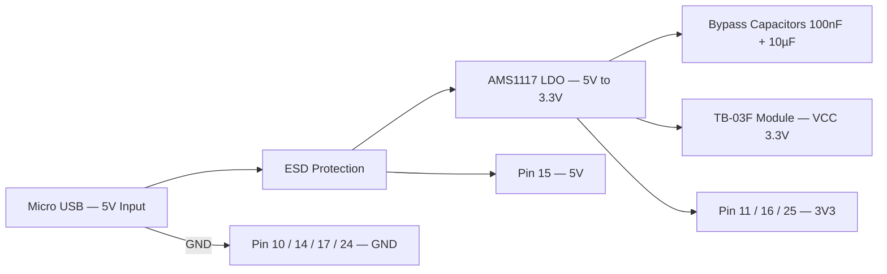
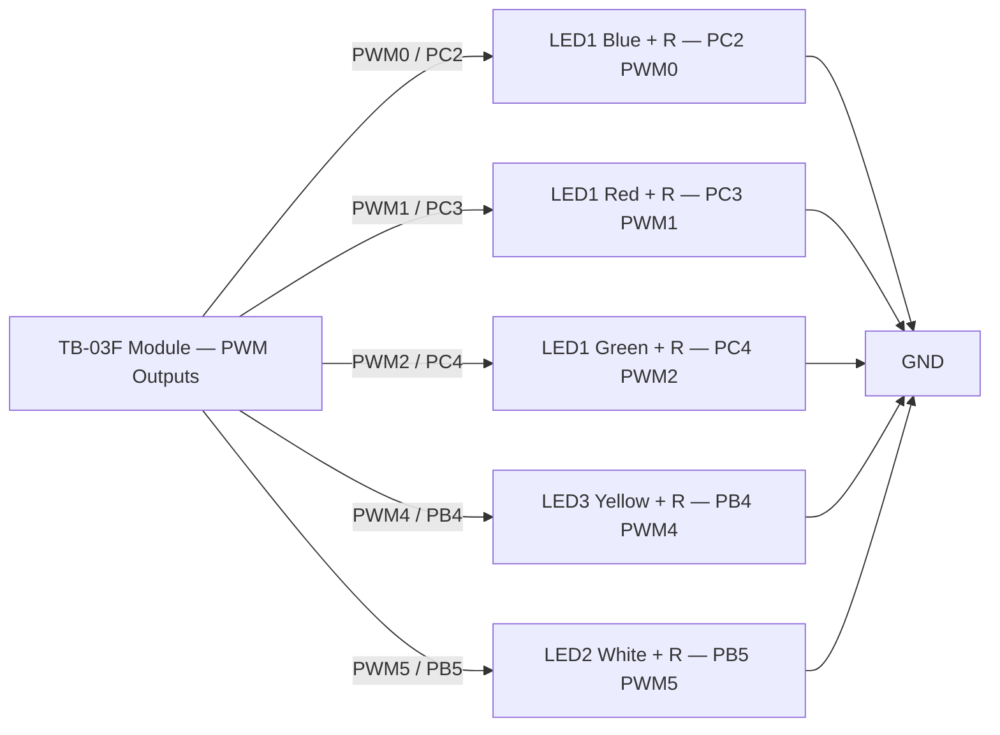
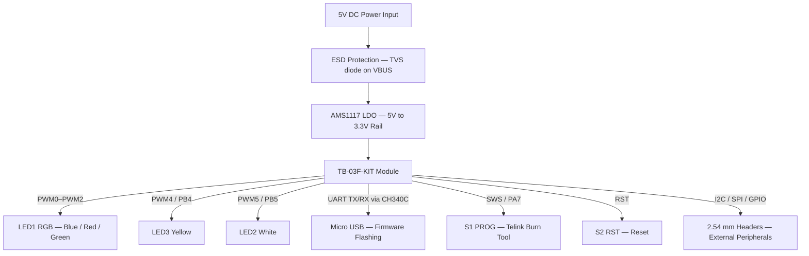

# TB-03F-KIT Specification
 
**Version:** V1.0  
**Copyright:** © 2020 Shenzhen Ai-Thinker Technology Co., Ltd. — All Rights Reserved
 
---
 
## Disclaimer and Copyright Notice
 
The information in this document, including the URL addresses for reference, is subject to change without notice. The documentation is provided "as is" without any warranty, including any warranties of merchantability, fitness for a particular purpose, or non-infringement.
 
The test data presented here are obtained by Ai-Thinker laboratory; actual results may slightly differ. The Wi-Fi Alliance membership mark is owned by the WiFi Alliance. All trade-mark names, trademarks, and registered trademarks mentioned herein are the property of their respective owners.
 
The final interpretation right is owned by **Shenzhen Ai-Thinker Technology Co., Ltd.**
 
> **Note:** The contents of this manual may be changed due to product version upgrades or other reasons. Shenzhen Ai-Thinker Technology Co., Ltd. reserves the right to modify the contents of this manual without notice.
 
---
 
## Revision History
 
| Version | Date       | Development / Revision | Developer | Approval |
|---------|------------|------------------------|-----------|----------|
| V1.0    | 2020-12-03 | Official release       | ChengC    | XuH      |
 
---
 
## 1. Product Overview
 
The **TB-03F-Kit** development board is an intelligent lighting development board designed for the TB-03F module. It features five PWM-adjustable RGB colour LEDs and two cold/warm lamp beads. All module signals are accessible via pin headers, enabling convenient development and debugging.
 
The board integrates rich development resources:
 
- TLSR8253F512 chip (B85 family)
- AT instruction set
- SDK secondary development support
- Bluetooth Mesh networking
- Android / iOS APP control and WeChat Mini Program control
- Tmall Genie voice direct-connection control
- Multi-board Mesh networking debug capability
- 2.54 mm pin header exposing all GPIO / PWM / I2C / ADC interfaces
- UART interface for firmware flashing (simple and fast)
- SWS pin compatible with Telink official burning tool

### Characteristics
 
| Feature | Details |
|---------|---------|
| Module | TB-03F-Kit (TB-03F module development board) |
| Firmware options | Ali Tmall Genie version; Common AT version |
| Wireless | BLE 5.0, support Mesh |
| Interface type | Standard Micro USB + 2.54 mm spacing pin header |
| Exposed interfaces | PWM / I2C / GPIO / ADC |
| LEDs | R/G/B colour LEDs + cold and warm lamp beads |
| Buttons | Reset button + user-defined button |
| Voice control | Tmall Genie Voice Direct Control |
| App control | Android / iOS APP + WeChat Mini Program |
 
### Main Parameters
 
| Parameter | Value |
|-----------|-------|
| Model | TB-03F-KIT Development Board |
| Package | DIP-30 (2.54 mm spacing pin header) |
| Dimensions | 24.0 × 16.0 × 3.0 mm (±0.2 mm) |
| Wireless standard | Bluetooth 5.0, support Mesh |
| Frequency range | 2400 ~ 2483.5 MHz |
| Transmit power | Maximum 10 dBm |
| Receiving sensitivity | Minimum −93 dBm ± 2 |
| Interfaces | PWM / I2C / GPIO / ADC |
| Operating temperature | −20 °C ~ +70 °C |
| Storage temperature | −40 °C ~ +125 °C, < 90 % RH |
| Power supply | Micro USB 4.75 V ~ 5.25 V (recommended 5.0 V) |
| Deep sleep current | 0.4 µA (module only) |
| Standby current | 2.51 mA (module only) |
| Full-load current (TX 10 dBm) | 20.54 mA (module only) |
| PCB current | 4 mA |
 
---
 
## 2. Electrical Parameters
 
### Absolute Maximum Ratings
 
> Exceeding any of the following absolute maximum values may cause permanent chip damage.
 
| Parameter | Min. | Typ. | Max. | Unit |
|-----------|------|------|------|------|
| Micro USB supply voltage | 4.75 | 5.0 | 5.25 | V |
| Operating temperature | −20 | — | +70 | °C |
| Storage temperature | −40 | — | +125 | °C |
 
### Power Consumption
 
> Note: values refer to module consumption only.
 
| Parameter | Typ. | Unit |
|-----------|------|------|
| Emission power (10 dBm) | 20.54 | mA |
| Standby power consumption | 2.51 | mA |
| Sleep mode | 0.8 | µA |
 
### RF Parameters
 
**RF Transmit Power**
 
| Parameter | Min. | Typ. | Max. | Unit |
|-----------|------|------|------|------|
| Average power | — | 9.5 | 10 | dBm |
 
**Receiving Sensitivity**
 
| Parameter | Min. | Typ. | Max. | Unit |
|-----------|------|------|------|------|
| Receiving sensitivity | −94 | −93 | — | dBm |
 
---
 
## 3. Appearance Dimensions
 
Board outline: **24.0 × 16.0 × 3.0 mm** (±0.2 mm) — DIP-30, 2.54 mm pitch.
 
```
                 ←──────────────── 24.0 mm ─────────────────→
              ┌────────────────────────────────────────────────┐  
  1  RST  ●───┤                   PCB antenna  ─────╗          │───●  30  C0
              │   ┌────────────────────────────────────────┐   │  
              │   │          TB-03F MODULE                 │   │  ↑
              │   │    (Telink TLSR8232 BLE 5.0 SoC)       │   │  │
              │   │    AI-Thinker                          │   │  │
              │   │    Model S3                            │   │  │
              │   │    BT 5.0 MESH                         │   │  │
              │   │                                        │   │ 16.0 mm
    ...       │   │                                        │   │  │
    ...       │   │                                        │   │  │
    ...       │   └────────────────────────────────────────┘   │  │
              │                                                │  │
              │   ╔══════════════════════════╗ ●──LED3 White   │  │
              │   ║ LED1–RGB (common cathode)║    (PWM5 / PB5) │  ↓
              │   ║PC2→Blue PC3→Red PC4→Green║ ●──LED2 Yellow  │
              │   ╚══════════════════════════╝    (PWM4 / PB4) │ ...
              │   ┌───────────────┐  ┌─────────────────────┐   │ ...
              │   │   AMS1117     │  │        CH340C       │   │ ...
              │   │(LDO 5V → 3.3V)│  │     (USB ↔ UART)    │   │
 15  5V   ●───┤   └───────────────┘  └─────────────────────┘   │───●  16  3V3
              │   ┌─────────────┐            ┌─────────────┐   │
              │   │ S1  PROG    │            │  S2  RST    │   │
              │   │ KEY_USER    │            │  KEY_RST    │   │
              │   │ TL SWS PA7  │            │  RESET      │   │
              │   └────(DTR)────┘            └─────────────┘   │
              │                ┌──────────────────┐            │
              │                │   micro USB ♀    │            │
              └────────────────┴──────────────────┴────────────┘
                                           ← 3.0 mm thick PCB
```
 
### Button Summary
 
| Switch | Key Name | Label | Signal |
|--------|----------|-------|--------|
| S1 | KEY_USER | PROG | TL SWS PA7 (DTR) |
| S2 | KEY_RST | RST | RESET |
 
### RGB LED1 — Pin Mapping
 
| Signal Link | IC Port | LED Colour |
|-------------|---------|------------|
| TL C2 | PC2 | Blue |
| TL C3 | PC3 | Red |
| TL C4 | PC4 | Green |
 
---
 
## 4. Pin Definition
 
The TB-03F-KIT development board exposes **30 interfaces** via a DIP-30 (2.54 mm pitch) pin header.
 
### Pin Layout Diagram
 
```
               TB-03F-KIT — Top View
         (pins numbered from top-left, CW)

    ┌────────────────────────────────────────┐
 1  │ RST      ── PCB antenna ─────╗      C0 │ 30
 2  │ C4   (PC4 / PWM2 / RGB-G)           C1 │ 29
 3  │ SWS  (PA7 / KEY_USER / DTR)         D4 │ 28
 4  │ C3   (PC3 / PWM1 / RGB-R)           D3 │ 27
 5  │ D7                                  D2 │ 26
 6  │ B7                                 3V3 │ 25
 7  │ B6                                 GND │ 24
 8  │ NC                                  A1 │ 23
 9  │ NC             C2 (PC2 / PWM0 / RGB-B) │ 22
10  │ GND      B4 (PB4 / PWM4 / LED3-Yellow) │ 21
11  │ 3V3       B5 (PB5 / PWM5 / LED2-White) │ 20
12  │ NC                           RXD (PA0) │ 19
13  │ NC                           TXD (PB1) │ 18
14  │ GND                                GND │ 17
15  │ 5V            VCC = 3V3 (3.3 V supply) │ 16
    └────────────────────────────────────────┘
                  [ micro USB ]
```
 
### Pin Definitions Table
 
| No. | Pin Name | SoC pin and function |
|-----|----------|----------|
| 1 | RST | Reset |
| 2 | C4 | PWM2 output / UART_CTS / PWM0 reverse output / SAR ADC input / GPIO PC4 |
| 3 | SWS | Single Line Slave / UART_RTS / GPIO PA7 |
| 4 | C3 | PWM1 output / UART_RX / I2C Serial Clock / 32 kHz Crystal input (selection) / GPIO PC3 |
| 5 | D7 | GPIO PD7 / SPI Clock (I2C_SCK) |
| 6 | B7 | SPI_DO data output / UART_RX / SAR ADC input / GPIO PB7 |
| 7 | B6 | SPI_DI data input (I2C_SDA) / UART_RTS / SAR ADC input / GPIO PB6 |
| 8 | NC | Empty |
| 9 | NC | Empty |
| 10 | GND | Ground |
| 11 | 3V3 | 3.3 V power supply |
| 12 | NC | Empty |
| 13 | NC | Empty |
| 14 | GND | Ground |
| 15 | 5V | 5 V power supply |
| 16 | VCC | 3.3 V power supply |
| 17 | GND | Ground |
| 18 | TXD | UART_TX / GPIO PB1 / PWM4 output / SAR ADC input |
| 19 | RXD | UART_RX / GPIO PA0 / PWM0 reverse output |
| 20 | B5 | PWM5 output / SAR ADC input / GPIO PB5 |
| 21 | B4 | PWM4 output / SAR ADC input / GPIO PB4 |
| 22 | C2 | PWM0 output / I2C serial data / 32 kHz Crystal output (selection) / GPIO PC2 |
| 23 | A1 | GPIO PA1 / I2S_clock |
| 24 | GND | Ground |
| 25 | 3V3 | 3.3 V power supply |
| 26 | D2 | GPIO PD2 / PWM3 output / SPI Chip Selection (Low Level Effective) / I2S_LR |
| 27 | D3 | GPIO PD3 / PWM1 reverse output / I2S_SDI |
| 28 | D4 | GPIO PD4 / Single Line Host SWM / PWM2 Reverse output / I2S_SDO |
| 29 | C1 | I2C_CLK / PWM1 Reverse output / PWM0 output / GPIO PC1 |
| 30 | C0 | I2C_SDA / PWM4 Reverse output / UART_RTS / GPIO PC0 |
 
---
 
## 5. Schematics
 
### Power Section
 

 
### LED and key Section
 
#### PWM Channel Mapping
 
| PWM Channel | IC Port | Function | Component |
|-------------|---------|----------|-----------|
| PWM0 | PC2 | RGB Blue | LED1 (Blue element) |
| PWM1 | PC3 | RGB Red | LED1 (Red element) |
| PWM2 | PC4 | RGB Green | LED1 (Green element) |
| PWM3 | PD2 | — | (reserved / general purpose) |
| PWM4 | PB4 | LED Yellow | LED3 |
| PWM5 | PB5 | LED White | LED2 |
 
#### BOARD_PINS Index Reference
 
| Index | Signal | Port | Description |
|-------|--------|------|-------------|
| 0 | Key / SWS | PA7 | User button (PROG / DTR) |
| 1 | RGB Blue | PC2 | LED1 blue element (PWM0) |
| 2 | RGB Red | PC3 | LED1 red element (PWM1) |
| 3 | RGB Green | PC4 | LED1 green element (PWM2) |
| 4 | Side Yellow | PB4 | LED3 (PWM4) |
| 5 | Side White | PB5 | LED2 (PWM5) |
| 6 | UART TX | PB1 | Serial transmit |
| 7 | UART RX | PA0 | Serial receive |
 
#### Schematic
 

 
---
 
## 6. Design Guidance
 
### 6.1 Application Circuit
 

 
### 6.2 Antenna Layout Requirements
 
- Do **not** place any metal parts around the module antenna area.
- Keep the antenna area away from high-frequency devices and switching converters.
- Ensure a clear ground plane clearance under the antenna.
### 6.3 Power Supply Guidelines
 
| Item | Requirement |
|------|-------------|
| Recommended voltage | 5 V |
| Peak current capability | > 800 mA |
| Preferred supply type | LDO (lowest ripple) |
| DC-DC ripple limit | ≤ 30 mV |
| DC-DC dynamic response | Reserve position for dynamic response capacitor |
| 5 V input protection | Add ESD device on the 5 V power interface |
 
---
 
## 7. Reflow Profile
 
The TB-03F-KIT uses a standard lead-free SMT reflow soldering profile (J-STD-020).
 
| Phase | Temp. Range | Ramp Rate | Duration |
|-------|-------------|-----------|---------|
| **Preheat** | 25 °C → 150 °C | +1.0 ~ +3.0 °C/s | ~60–90 s |
| **Soak** | 150 °C → 200 °C | +0.5 ~ +1.0 °C/s | ~60–120 s |
| **Reflow** (above liquidus 183 °C) | 183 °C → 260 °C | +1.0 ~ +3.0 °C/s | 40–60 s |
| **Peak** | ≤ 260 °C | — | ≤ 10 s |
| **Cooling** | 260 °C → 25 °C | −1.0 ~ −6.0 °C/s | ≥ 30 s |
 
---
 
## 8. Package Information
 
TB-03F-KIT is shipped in an **anti-static bag**.
 
---
 
## 9. Contacts
 
| | |
|-|---|
| **Company website** | https://www.ai-thinker.com |
| **Developer website** | https://docs.ai-thinker.com |
| **Community forum** | http://bbs.ai-thinker.com |
| **Sampling / purchasing** | https://ai-thinker.en.alibaba.com |
| **Business cooperation** | overseas@aithinker.com |
| **Technology support** | support@aithinker.com |
| **Address** | Room 410, Building C, Huafeng Intelligent Innovation Port, Xixiang, Baoan District, Shenzhen |
| **Phone** | 0755-29162996 |

---------------------------

# Mapping TB-03F-KIT pin number with TLSR8250F512ES16 SoC

| KIT Pin # | KIT Pin Name | TLSR8250F512ES16 Pin |
|:---------:|:------------:|:--------------------:|
| 1 | RST | RESET |
| 2 | C4 | PC4 |
| 3 | SWS | PA7 |
| 4 | C3 | PC3 |
| 5 | D7 | PD7 |
| 6 | B7 | PB7 |
| 7 | B6 | PB6 |
| 8 | NC | — |
| 9 | NC | — |
| 10 | GND | GND |
| 11 | 3V3 | VCC |
| 12 | NC | — |
| 13 | NC | — |
| 14 | GND | GND |
| 15 | 5V | — *(pre-LDO, not connected to SoC)* |
| 16 | VCC | VCC |
| 17 | GND | GND |
| 18 | TXD | PB1 |
| 19 | RXD | PA0 |
| 20 | B5 | PB5 |
| 21 | B4 | PB4 |
| 22 | C2 | PC2 |
| 23 | A1 | PA1 |
| 24 | GND | GND |
| 25 | 3V3 | VCC |
| 26 | D2 | PD2 |
| 27 | D3 | PD3 |
| 28 | D4 | PD4 |
| 29 | C1 | PC1 |
| 30 | C0 | PC0 |

Notes:
- **Pin 15 (5V)** is the raw USB supply upstream of the AMS1117 LDO — it does not connect directly to any SoC pin.
- **Pins 11, 16, 25** all map to the SoC's VCC rail (3.3 V); they are parallel supply points exposed for convenience.
- **Pins 10, 14, 17, 24** are all GND, connected to the common ground plane.

# TB-03F Pinout

| Pin | Name (= TLSR825x) | Full Function Description |
|:---:|:-----------------:|--------------------------|
| 1 | RST | System Reset (Active Low) |
| 2 | PC4 | GPIO PC4 / PWM2 output / PWM0 inverted output / UART_CTS / SAR ADC input |
| 3 | SWS | Single Wire Slave — Debug / Programming (DTR) / UART_RTS / GPIO PA7 |
| 4 | PC3 | GPIO PC3 / PWM1 output / UART_RX / I2C SCL / 32 kHz Crystal input (optional) |
| 5 | PD7 | GPIO PD7 / SPI Clock Master (SCK) / I2C SCK |
| 6 | PB7 | GPIO PB7 / **SPI_DO** (MISO — master mode) / UART_RX / SAR ADC input |
| 7 | PB6 | GPIO PB6 / **SPI_DI** (MOSI — master mode) / I2C_SDA / UART_RTS / SAR ADC input |
| 8 | 3V3 | Power Supply (3.3 V) |
| 9 | NC | Not Connected |
| 10 | PA1 | GPIO PA1 / I2S Clock |
| 11 | PC2 | GPIO PC2 / PWM0 output / I2C SDA / 32 kHz Crystal output (optional) |
| 12 | PB4 | GPIO PB4 / PWM4 output / SAR ADC input |
| 13 | PB5 | GPIO PB5 / PWM5 output / SAR ADC input |
| 14 | NC | Not Connected |
| 15 | GND | Ground |
| 16 | PD2 | GPIO PD2 / PWM3 output / SPI CS — Slave (active low) / I2S_LR |
| 17 | PD3 | GPIO PD3 / PWM1 inverted output / SPI CLK — Slave / I2S_SDI |
| 18 | PD4 | GPIO PD4 / PWM2 inverted output / Single Line Host SWM / SPI_DI — Slave / I2S_SDO |
| 19 | PC1 | GPIO PC1 / **I2C_CLK (SCL)** / PWM1 inverted output / PWM0 output |
| 20 | PC0 | GPIO PC0 / **I2C_SDA** / PWM4 inverted output / UART_RTS |
| 21 | PA0 | GPIO PA0 / UART_RX / PWM0 inverted output |
| 22 | PB1 | GPIO PB1 / UART_TX / PWM4 output / SAR ADC input |
