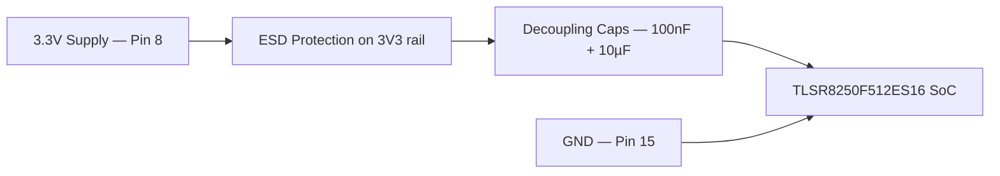
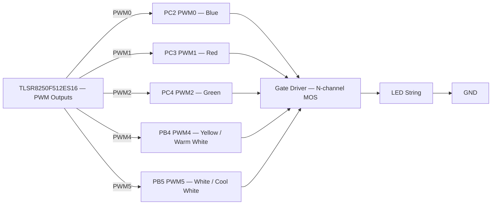
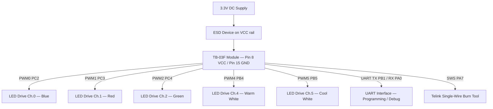
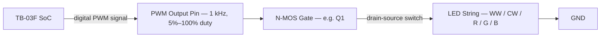

# TB-03F Module Specification
 
**Version:** V1.1  
**Copyright:** © 2021 Shenzhen Ai-Thinker Technology Co., Ltd. — All Rights Reserved
 
---
 
## Disclaimer and Copyright Notice
 
The information in this document, including URL addresses for reference, is subject to change without notice. The documentation is provided "as is" without warranty of any kind, including any warranty of merchantability, fitness for a particular purpose, or non-infringement, and any warranty of any proposal, specification, or sample mentioned elsewhere.
 
No liability is assumed in this document, including any infringement of any patent rights arising out of the use of the information in this document. No license is granted by estoppel or otherwise in this document, either express or implied.
 
The test data presented here are obtained from testing performed by Ai-Thinker Labs. Actual results may vary slightly. The Bluetooth Alliance member logo is owned by the Bluetooth Alliance. All trademark names, trademarks and registered trademarks mentioned herein are the property of their respective owners.
 
The final interpretation right belongs to **Shenzhen Ai-Thinker Technology Co., Ltd.**
 
> **Notice:** The contents of this manual may be changed due to product version upgrades or other reasons. Shenzhen Ai-Thinker Technology Co., Ltd. reserves the right to modify the contents of this manual without any notice. This manual is only used as a guide. Shenzhen Ai-Thinker Technology Co., Ltd. makes every effort to provide accurate information, but does not guarantee that the content is completely error-free. All statements, information and recommendations do not constitute any express or implied warranty.
 
---
 
## Revision History
 
| Version | Date       | Development / Revision            | Developer | Approval |
|---------|------------|-----------------------------------|-----------|----------|
| V1.0    | 2020-03-28 | Initial release                   | Yiji Xie  | Xu Hong  |
| V1.1    | 2021-01-04 | Update database                   | Xu Hong   | Xu Hong  |
 
---
 
## Table of Contents
 
1. [Product Description](#1-product-description)
2. [Electrical Parameters](#2-electrical-parameters)
3. [Physical Dimensions](#3-physical-dimensions)
4. [Pin Definition](#4-pin-definition)
5. [Schematics](#5-schematics)
6. [Design Guide](#6-design-guide)
7. [Reflow Profile](#7-reflow-profile)
8. [Packaging](#8-packaging)
9. [Contact Us](#9-contact-us)
---
 
## 1. Product Description
 
The **TB-03F** intelligent lighting module is a Bluetooth module designed around the **TLSR8250F512ES16** chip, conforming to BT 5.0 low-power Tmall Genie Mesh. The module supports direct control by Tmall Genie and includes Bluetooth Mesh networking capability. Devices are peered through star-network communication using Bluetooth broadcast, ensuring timely response even with multiple devices.
 
This module targets intelligent light control, meeting requirements for low power consumption, low latency and short-range wireless data communication.
 
### Features
 
- Direct Tmall Genie control — no gateway required
- SMD-22 package
- 6 independent PWM outputs
- On-board PCB antenna — no external antenna design needed
- Brightness (duty cycle) adjustment range: 5 %–100 %
- Factory default: 50 % duty cycle for cool and warm colour channels
- PWM output frequency: 1 kHz
- Multiple sleep modes; deep-sleep current as low as 0.4 µA
- Wall-switch colour-temperature toggle function
- Supports secondary development (custom firmware via SDK)
### Main Parameters
 
| Parameter | Value |
|-----------|-------|
| Module model | TB-03F |
| Dimensions | 24.0 × 16.0 × 3.0 mm (±0.2 mm) |
| Package | SMD-22 |
| Wireless standard | BT 5.0 |
| Frequency range | 2400 ~ 2483.5 MHz |
| Transmit power | Maximum 10 dBm |
| Receive sensitivity | −93 dBm ± 2 |
| Interfaces | GPIO / PWM / SPI / ADC / I2S |
| Operating temperature | −40 °C ~ +85 °C |
| Storage environment | −40 °C ~ +125 °C, < 90 % RH |
| Power supply voltage | 2.7 V ~ 3.6 V |
| Power supply current | ≥ 50 mA |
| Deep sleep current | 0.4 µA |
| Standby current | 2.51 mA |
| TX (PRBS9) @ 10 dBm | 6.36 mA |
| TX (Carrier Data) @ 10 dBm | 20.54 mA |
| Transmission distance (open LoS) | 80 m ~ 150 m |
 
---
 
## 2. Electrical Parameters
 
### Absolute Maximum Ratings
 
> Exceeding any of the following absolute maximum values may cause permanent chip damage.
 
| Parameter | Min. | Typ. | Max. | Unit |
|-----------|------|------|------|------|
| Power supply voltage | 2.7 | 3.3 | 3.6 | V |
| I/O voltage (VCCIO) | −0.3 | — | 3.6 | V |
| Operating temperature | −40 | — | +85 | °C |
| Storage temperature | −40 | — | +125 | °C |
 
### Power Consumption
 
| Item | Typical | Unit |
|------|---------|------|
| Transmit power (10 dBm) | 20.54 | mA |
| Receive power | 6.36 | mA |
| Standby power consumption | 2.51 | mA |
| Light sleep | 1.5 | µA |
| Deep sleep | 0.4 | µA |
 
### RF Parameters
 
**RF Transmit Power**
 
| Parameter | Min. | Typ. | Max. | Unit |
|-----------|------|------|------|------|
| Average power | — | 9.5 | 10 | dBm |
 
**Receiving Sensitivity**
 
| Parameter | Min. | Typ. | Max. | Unit |
|-----------|------|------|------|------|
| Receive sensitivity | −94 | −93 | — | dBm |
 
---
 
## 3. Physical Dimensions
 
Module outline: **24.0 × 16.0 × 3.0 mm** (±0.2 mm) — SMD-22, 1.5 mm pitch castellated pads.
 
```
         ←─────────────────── 24.0 mm ───────────────────→
         ┌────────────────────────────────────────────────┐  ↑
  1 RST  ┤ ■                                            ■ ├ 22 PB1
  2 PC4  ┤ ■                                            ■ ├ 21 PA0
  3 SWS  ┤ ■    ┌──────────────────────────────────┐    ■ ├ 20 PC0
  4 PC3  ┤ ■    │        TB-03F MODULE             │    ■ ├ 19 PC1
  5 PD7  ┤ ■    │ TLSR8250F512ES16 (Telink BLE5.0) │    ■ ├ 18 PD4
  6 PB7  ┤ ■    │                                  │    ■ ├ 17 PD3
  7 PB6  ┤ ■    │        PCB antenna ──╗           │    ■ ├ 16 PD2   16.0 mm
  8 3V3  ┤ ■    └──────────────────────────────────┘    ■ ├ 15 GND
  9 NC   ┤ ■                                            ■ ├ 14 NC
 10 PA1  ┤ ■                                            ■ ├ 13 PB5
 11 PC2  ┤ ■                                            ■ ├ 12 PB4
         └────────────────────────────────────────────────┘  ↓
                             PCB thickness: 3.0 mm
```
 
> Pad pitch: 1.5 mm. Castellated SMD pads on all four sides (11 pads left side, 11 pads right side).
 
---
 
## 4. Pin Definition
 
The TB-03F module has **22 castellated SMD pads**. Pins are numbered 1–11 down the left side and 12–22 up the right side.
 
### Pin Definitions Table
 
| No. | Name | Function Description |
|-----|------|----------------------|
| 1 | RST | Reset (active low) |
| 2 | PC4 | PWM2 output / UART_CTS / PWM0 inverted output / SAR ADC input / GPIO PC4 |
| 3 | SWS | Single Line Slave / UART_RTS / GPIO PA7 |
| 4 | PC3 | PWM1 output / UART_RX / I2C Serial Clock / 32 kHz Crystal input (optional) / GPIO PC3 |
| 5 | PD7 | GPIO PD7 / SPI Clock (I2C_SCK) |
| 6 | PB7 | SPI_DO data output / UART_RX / SAR ADC input / GPIO PB7 |
| 7 | PB6 | SPI_DI data input (I2C_SDA) / UART_RTS / SAR ADC input / GPIO PB6 |
| 8 | 3V3 | Power supply (3.3 V) |
| 9 | NC | Not connected |
| 10 | PA1 | GPIO PA1 / I2S_clock |
| 11 | PC2 | PWM0 output / I2C serial data / 32 kHz Crystal output (optional) / GPIO PC2 |
| 12 | PB4 | PWM4 output / SAR ADC input / GPIO PB4 |
| 13 | PB5 | PWM5 output / SAR ADC input / GPIO PB5 |
| 14 | NC | Not connected |
| 15 | GND | Ground |
| 16 | PD2 | GPIO PD2 / PWM3 output / SPI Chip Select (active low) / I2S_LR |
| 17 | PD3 | GPIO PD3 / PWM1 inverted output / I2S_SDI |
| 18 | PD4 | GPIO PD4 / Single Line Host SWM / PWM2 inverted output / I2S_SDO |
| 19 | PC1 | I2C_CLK / PWM1 inverted output / PWM0 output / GPIO PC1 |
| 20 | PC0 | I2C_SDA / PWM4 inverted output / UART_RTS / GPIO PC0 |
| 21 | PA0 | UART_RX / GPIO PA0 / PWM0 inverted output |
| 22 | PB1 | UART_TX / GPIO PB1 / PWM4 output / SAR ADC input |

| TB-03F Pin | Pin Name (= TLSR8253 SoC Pin) | Typical Description / Function |
|:----------:|:-----------------------------:|-------------------------------|
| 1 | RST | System Reset (Active Low) |
| 2 | PC4 | GPIO / PWM2 / UART_CTS / SAR ADC Input |
| 3 | SWS | Single Wire Slave (Debug / Programming Interface) |
| 4 | PC3 | GPIO / PWM1 / UART_RX |
| 5 | PD7 | GPIO / SPI_CK (Master) / I2C_SCL |
| 6 | PB7 | GPIO / SPI_DI / I2C_SDA / UART_RTS |
| 7 | PB6 | GPIO / SPI_DO / UART_TX |
| 8 | 3V3 | Power Supply (3.3 V) |
| 9 | NC | Not Connected |
| 10 | PA1 | GPIO / I2C_SDA / PWM1_N |
| 11 | PC2 | GPIO / PWM0 / UART_TX |
| 12 | PB4 | GPIO / PWM4 / SAR ADC Input |
| 13 | PB5 | GPIO / PWM5 / SAR ADC Input |
| 14 | NC | Not Connected |
| 15 | GND | Ground |
| 16 | PD2 | GPIO / PWM3 / SPI_CN (Slave) |
| 17 | PD3 | GPIO / PWM4 / SPI_CK (Slave) |
| 18 | PD4 | GPIO / PWM5 / SPI_DI (Slave) |
| 19 | PC1 | GPIO / PWM1 / I2C_SDA |
| 20 | PC0 | GPIO / PWM0 / I2C_SCL |
| 21 | PA0 | GPIO / I2C_SCL / PWM0_N |
| 22 | PB1 | GPIO / PWM1 / SAR ADC Input |

### PWM Channel Summary
 
| PWM Channel | SoC Port | Primary Use |
|-------------|----------|-------------|
| PWM0 | PC2 (pin 11) | Colour channel (e.g. RGB Blue) |
| PWM1 | PC3 (pin 4) | Colour channel (e.g. RGB Red) |
| PWM2 | PC4 (pin 2) | Colour channel (e.g. RGB Green) |
| PWM3 | PD2 (pin 16) | General purpose |
| PWM4 | PB4 (pin 12) | Colour channel (e.g. Yellow / Warm white) |
| PWM5 | PB5 (pin 13) | Colour channel (e.g. White / Cool white) |
 
---
 
## 5. Schematics
 
### Power Section
 

 
### LED PWM Drive Section
 

 
---
 
## 6. Design Guide
 
### 6.1 Application Circuit
 

 
### 6.2 Recommended Module Footprint
 
> Design the PCB footprint according to the module pad diagram. Ensure PCB pads are not offset from the module castellated pads; a slight outward expansion of the PCB pad is acceptable and does not affect module performance.
 
```
  PCB pad layout (left side — 11 pads, 1.5 mm pitch):
 
  ┌──────────────────┐
  │  ▓ pad 1  (RST)  │
  │  ▓ pad 2  (PC4)  │
  │  ▓ pad 3  (SWS)  │
  │  ▓ pad 4  (PC3)  │
  │  ▓ pad 5  (PD7)  │
  │  ▓ pad 6  (PB7)  │
  │  ▓ pad 7  (PB6)  │
  │  ▓ pad 8  (3V3)  │
  │  ▓ pad 9  (NC)   │
  │  ▓ pad 10 (PA1)  │
  │  ▓ pad 11 (PC2)  │
  └──────────────────┘
  (Mirror for right-side pads 12–22)
```
 
### 6.3 Antenna Layout Requirements
 
Two recommended placement options:
 
**Option A — Antenna overhangs the PCB edge**
 
```
  ┌──────────────────────────────────┬──────╗
  │       Host PCB                   │TB-03F║◄── antenna extends beyond edge
  │                                  │      ║
  └──────────────────────────────────┴──────╝
```
 
**Option B — Host PCB cutout under antenna**
 
```
  ┌──────────────────────────────────┬──────╗
  │       Host PCB           cutout  │TB-03F║
  │                         ░░░░░░░  │      ║
  └──────────────────────────────────┴──────╝
```
 
Additional rules:
- Do **not** place any metal parts around the antenna area.
- Keep the antenna area clear of high-frequency devices and switching converters.
### 6.4 Power Supply Guidelines
 
| Item | Requirement |
|------|-------------|
| Recommended voltage | 3.3 V |
| Peak current capability | ≥ 50 mA |
| Preferred supply type | LDO (lowest ripple) |
| DC-DC ripple limit | ≤ 30 mV |
| DC-DC dynamic response | Reserve PCB footprint for dynamic response capacitor |
| 3.3 V input protection | Add ESD device on the 3.3 V power interface |
 
### 6.5 PWM Dimming Scheme
 
For lamps requiring dimming, connect the corresponding PWM pin to the control input of the downstream driver circuit. Each PWM output independently generates a digital signal with 100 adjustable duty-cycle levels (1 % steps). The downstream circuit may be voltage-driven or current-driven.


 
### 6.6 Single-Channel LED Drive Reference
 
The following reference uses one N-channel MOS transistor (Q1) to drive a single white-LED string (channel **CW_I**). The same topology applies identically to all five remaining channels.
 
```
  3.3V ──────────┬──────── LED+ (WW)
                 │
              [LED string]
                 │
                 └──── Drain (Q1)
                          │
  CW_I (PWM) ──[Rg]── Gate (Q1)
                          │
                       Source ──── GND
```
 
> `Rg` is a gate resistor (typically 10–100 Ω) to limit switching transients.
 
---
 
## 7. Reflow Profile
 
The TB-03F uses a standard lead-free SMT reflow soldering profile (per J-STD-020).
 
| Phase | Temperature Range | Ramp Rate | Duration |
|-------|-------------------|-----------|---------|
| **Preheat** | 25 °C → 150 °C | +1.0 ~ +3.0 °C/s | ~60–90 s |
| **Soak** | 150 °C → 200 °C | +0.5 ~ +1.0 °C/s | ~60–120 s |
| **Reflow** (above liquidus 183 °C) | 183 °C → 260 °C | +1.0 ~ +3.0 °C/s | 40–60 s |
| **Peak** | ≤ 260 °C | — | ≤ 10 s |
| **Cooling** | 260 °C → 25 °C | −1.0 ~ −6.0 °C/s | ≥ 30 s |
 
---
 
## 8. Packaging
 
TB-03F modules are shipped in **tape-and-reel** (SMT taping) packaging.
 
---
 
## 9. Secondary Development
 
The TB-03F module supports user-written firmware for customised functions.
 
| Environment | Resource |
|-------------|----------|
| Linux SDK (Ai-Thinker collation) | https://github.com/Ai-Thinker-Open/Telink_825X_SDK |
| Windows — Telink official SDK | http://wiki.telink-semi.cn |
 
---
 
## 10. Contacts
 
| | |
|-|---|
| **Company website** | https://www.ai-thinker.com |
| **Developer docs** | https://docs.ai-thinker.com |
| **Official forum** | http://bbs.ai-thinker.com |
| **Sample purchase** | https://anxinke.taobao.com |
| **Business** | sales@aithinker.com |
| **Technical support** | support@aithinker.com |
| **Address** | Rooms 108–410, Gushu Huafeng Smart Innovation Port, Gushu, Xixiang, Baoan District, Shenzhen 518000, China |
| **Phone** | 0755-29162996 |

