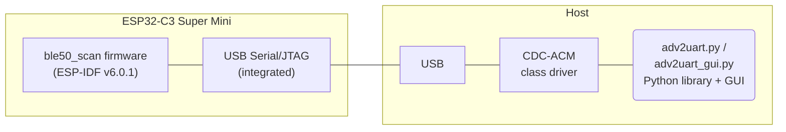

# ESP32-C3 ADV_BLE2UART ble50_scan

**ESP32-C3 firmware** implementing a BLE 5.0 scanner that continuously receives
Bluetooth Low Energy advertisements (both 1M PHY and Coded PHY S=8 Long Range)
and delivers them to a host connected via the chip's native USB Serial/JTAG
peripheral. The same protocol also lets the host drive GPIOs, control RF
parameters, initiate GATT central connections, and transmit custom
advertisements.



## Firmware characteristics

- Target: [Espressif ESP32-C3](https://www.espressif.com/en/products/socs/esp32-c3) (RISC-V, 160 MHz, BLE 5.0).
- Validated on the **ESP32-C3 Super Mini** development board.
- Transport: **native USB Serial/JTAG** (no CH340 / external UART bridge).
  - The host CDC `baudrate` field is ignored — throughput is the USB full-speed
    bulk link (~480 Mbit/s shared). The firmware therefore rejects
    `UART set_baud` (returns `Denied`).
  - DTR/RTS pulse on the host triggers a hardware reset of the chip
    (`rst:0x15 USB_UART_CHIP_RESET`). The GUI keeps DTR/RTS low at Connect for
    this reason; the bundled adv2uart.py likewise.
- BLE stack: ESP-IDF Bluedroid host with BLE 5.0 extended scanning enabled,
  scanning **1M PHY and Coded PHY S=8** simultaneously with independent
  windows for each PHY.
- Frame protocol: **binary, length-prefixed, CRC-16 checked** (same wire format
  used by the TLSR825x sibling — see [`../../ble2uart/README.md`](../../ble2uart/README.md)).
- Filter lists: separate **white list and black list**, **64 entries each**,
  supporting full MAC or 1–5 byte MAC prefix matches.
- Board LED (GPIO8, active-low) driven via the hardware **LEDC** peripheral
  for two-level brightness: dim flash on a 1M adv, full-bright flash on a
  Coded adv. PWM is generated in hardware so the BLE RX path is unaffected.
- Host-driven **GPIO interrupts**: arm any input pin and receive spontaneous
  edge events over the protocol (e.g. BOOT button on GPIO9).
- BLE central role available: open / write / receive notifications on any
  peer, on 1M or Coded PHY.

## ESP32-C3 board LED

The Super Mini exposes a single user LED on GPIO8 (active-low).

| Event                                  | LED behaviour                       |
|----------------------------------------|-------------------------------------|
| Idle (no host activity, no adv)        | Off                                 |
| Legacy / 1M / 2M advertisement matched | ~3 % brightness flash, 25 ms        |
| Coded PHY advertisement matched        | 100 % brightness flash, 25 ms       |
| Any host command processed             | ~3 % brightness flash, 25 ms        |
| User-driven (GPIO Write/Toggle/Blink)  | As requested by the host            |

LEDC frequency is 5 kHz with 8-bit resolution. The duty value 256 (max + 1)
is used as the "always-HIGH" sentinel so idle leaks no current through the
LED.

## Build

The toolchain is fetched and pinned locally under `.tooling/` so the build is
fully reproducible without touching the system-wide ESP-IDF installation.

### Prerequisites

Tested on WSL2 (Ubuntu 22.04) and native Linux. Install once:

```bash
sudo apt-get install -y git python3 python3-venv cmake ninja-build
```

> **Note:** BLE configuration defaults are stored in
> [`ble50_scan/sdkconfig.defaults`](ble50_scan/sdkconfig.defaults). These are
> merged automatically by `idf.py set-target`, ensuring Bluetooth and
> BLE 5.0 features are enabled regardless of the target chip. If you need
> to customise BLE settings, edit `sdkconfig.defaults` or run
> `idf.py menuconfig` after the build is configured.

### One-shot install of the local toolchain

From `source/esp32ble/`:

```bash
./install.sh                                              # default: esp32c3
./install.sh --device esp32c6 --rgb 15 --adv rgb         # RGB on GPIO15 via RMT
./install.sh --device esp32c3 --led 8 --adv led           # regular LED on GPIO8
ESP_TARGET=esp32c6 LED_GPIO=8 RGB_GPIO=15 ADV_MODE=rgb ./install.sh  # via env vars
```

> The `--device` option accepts any ESP32-family target (esp32c3, esp32c6,
> esp32h2, ...). Run `./install.sh --help` for the full list.

This clones ESP-IDF v6.0.1 into `.tooling/esp-idf-v6.0.1/`, installs the
toolchain for the selected target (default `esp32c3`) and Python virtualenv
into `.tooling/espressif/`, and downloads the latest `esptool.exe` (Windows)
into `ble50_scan/`. Re-running the script is idempotent. To wipe both:

```bash
./install.sh clean
```

### Clean firmware build

From `source/esp32ble/`:

```bash
./build.sh                                               # default: esp32c3, no LED
./build.sh --device esp32c6 --rgb 15 --adv rgb           # RGB on GPIO15
./build.sh --device esp32c6 --led 8 --rgb 15 --adv led   # LED on GPIO8, RGB on GPIO15
./build.sh --device esp32c3 --led 8 --adv led             # regular LED on GPIO8
./build.sh --device esp32c6 --adv none                    # no LED activity
ESP_TARGET=esp32c6 LED_GPIO=8 RGB_GPIO=15 ADV_MODE=rgb ./build.sh  # via env vars
```

> The `--device`, `--led`, `--rgb`, and `--adv` options work identically in
> `install.sh` and `build.sh`. Run `./build.sh --help` for details.

For **fast incremental rebuilds** (skips the clean step, only recompiles
changed files):

```bash
./build.sh --incremental                            # quick rebuild, default target
./build.sh -i --device esp32c6 --rgb 15 --adv rgb
```

Note: `--incremental` / `-i` is safe when only source files changed; if you
changed the LED/RGB/ADV configuration or the device target, do a full (clean)
build.

The build automatically detects the current target in `sdkconfig` and runs
`idf.py set-target` if the target has changed. BLE configuration defaults
are stored in `ble50_scan/sdkconfig.defaults`. LED/GPIO settings are generated
automatically from the `--led`/`--rgb`/`--adv` flags and merged by the build
system.

Produces:

```
ble50_scan/build/ble50_scan.bin            (application)
ble50_scan/build/bootloader/bootloader.bin
ble50_scan/build/partition_table/partition-table.bin
```

### LED / RGB configuration

The board LED(s) are configured via command-line flags instead of static
board configuration files:

| Flag | Description | Default GPIO |
|------|-------------|--------------|
| `--led <gpio>` | Regular (PWM) LED on this GPIO | — |
| `--rgb <gpio>` | RGB LED (SK6812) on this GPIO | — |
| `--adv <mode>` | What blinks on advertisements: `led`, `rgb`, `none` | — |

**Examples:**

```bash
# Regular LED on GPIO8, blinks on advertisements
./build.sh --device esp32c3 --led 8 --adv led

# RGB LED on GPIO15 via RMT, blinks on advertisements
./build.sh --device esp32c6 --rgb 15 --adv rgb

# Both LEDs present; advertisements blink the regular LED
./build.sh --device esp32c6 --led 8 --rgb 15 --adv led

# Both LEDs present; no advertisement blinking
./build.sh --device esp32c6 --led 8 --rgb 15 --adv none

# No LEDs at all
./build.sh --device esp32c3
```

The RGB LED shows **blue** for 1M/legacy advertisements and **green** for
Coded PHY advertisements.

### Serial protocol for LED control

Both LEDs are controlled through the **GPIO command** (`CMD_ID_GPIO = 0x06`).
The firmware automatically recognises whether a pin is a regular (PWM) LED
or an RGB (RMT) LED and applies the appropriate control.

#### Regular (PWM) LED — GPIO write / toggle

Write the GPIO level (active-low convention: level=0 = ON, level=1 = OFF):

```
[0x06, 0x02, pin, level, 0, 0, 0]
```

Toggle the LED:

```
[0x06, 0x03, pin, 0, 0, 0, 0]
```

| Byte | Field     | Description                                |
|------|-----------|--------------------------------------------|
| 0    | `CMD_ID`  | `0x06` (CMD_ID_GPIO)                       |
| 1    | `op`      | `0x02` = write, `0x03` = toggle            |
| 2    | `pin`     | GPIO number (e.g. `0x08` for GPIO8)        |
| 3    | `level`   | Write only: `0x00` = low, `0x01` = high    |
| 4–6  | (padding) | Fill with `0x00`                           |

Examples with `adv2uart.py`:
```python
# Regular LED on GPIO8, active-low: write 0 = ON
dv.command(b'\x06\x02\x08\x00\x00\x00\x00')
# Regular LED on GPIO8: write 1 = OFF
dv.command(b'\x06\x02\x08\x01\x00\x00\x00')
# Toggle
dv.command(b'\x06\x03\x08\x00\x00\x00\x00')
```

#### RGB LED (SK6812/WS2812 via RMT) — GPIO write / RGB colour

Turn ON (white) / OFF:

```
[0x06, 0x02, pin, 1/0, 0, 0, 0]
```

Set arbitrary colour — op `0x08` (GPIO_OP_RGB), channels 0–255:

```
[0x06, 0x08, pin, R, G, B, 0]
```

| Byte | Field     | Description                                |
|------|-----------|--------------------------------------------|
| 0    | `CMD_ID`  | `0x06` (CMD_ID_GPIO)                       |
| 1    | `op`      | `0x08` = RGB colour                        |
| 2    | `pin`     | GPIO number (e.g. `0x0F` for GPIO15)       |
| 3    | `R`       | Red channel (0–255)                        |
| 4    | `G`       | Green channel (0–255)                      |
| 5    | `B`       | Blue channel (0–255)                       |
| 6    | (padding) | Fill with `0x00`                           |

Examples with `adv2uart.py`:
```python
# RGB ON (white) on GPIO15
dv.command(b'\x06\x02\x0f\x01\x00\x00\x00')
# RGB OFF on GPIO15
dv.command(b'\x06\x02\x0f\x00\x00\x00\x00')
# Purple (R=64, G=0, B=32) on GPIO15
dv.command(b'\x06\x08\x0f\x40\x00\x20\x00')
# Green (R=0, G=255, B=0) on GPIO15
dv.command(b'\x06\x08\x0f\x00\xff\x00\x00')
```

#### GPIO response (all LED types)

The firmware response to every GPIO command has the format:

| Byte | Field         | Description                                |
|------|---------------|--------------------------------------------|
| 0    | `op`          | Echo of the operation                      |
| 1    | `pin_code`    | Echo of the pin                            |
| 2    | `level`       | Current pin level (0/1)                    |
| 3    | `is_led`      | `1` if this pin is a configured LED        |
| 4–5  | `board_mask`  | Bitmap of LED pins (pins < 16)             |

The response tells the host whether the pin is a recognised LED (`is_led=1`),
allowing host tools to light up a "this is an LED" indicator in the UI.

#### Host tools

- **TUI** (`adv2uart_tui.c`): keys `N` = LED ON, `O` = LED OFF, `L` = toggle.
  Press `?` in the GPIO panel for RGB colour control if an RGB GPIO is
  configured. Pass `--led-gpio`, `--rgb-gpio`, `--led-active-low` to match
  the firmware build configuration.
- **GUI** (`adv2uart_gui.py`): RGB panel with colour picker, brightness slider,
  "Set RGB" / "Off" buttons. Select device profile or pass `--device` with
  the profile id.
- **Web GUI** (`adv2uart_web_gui.html`): GPIO panel with write/toggle and
  RGB colour picker for the configured RGB pin.

For incremental rebuilds after the first clean build:

```bash
make -C ble50_scan/build -j"$(nproc)"
```

## Flash

From WSL get the Windows-style path of the build directory:

```bash
wslpath -w ble50_scan
```

Then from a Windows CMD prompt:

```cmd
pushd <output of wslpath -w ble50_scan>
flash.cmd COM3              # ESP32-C3 (default)
flash.cmd COM7 esp32c6      # ESP32-C6
flash.cmd COM9 esp32h2      # ESP32-H2, etc.
popd
```

`flash.cmd` calls `esptool.exe` (v5.3.0, downloaded from
[GitHub releases](https://github.com/espressif/esptool/releases))
with the bootloader (offset `0x0`), partition table (`0x8000`) and
application (`0x10000`). The chip type defaults to `esp32c3` and can be
overridden with the second argument — use `flash.cmd COM7 esp32c6` for
an ESP32-C6 board.

## Host tools

- [`adv2uart.py`](adv2uart.py) — CLI scanner / driver. Streams adverts and
  command responses to the console, exposes white/black list management,
  battery query, scan windows, GPIO event arming, etc.
- [`adv2uart_gui.py`](adv2uart_gui.py) — Tkinter GUI front-end with multiple
  tabs (Live adverts, MAC stats, GPIO, RF, Console, TX Adv, BLE Conn, Log)
  and a profile system that lets the same file drive both this firmware and
  the TLSR825x `ble2uart` firmware.
- [`adv2uart.c`](adv2uart.c) — standalone C CLI equivalent of `adv2uart.py`.
  Supports serial scan control, whitelist/blacklist handling, VBAT query,
  GPIO event commands, scan timeout policies and runtime status output.
- [`adv2uart_tui.c`](adv2uart_tui.c) — Linux ncurses TUI front-end in C.
  Shows live advertisements and protocol logs, with keyboard controls for
  Start/Stop scan, INFO, VBAT, white/black list updates, and GPIOEVT query.
- [`adv2uart_api.mjs`](adv2uart_api.mjs) — JavaScript protocol/API module
  (CRC framing, parser, command builders, high-level API methods).
- [`adv2uart.js`](adv2uart.js) — Node.js CLI equivalent of `adv2uart.py`
  built on top of `adv2uart_api.mjs`.
- [`adv2uart_web_gui.html`](adv2uart_web_gui.html) +
  [`adv2uart_web_gui.js`](adv2uart_web_gui.js) — browser test GUI using
  the Web Serial API (Chromium/Edge, secure context).
- [`adv2uart_api.ts`](adv2uart_api.ts) — typed source for the JavaScript API
  surface (discriminated unions and shared event/response shapes). This file is
  currently source-only and is not part of the runtime build.

Both Python programs require Python 3.10+ with:

```bash
pip3 install pyserial construct
```

Run from `ble50_scan/`:

```bash
python3 adv2uart.py COM3                 # CLI scanner with default 1M+Coded
python3 adv2uart_gui.py --device esp32-c3 --port COM3 --connect
```

## JavaScript API, CLI and Web GUI

### Node.js CLI (`adv2uart.js`)

Requirements:

```bash
sudo apt-get install -y nodejs npm
npm install serialport
```

Run examples:

```bash
node adv2uart.js --port /dev/ttyACM0 --phy both --scan-window-ms 30
node adv2uart.js --port /dev/ttyACM0 --battery
node adv2uart.js --port /dev/ttyACM0 --gpio-event 9 --gpio-event-only
```

### Browser test GUI (`adv2uart_web_gui.html`)

Serve `ble50_scan/` with a local HTTP server and open the page in Chromium/Edge:

```bash
python3 -m http.server 8080
# then open: http://localhost:8080/adv2uart_web_gui.html
```

The GUI uses `navigator.serial` and includes scan controls, MAC filters,
GPIO/GPIOEVT tools, TXADV controls, BLE connection commands, live
advertisements table and log panel.

Build and run the C TUI from `ble50_scan/`:

```bash
gcc -Wall -Wextra -O2 adv2uart_tui.c -o adv2uart_tui -lncurses
./adv2uart_tui --port /dev/ttyACM0 --baud 2000000
```

## C host programs

The repository contains two host-side C programs:

- [`adv2uart.c`](adv2uart.c): non-interactive CLI scanner/driver (Python
  CLI equivalent).
- [`adv2uart_tui.c`](adv2uart_tui.c): interactive ncurses terminal UI.

Compile both from `ble50_scan/`:

```bash
gcc -Wall -Wextra -O2 adv2uart.c -o adv2uart
gcc -Wall -Wextra -O2 adv2uart_tui.c -o adv2uart_tui -lncurses
```

Quick run examples:

```bash
./adv2uart --port /dev/ttyACM0 --phy both --scan-window-ms 30
./adv2uart_tui --port /dev/ttyACM0 --baud 2000000
```

Cross-compile note (MIPS/OpenWrt-like targets):

```bash
mipsel-linux-musl-gcc -Wall -Wextra -O2 adv2uart.c -o adv2uart.mips
mipsel-linux-musl-gcc -Wall -Wextra -O2 adv2uart_tui.c -o adv2uart_tui.mips -lncurses
```

### Build `linux_flasher.c` on Linux

`linux_flasher.c` uses Espressif's `esp-serial-flasher` headers/libraries
(`esp_loader.h`, `linux_port.h`, `example_common.h`, `md5_hash.h`).

Tested workflow:

```bash
# from source/esp32ble/ble50_scan
git clone --depth 1 https://github.com/espressif/esp-serial-flasher.git .tooling/esp-serial-flasher
cp linux_flasher.c .tooling/esp-serial-flasher/examples/linux_example/main.c

cd .tooling/esp-serial-flasher/examples/linux_example
mkdir -p build && cd build
cmake -DCMAKE_C_FLAGS='-I../../../private_include' ..
cmake --build .
```

Output binary:

```text
.tooling/esp-serial-flasher/examples/linux_example/build/linux_flasher
```

Run help:

```bash
.tooling/esp-serial-flasher/examples/linux_example/build/linux_flasher --help
```

Use `./adv2uart_tui --help` to list all keys and options.

The GUI accepts `--device {esp32-c3, tb-03f-kit}` for profile-aware UI
(default `esp32-c3`).

## Wire frame layout

Every packet on the link — host-to-device commands, device-to-host responses
and device-to-host advertisement reports — uses the **same 13-byte header**
plus optional variable-length payload, terminated by a 2-byte CRC-16.

```
offset  size  meaning                                  device→host          host→device
------  ----  ---------------------------------------  -------------------  -----------------
0       1     payload_len                              0..229 ext-adv data  0 for fixed-len cmds
1       1     RSSI (s8) for adverts / cmd id for cmds  RSSI in dBm           CMD_ID_xxx
2       1     event_type for adverts / status for cmd  event_type            0 (don't care)
3       1     addr_type|dir<<4 for adv / data_len      addr type             FRAME_DATA_LEN echo
4       1     primary_phy|secondary_phy<<4 / 0xFF      adv PHY map           0xFF for commands
5..10   6     peer MAC (LE) / command data field       6-byte MAC            command parameters
11..    N     extended-adv payload data                payload_len bytes     command-specific
end-2   2     CRC-16 (little-endian)                   over all preceding    over all preceding
```

The `byte[4] = 0xFF` discriminates a command response/event from an
advertisement report on the parsing side.

CRC-16 polynomial is the standard CRC-16/ARC (poly 0xA001, init 0xFFFF,
no final XOR). Implementation in [`main/crc.c`](main/crc.c).

## Command reference

Each command is sent as `[CMD_ID][...payload...][CRC16]`. Responses share the
common header; semantics of `byte[2]` (response status) follow the table:

| Status code | Mnemonic            | Meaning                                |
|-------------|---------------------|----------------------------------------|
| 0           | `OK`                | Operation succeeded                    |
| 1           | `Bad arguments`     | Frame too short / op not recognised    |
| 2           | `Unknown pin`       | GPIO id outside the supported set      |
| 3           | `Denied`            | Refused by the firmware / BLE stack    |
| 4           | `Bad value`         | Value out of range                     |

### 0x00 — `INFO`

Request: `[00]`

Response carries `byte[1]=SW_VERSION` (0x02 at the time of writing) and
`data[0..5]` = local 6-byte BD_ADDR (the chip's Bluetooth public address).

### 0x01 — `SCAN`

Start, stop or reconfigure the BLE scanner.

Request:
- 3-byte payload (legacy short form, 1M and Coded share the same window):
  - `data[0]` — flags (see below)
  - `data[1..2]` — 1M-window units (LE, 1 unit = 0.625 ms)
- 5-byte payload (extended form, distinct 1M and Coded windows):
  - `data[0]` — flags
  - `data[1..2]` — 1M-window units
  - `data[3..4]` — Coded-window units (0 = same as 1M)

Flags byte layout (matches the `ble2uart` companion):

```
bit 7..6  Own address type (00=PUBLIC, 01=RANDOM, 10/11=RPA)
bit 5     Discard random peer addresses
bit 4     Discard private / RPA peer addresses
bit 3     Enable duplicate filter
bit 2     Active scan (vs passive)
bit 1     SCAN_PHY_CODED
bit 0     SCAN_PHY_1M
```

Both PHYs `False` ⇒ stop scanning. Window units = 0xFFFF disables either PHY
without altering the other one.

Response: status echo; `data[5..]` = re-encoded current scan config (used by
the host to confirm what the firmware actually committed).

### 0x02 / 0x03 — `WMAC` / `BMAC`

Add a whitelist (`0x02`) or blacklist (`0x03`) entry. Payload is 1 to 6 bytes
of MAC in **little-endian on-wire order**. Sub-6-byte payloads act as a
prefix filter (e.g. an OUI). Up to **64 entries per list**; lists are
mutually exclusive — when both are populated the firmware is undefined.

Response status:
- `OK` (the index of the new entry is returned in `byte[2]`)
- `Denied` when the list is full

### 0x04 — `CLRM`

Clear both white and black lists. Payload empty. Response `data[2]` returns
`FILTER_LIST_CAPACITY` (64) so the host can size its UI.

### 0x05 — `PRNT`

Reserved for printf-style debug messages going device→host. The firmware
uses `send_debug_print()` internally; the host should treat it as a
human-readable diagnostic string in `data[..]`.

### 0x06 — `GPIO`

Combined op-mux for raw GPIO operations. Payload `[op, pin_id, ...]`:

| `op` | Operation              | Extra payload         | Response / Notes                     |
|------|------------------------|-----------------------|--------------------------------------|
| 0    | status query           | —                     | echoes current pin state             |
| 1    | read level             | —                     | `data[2]` = 0/1                      |
| 2    | write level            | `[level]`             | applies `output_en=1`                |
| 3    | toggle level           | —                     | —                                    |
| 4    | configure              | `[in,out,pull]`       | `pull`: 0=float, 1=up, 2=down        |
| 7    | analog read (ADC1)     | —                     | 12-bit raw 0..4095 in `data[2..3]`   |
| 8    | set RGB colour         | `[R, G, B]`          | WS2812 only; each channel 0–255      |

All GPIO responses share a common footer:
- `data[3]` = 1 if the pin is the board LED pin, else 0
- `data[4..5]` = board GPIO mask (LE uint16, bitmask of available pins)

**Op 2/3 on the board LED pin:**
- **Non-RGB boards** (e.g. ESP32-C3): the LED is driven by the LEDC PWM
  peripheral. Ops 2/3 go through the PWM duty-update path so the
  bidirectional brightness scheme is preserved.
- **RGB boards** (e.g. ESP32-C6 with `CONFIG_BOARD_LED_TYPE_RGB`): op 2 turns
  the RGB LED on (white, 32×32×32) or off; op 3 toggles it.

**Op 8** (`set RGB colour`) is available only on boards with a WS2812 RGB LED.
The pin_id must be the board LED GPIO (`BOARD_LED_GPIO`). Returns `Denied` on
non-RGB boards.

Supported pins on ESP32-C3 Super Mini:
`GPIO0 GPIO1 GPIO2 GPIO3 GPIO4 GPIO5 GPIO6 GPIO7 GPIO8(LED) GPIO9(BOOT) GPIO10 GPIO20 GPIO21`.
Analog reads are valid only on `GPIO0..GPIO4` (ADC1 channels).

Supported pins on ESP32-C6 GPIO15:
`GPIO0 GPIO1 GPIO2 GPIO3 GPIO4 GPIO5 GPIO6 GPIO7 GPIO8 GPIO9(BOOT) GPIO10 GPIO12 GPIO15(RGB) GPIO23`.
Analog reads are valid only on `GPIO0..GPIO4` (ADC1 channels).

### 0x08 — `UART`

Inspect / attempt to change the host transport baud rate.

| `op` | Operation               | Response / Notes                                |
|------|-------------------------|--------------------------------------------------|
| 0    | status query            | `data[0]=op`, `data[1]=baud_index`, `data[2]=table_size`, `data[3..5]=baud_rate` (LE 24-bit) |
| 1    | echo / store request    | returns `OK`                                     |
| 2    | set baud                | returns `Denied` (USB SJTAG ignores baud)        |

### 0x09 — `RFSDK`

RF-stack control.

| `op` | Action                          | Parameters / Response             |
|------|---------------------------------|-----------------------------------|
| 0    | status query                    | `data[0]=power_index`, `data[1]=xtal_cap`, `data[2..4]=scan_channels`, `data[5]=coded_min_units` |
| 1    | set TX power level              | `[esp_power_level_t]` 0..15       |
| 2    | XTAL capacitance trim           | `Denied` (no software trim on C3) |
| 3    | custom adv channels             | `Denied` (HW-fixed to 37,38,39)   |
| 4    | set Coded-PHY minimum window    | `[units]` (1 unit = 10 ms)        |

### 0x0A — `VERSION`

Returns HW/SDK metadata:
- `byte[1]` = SW_VERSION (firmware-defined, currently 0x02)
- `data[0]` = HW_VERSION (e.g. 0xC3 for ESP32-C3, 0xC6 for ESP32-C6)
- `data[1]` = reserved (0x00)
- `data[2]` = reserved (0x01)
- `data[3..5]` = ESP-IDF major/minor/patch

### 0x0B — `TXADV`

Transmit custom advertisements.

| `op` | Action                                   | Parameters                                     |
|------|------------------------------------------|------------------------------------------------|
| 0    | stop ongoing TX-adv                      | —                                              |
| 1    | start TX-adv                             | `[phy, interval_lo, interval_hi, adv_len, adv_data[]]` |
| 2    | status query (CMD_STATUS_OK + current)   | —                                              |

`phy`: 0 = Legacy 1M (`ADV_NONCONN_IND`), 1 = Extended 1M, 2 = Extended
Coded PHY.

`interval` is in 0.625 ms units (BLE-standard); minimum `0x20` = 20 ms.
`adv_data` is up to **31 bytes** (legacy adv limit; the firmware uses
`TXADV_DATA_MAX_LEN` and won't accept longer payloads).

### 0x0C — `CONN`

GATT central operations. Generates up to 3 spontaneous responses per
request: the synchronous ack, the asynchronous `ESP_GATTC_OPEN_EVT`
outcome, and the `ESP_GATTC_DISCONNECT_EVT` cleanup.

| `op` | Action                  | Parameters                              | Notes                              |
|------|-------------------------|-----------------------------------------|------------------------------------|
| 0    | status query            | —                                       | returns current state              |
| 1    | open (1M PHY)           | `[addr_type, peer_addr[6]]`             |                                    |
| 2    | open (Coded PHY)        | `[addr_type, peer_addr[6]]`             |                                    |
| 3    | disconnect              | —                                       |                                    |
| 4    | cancel pending open     | —                                       |                                    |
| 5    | discover all services   | —                                       | triggers full enumeration (async)  |
| 6    | read characteristic     | `[0, handle_lo, handle_hi]`             | response via spontaneous frame     |
| 7    | write with response     | `[0, handle_lo, handle_hi, len, data]`  | ATT Write Request                  |
| 8    | read descriptor         | `[0, handle_lo, handle_hi]`             | response via spontaneous frame     |
| 9    | write descriptor        | `[0, handle_lo, handle_hi, len, data]`  |                                    |
| 10   | exchange MTU            | `[0, mtu_lo, mtu_hi]`                   | re-negotiates ATT MTU              |
| 11   | pair                    | —                                       | initiates pairing                  |
| 12   | unpair                  | —                                       | removes bond + disconnects         |

`addr_type`: 0 = PUBLIC, 1 = RANDOM. `peer_addr` is LE on-wire.

**Response payload** (ops 0–4, synchronous):
- `data[0]` — current `conn_state` (0 = Idle, 1 = Connecting, 2 = Connected)
- `data[1]` — `peer_addr_type`
- `data[2..3]` — discovered notify-characteristic handle (LE)
- `data[4..5]` — connection interval in 1.25 ms units (LE)

**Spontaneous discovery events** (triggered by op 5):
When discovery completes, the firmware sends one or more frames with
`CMD_ID_CONN` and the high bit of `byte[2]` set (`0x80`). `byte[2] & 0x7F`
identifies the sub-type:

| Sub-type | Name          | `data[]` content                                |
|----------|---------------|-------------------------------------------------|
| 0        | Service       | `[is_primary, start_handle_lo, start_handle_hi, end_handle_lo, end_handle_hi, uuid...]` |
| 1        | Characteristic| `[handle_lo, handle_hi, properties, uuid...]`   |
| 2        | Descriptor    | `[handle_lo, handle_hi, uuid...]`               |
| 3        | Complete      | empty (marks end of discovery)                  |

**Spontaneous read responses** (ops 6, 8):
The result is delivered asynchronously in a frame with `CMD_ID_CONN` and
`byte[2]` = status code (0 = OK, 3 = Denied). The payload contains:
`[handle_lo, handle_hi, value_len, value...]`.

### 0x0D — `TXDATA`

`ATT Write Without Response` on the active connection.
Payload: `[att_handle_lo, att_handle_hi, data_len, data[]]`. Maximum
`data_len` is 20 bytes (default ATT MTU minus 3). Response includes
`data[3]` = `esp_gatt_status_t` returned by the stack.

### 0x0E — `RXDATA`

Spontaneous device→host frame carrying received `ATT Notification` or
`Indication` payloads. The `byte[2]` field encodes opcode (`0x1B` = Notify,
`0x1D` = Indication). `data[0..1]` = ATT handle, `data[2]` = value length,
`data[3..]` = value bytes (up to 96 extra payload bytes for indications
larger than the 6-byte fixed data field).

A host-issued `0x0E` request is `Denied` — there is nothing to "request",
the frame only flows device→host.

### 0x0F — `VBAT`

`Denied` on all current ESP32 targets: neither the ESP32-C3 nor ESP32-C6
have an internal supply-voltage sensor accessible to the firmware (unlike
TLSR825x). Connect an external divider to one of `GPIO0..GPIO4` and use
`GPIO op=7` (analog read) instead.

### 0x10 — `GPIOEVT`

Hardware GPIO edge notifications.

| `op` | Action                  | Parameters    | Response payload                          |
|------|-------------------------|---------------|-------------------------------------------|
| 0    | query armed bitmap      | —             | `data[0..3]` = 32-bit LE bitmap           |
| 1    | enable both-edge ISR    | `[pin]`       | `data[0]=pin`, `data[1..4]=mask`          |
| 2    | disable ISR             | `[pin]`       | `data[0]=pin`, `data[1..4]=mask`          |
| 3    | disable every pin       | —             | —                                         |

**Spontaneous events** carry the same `CMD_ID_GPIOEVT` cmd code with the
high bit (`0x80`) **set** in `byte[2]` (status field) so the host can
distinguish them from command acks:

- low 5 bits of `byte[2]` = pin id
- `data[0]` = pin id
- `data[1]` = new level (0 = falling edge / 1 = rising edge)
- `data[2..5]` = 32-bit millisecond timestamp (`esp_timer_get_time/1000`)

Internally the firmware uses a `gpio_isr_handler_add()` per pin, queues
events into a 16-slot FreeRTOS queue from the ISR, and drains the queue
on each iteration of the `io_task` loop (≈ every 3 ms).

The board LED pin cannot be armed for GPIO events:
- **Non-RGB boards** (e.g. ESP32-C3, GPIO8): the LEDC peripheral owns it.
- **RGB boards** (e.g. ESP32-C6 GPIO15): the RMT peripheral owns it.

## Repository layout

```
ble50_scan/
├── README.md          this file
├── CMakeLists.txt     ESP-IDF project descriptor
├── main/
│   ├── ble50_scan.c   firmware sources
│   ├── crc.c, crc.h   CRC-16/ARC implementation
│   └── CMakeLists.txt component descriptor
├── adv2uart.py            Python CLI scanner / driver library
├── adv2uart_gui.py        Tk-based GUI front-end (dual device profiles)
├── bleak_adv2uart.py      Bleak backend (Scanner + Client)
├── scan_bleak.py           CLI scanner using Bleak + adv2uart backend
├── sdkconfig              pinned ESP-IDF configuration
├── flash.cmd              Windows one-shot flasher (uses esptool.exe)
├── esptool.exe            Windows esptool used by flash.cmd
└── build/                 generated; only the three .bin files are tracked
```

## Bleak backend (`bleak_adv2uart.py`)

A complete `BleakScanner` / `BleakClient` backend for the [Bleak](https://github.com/hbldh/bleak)
library is provided in [`bleak_adv2uart.py`](bleak_adv2uart.py). It lets
existing Bleak-based code work transparently over the ESP32's USB serial
link instead of a local BLE adapter.

```python
from bleak import BleakScanner, BleakClient
from ble50_scan.bleak_adv2uart import BleakScannerAdv2Uart, BleakClientAdv2Uart

# Scan via ESP32
scanner = BleakScanner(backend=BleakScannerAdv2Uart)
devices = await scanner.discover()

# Connect via ESP32 as GATT client
client = BleakClient(devices[0].address, backend=BleakClientAdv2Uart)
async with client:
    # Services are discovered automatically on connect
    for svc in client.services:
        print(svc)
```

**Capabilities:**
- **Scanner** (full): receives BLE advertisements forwarded by the ESP32 and
  reconstructs `AdvertisementData` with MAC, RSSI, PHY, AD fields.
- **Client** (full): connect/disconnect, service discovery (services +
  characteristics + descriptors), read/write characteristic, read/write
  descriptor, MTU exchange, pair/unpair, notification reception.

Requires `pyserial`:

```bash
pip install pyserial bleak
```

The serial port defaults to `/dev/ttyACM0` (override via `ADV2UART_PORT`
environment variable or `port=` kwarg).

## Scan client (`scan_bleak.py`)

[`scan_bleak.py`](scan_bleak.py) is a ready-to-use command-line scanner built
on top of the Bleak backend.  It connects to the ESP32 over USB Serial,
streams received BLE advertisements to the console, and supports MAC
address filtering via the ESP32's built-in white/black list.

```
Usage:  scan_bleak.py [options]

Options:
  --port, -p <port>     Serial port (default: /dev/ttyACM0 or $ADV2UART_PORT)
  --baud, -b <baud>     Serial baud rate (default: 2000000)
  --timeout, -t <sec>   Scan duration in seconds (default: 10)
  --unique, -u          Show only the first sighting of each device
  --raw, -r             Append raw AD payload hex column
  --no-name             Hide the device name column
  --whitelist, -w <mac> Only show devices matching this MAC/prefix (repeatable)
  --blacklist <mac>     Exclude devices matching this MAC/prefix (repeatable)
  --verbose, -v         Enable debug logging
```

**Examples:**

```bash
# Scan for 30 seconds, one entry per device
python3 scan_bleak.py --port COM7 --timeout 30 --unique

# Whitelist — only show devices with a matching MAC prefix
python3 scan_bleak.py --port COM7 -w "A4:C1:38" -w "11:22:33"

# Blacklist — hide devices with a given OUI
python3 scan_bleak.py --port COM7 --blacklist "DE:AD:BE:EF"

# Whitelist + blacklist combined
python3 scan_bleak.py --port COM7 -w "A4:C1:38" --blacklist "FF:00"

# Show raw advertisement payload hex
python3 scan_bleak.py --port COM7 --raw
```

The whitelist/blacklist entries are sent to the ESP32 firmware before
scanning starts, so filtering happens on-device and reduces USB traffic.

## See also

- [Top-level README](../README.md) — build and flash quickstart.
- [TLSR825x sibling firmware README](../../ble2uart/README.md) — the same
  protocol implemented on Telink TLSR8253F. The two firmwares are wire
  compatible for the overlapping subset of commands.
